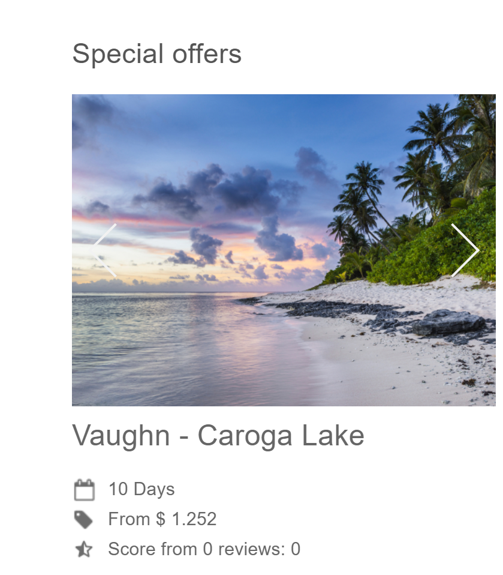
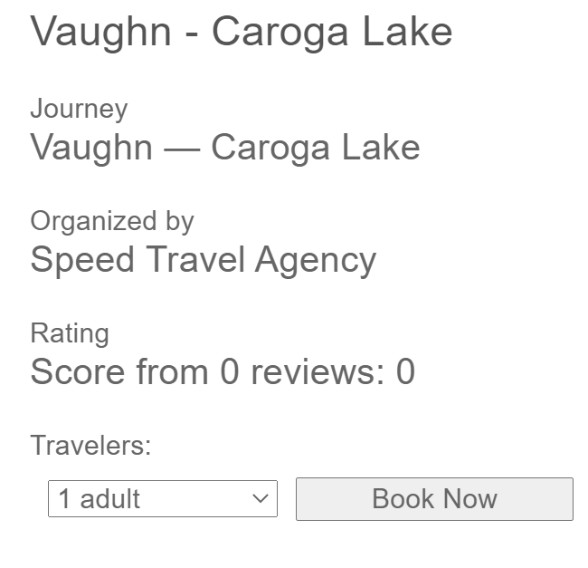
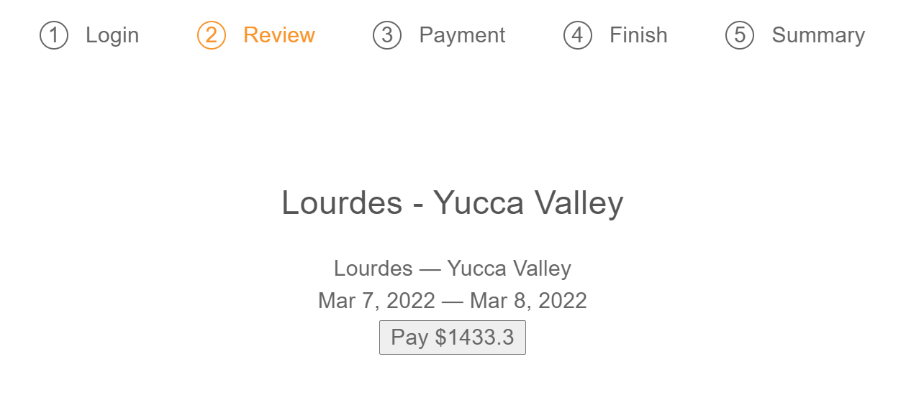
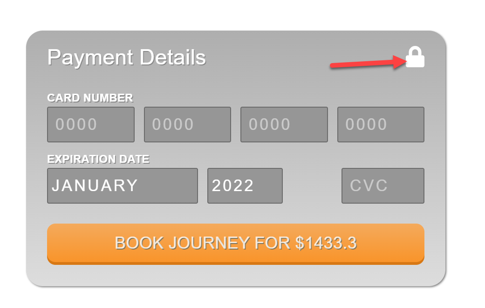
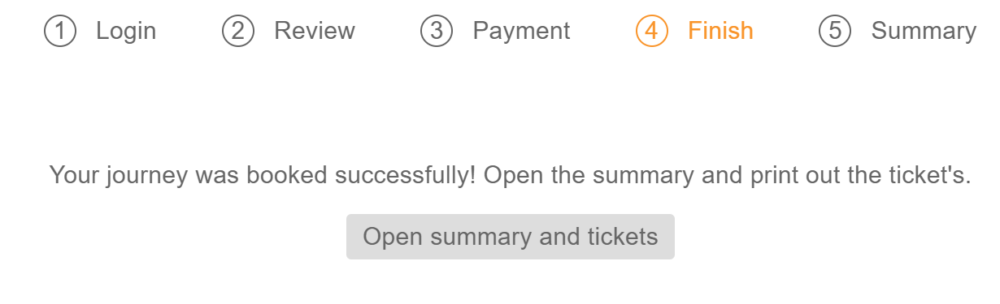
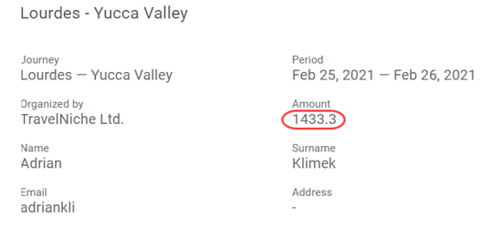
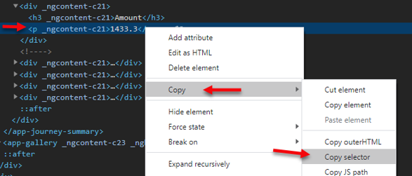
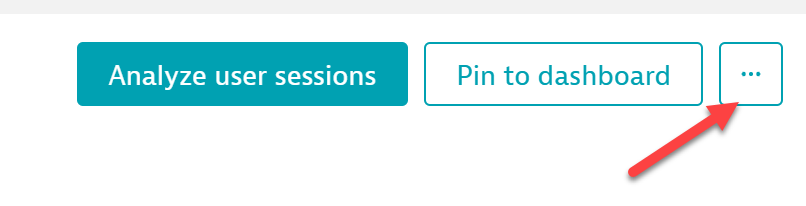
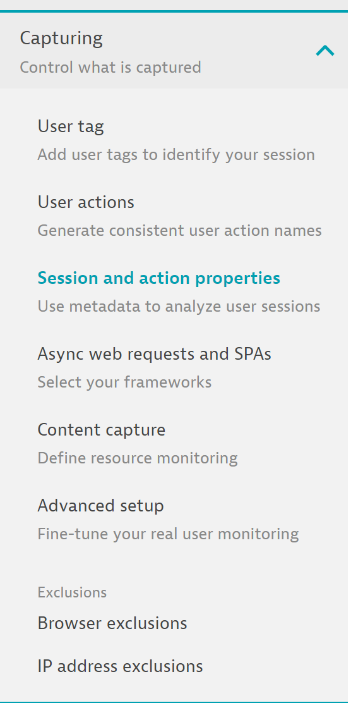
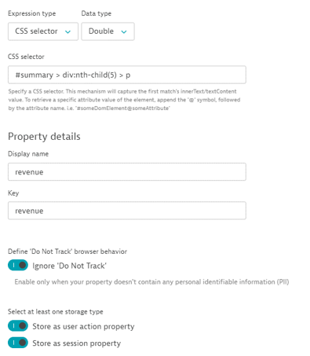

## Capturing Revenue Property

In this module, we will run through how to grab the trip cost dollar value from the EasyTravel website and store it within Dynatrace

### Creating the Property

- VIsit the EasyTravel website. It is available by using the IP address in your Dynatrace University environment and adding the :9080 port to the end of the URL

- Under “Special offers” (under the large promo image) on the home page, click on a destination



- Click “Book Now”



- You can sign in by clicking the padlock icon beside the sign in button and selecting an account, or by using the username demetramcm and the password demetramcm

- After signing in, click the “Pay” button



- Populate payment details by clicking the padlock on the top right of the credit card field, then press the “Book Journey” button



- Click the “Open summary and tickets” button



- Right click on the number representing the price of the trip and click inspect element.  Then right click the element in the browser’s DevTools, choose Copy > Copy selector. Don’t close the page! We’re not done with it yet




- Not able to grab it yourself? Not to worry, you can use the following selector:
```
#summary > div:nth-child(5) > p
```

### Creating the Property

- Back in the Dynatrace portal, navigate to the application settings. You can find this on the left menu under Digital Experience -> Web

- Select an applicaton. In the application overview > Click “…” > Edit



- Expand “Capturing” and select “Session and action properties”



- Click “Add property” and choose the “Custom defined property” tab
- Use Expression type: CSS selector
- Use Data type: Double
- Use CSS Selector (from the previous step): 
```
#summary > div:nth-child(5) > p
```
- Set Display name/Key: revenue
- Enable “Ignore ‘Do Not Track”
- Store as a session and action property

- Save property

