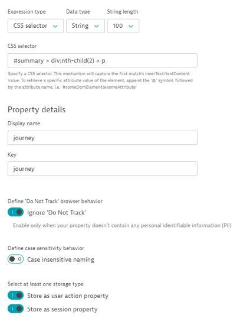

## Capturing the Journey

In this module, we will run through how to grab the trip destination from the EasyTravel website and store it within Dynatrace


### Finding the CSS Selector
- Return to the EasyTravel booking confirmation page you opened as part of the last hands-on exercise


- Right click on the Journey name and click inspect element. Right click the element in the browser’s DevTools, choose Copy > Copy selector 

- Not able to grab it yourself? Not to worry, you can use the following selector:
```
#summary > div:nth-child(2) > p
```

### Creating the Property

- You should still be on the Property creation screen for your application. If not, please reference the guide for exercise 3

- Click “Add property” and choose the “Custom defined property” tab
- Use Expression type: CSS selector
- Use Data type: String
- Select CSS Selector  and input your CSS selector from the previous step: 
```
#summary > div:nth-child(2) > p
```
- Set the Display name/Key: journey
- Enable “Ignore ‘Do Not Track”
- Store as a session and action property

- Save property



