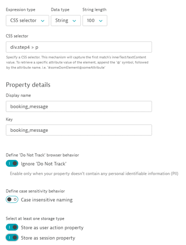

## Capturing the Booking Message

In this module, we will set up a property to capture a booking message. We will provide the CSS selector for this one.

### Creating the Property

- You should still be on the Property creation screen for your application. If not, please reference the guide for exercise 3

- Click “Add property” and choose the “Custom defined property” tab
- Use the Expression type: CSS selector
-Set the Data type: Double
- Select CSS Selector and use the following selector:
```
div.step4 > p
```
- Set the Display name/Key: booking_message
- Enable “Ignore ‘Do Not Track”
- Store as a session and action property

- Save property



