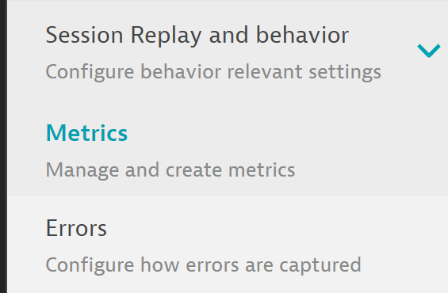
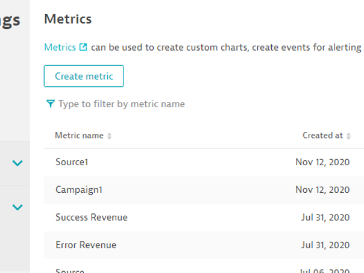
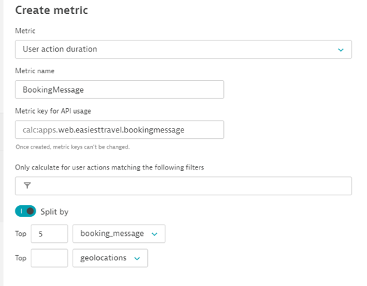
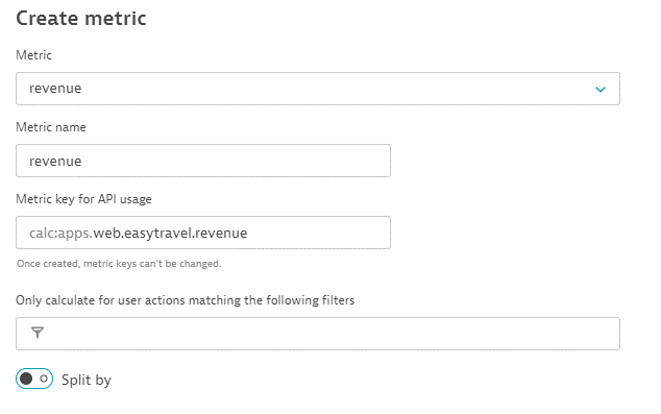

## Creating a Custom Metric

In this module, we will create a custom metric based on one of the properties you created earlier in this lesson

### Creating the Metric

- Navigate the application settings. Application overview -> three dots button -> Edit
- Click on “Metrics”

- Click the “Create metric” button

- Choose “User action duration” from the Metric dropdown. This is just a placeholder for a later step

- Change the Metric name to: BookingMessage

- Enable the “Split by” toggle

- Change the “browsers” dropdown to: booking_message (that is the property you just created)

- Enter “5” in the top input field for booking_message

- Click “Create metric”

### Creating a Revenue Metric

- Click “Create metric” again

- Choose “revenue” from the Metric dropdown

- Leave the Metric name: revenue

- Click “Create metric”

