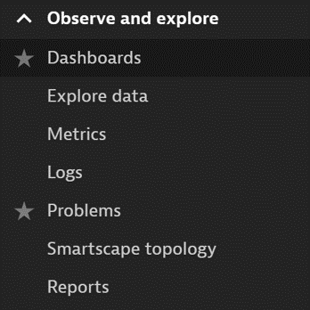
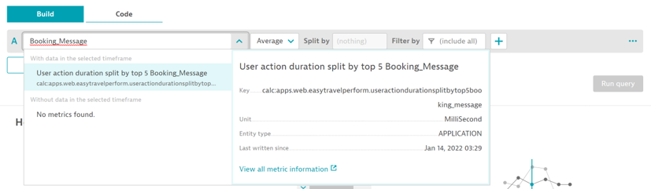
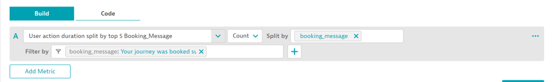
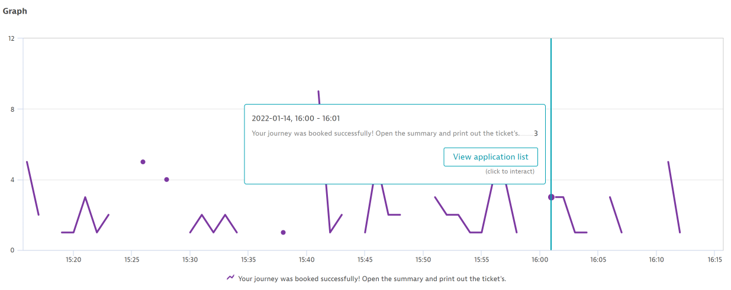
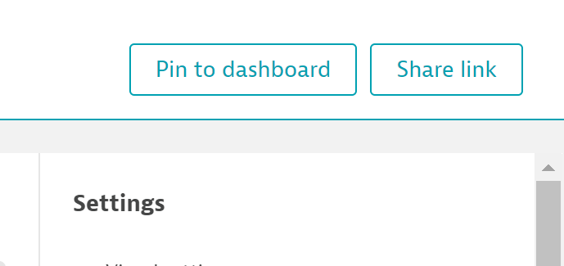
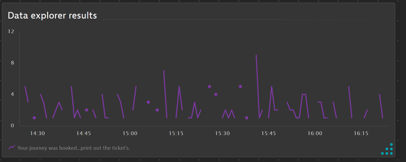

## Creating a Chart

In this module, we will create a charte basedon one of the properties you created earlier in this lesson

### Using Data Explorer

- From the left-hand menu, expand Observe and Explorer and , click select Explore . This will take us to the Data Explorer, which is the primary means of charting

- In the “Metric” input field, type: “Booking”, and select the Booking_Message metric. This will populate the Data Explorer with the data from the custom metric you created earlier

- From this page, we can see a graph of the current metric, which is  the average action duration of the user actions with our booking_message property

- By default, the chart will show performance (we selected Action Duration when creating this property). We’ll want to change this to count, which will tell us how many datapoints have a booking message

- We can also filter down for specific error messages. In this example, we’ll only have one message (successful bookings), but we’ll filter down to display only the successful message

- If your property and custom metric were both set up correctly, you should see a chart with data as per the screenshot below:

- Save this chart by clicking “Pin to dashboard” in the upper right

- Be sure the selected dashboard is the one we created earlier

- You can also rename the chart from the default “Data Explorer Results”

- The resulting dashboard tile will be added to the dashboard and can then be resized or moved

- We’ll have some more Data Explorer tips and info later in this session

