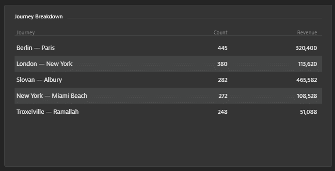

## Building a USQL Query

In this module, we will create a query for the User Session Query Language interface

### Using USQL

- Navigate to Query User Sessions under the Digital Experience subsection using the left-hand menu


- In the black text entry box, enter the following query:

```
SELECT top(useraction.stringProperties.journey, 5) as "Journey", COUNT(*) as "Count", SUM(useraction.doubleProperties.revenue) as "Revenue" FROM useraction where useraction.stringProperties.journey IS NOT NULL AND useraction.doubleProperties.revenue is NOT NULL GROUP BY top(useraction.stringProperties.journey,5)
```

- From there, click the Run Query button

- If the query is successful and there is data matching it, results should be provided as seen below:


- This chart can be pinned to the dashboard. There are different visualizations offered. Click on the "Table Only" option to switch the data to a table format


- Name the query “Journey Breakdown” by clicking the pen icon next to the table title

- Save the table to our dashboard by clicking the “Pin to dashboard” button above the table


- Now the USQL tile will be added to the dashboard and again can be resized or moved


