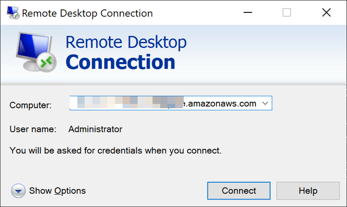
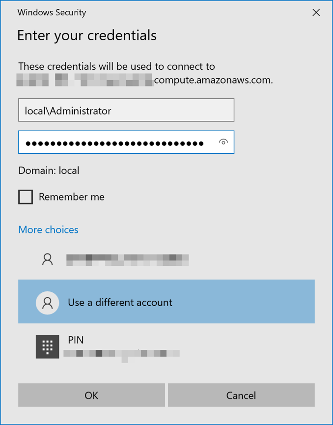
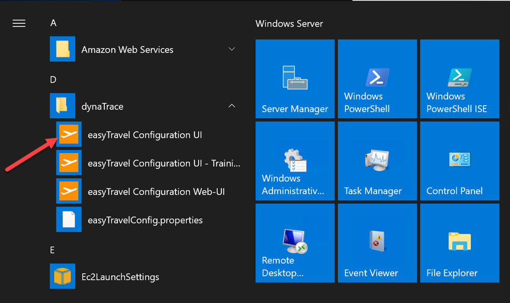
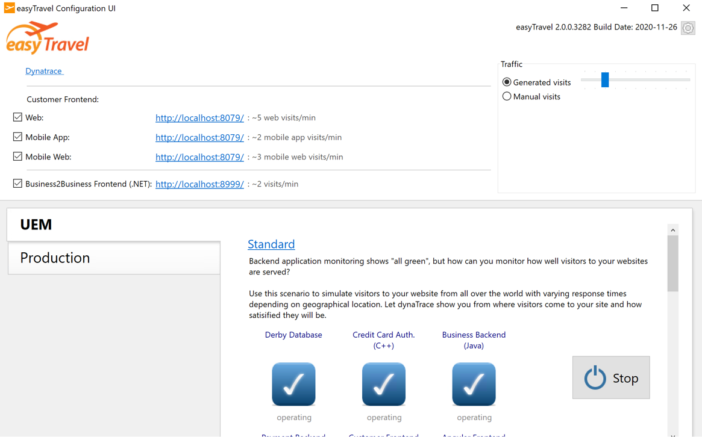

## Enabling EasyTravel

This module discusses the initial setup process needed to have the EasyTravel application generate RUM traffic within your environment

- Log into your Dynatrace provided Virtual Machine. The address for the virtual machine and the credentials can be found in Dynatrace University
- If you’re using Windows, you can hit the Windows key and type Remote Desktop Connection to find the RDP software
- Enter the address for the virtual machine and select Connect

- You will be prompted to enter credentials. Enter the credentials provided in Dynatrace University
-- You may have to select the “Use a Different Account” option to prevent Windows from trying to use your local machine’s login

- Once in the Virtual Machine, go to the Start menu and select Dynatrace
- Under the Dynatrace programs, select easyTravel Configuration UI

- Once easyTravel has loaded, it should automatically select initialize a profile. You will see a list of components in the Initializing phase
- Once the profile shows blue checkmarks under the different components, easyTravel will have initiated. No further action is needed – RUM traffic is now being generated in your tenant

