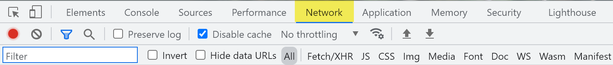
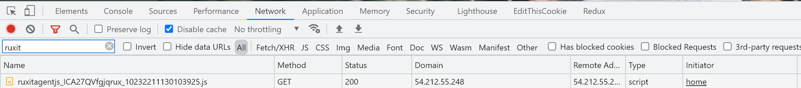
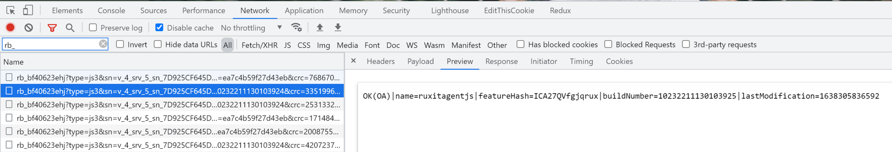
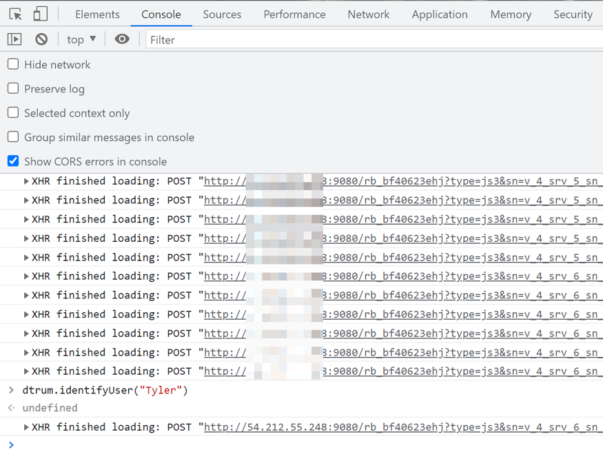

## Viewing EasyTravel (Optional)

This is an optional module that instructs you on how to view the Real User Monitoring JavaScript tag in action on the website generated by your EasyTravel demo environment

In this module, we will take what we've learned about how Real User Monitoring operates and see it in action

### Validating the Tag
- Open Console or Dev Tools in your browser by selecting F12. Once open, you'll likely be brought to the Console tab. To the right of it should be a Network tab - click on that



- Visit the URL or IP in your Dynatrace university. Add :9080 at the end to ensure you’re loading the Angular version of easyTravel

- Once the site has loaded, search for ruxit in the network tab and validate it returns a 200 OK status. This is the Dynatrace RUM tag. It is loaded on entry into the site and then cached



- Search for rb_ in your Chrome network tab. You should see 2-3 of these calls. These are the beacons that send the real user data back to Dynatrace after each interaction with the site that generates network activity

- Click on any one of the beacons to validate that the message being returned under Preview starts with OK



### Identifying Your Session

- Click around throughout the site for a few minutes to generate some network activity. Try to go through a flow to book a trip

- Once you’re done, go to the Console in your browser. Enter the following, with your name between the quotation marks:

 ```dtrum.identifyUser("")
    ```
- If it worked correctly, your browser will return "Undefined" followed by a message stating "XHR Finished loading: Post" with a link to the Dynatrace beacon beside it

- This manual use of user tagging will be used to identify your session later on. And remember – this data is only visible within your tenant. Other participants cannot see it 

