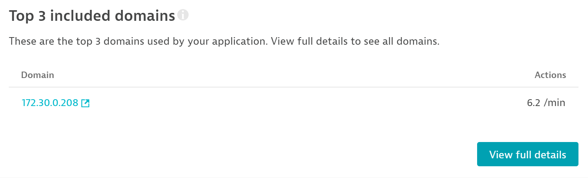
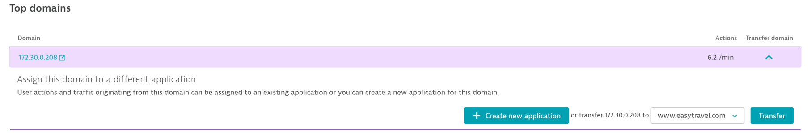
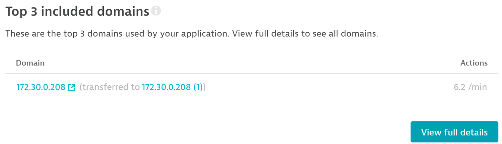

## Application Detection

In this module, we'll go through how to move RUM traffic for a specific domain from the catch-all application to its own dedicated RUM application.

### Detection Settings
- Click on My Web Application and scroll to the bottom where you see the “Top 3 Included Domains” section. Select the View Full Details button

- Under Top Domains, expand the domain (in this case, likely an IP address) by using the arrow under Transfer Domain on the right

- Here you can either create a brand new application to send the data from that domain to, or send it to a previously configured application

- Click the Create New Application button to move traffic from this domain into a new application

- Once complete, the default My Web Application should now display a note under the top domains that the domain you just set up a rule for is now being transferred to a new app

- Data is not transferred between the two applications. The historical data is still stored in My Web Application but the new application starts fresh. This makes it important to make this change early in the setup process. New applications do not take any settings or configuration from the My Web Application
