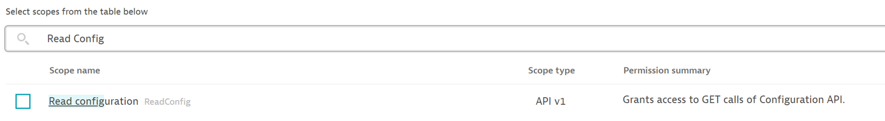
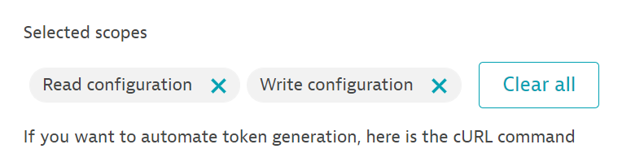
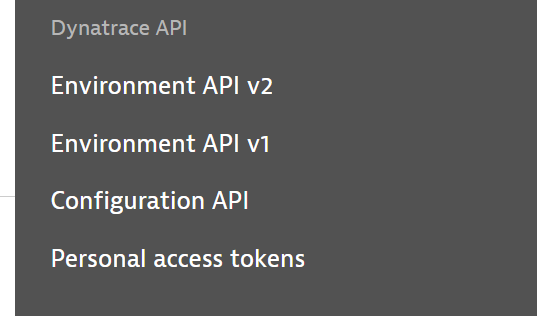
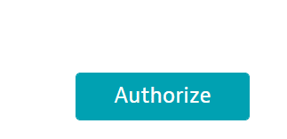
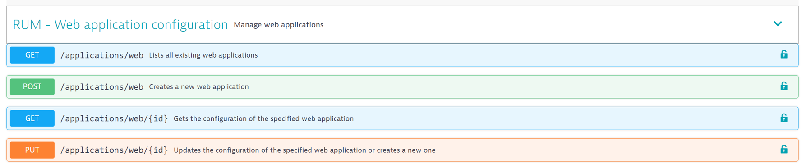
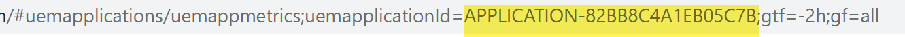
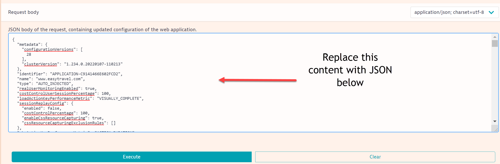
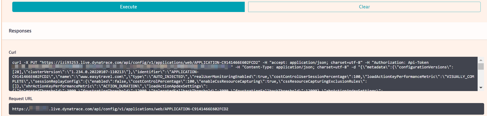

## Deploying Best Practices

The new application that was created takes Dynatrace's default settings.

This module will provide a .JSON file with some pre-configured best practices for the EasyTravel app, and we will walk through how to use the API and the API Explorer to deploy it.

We will not go into depth about these best practices, as they are covered in the Advanced RUM Hands on Training session. We deploy them to give a taste of the different ways the data can be configured or enriched.


### Creating an API token

- Expand the Manage section under the left hand menu, then select Access Tokens

- Click the Generate Token button at the top right

- On the token creation screen, give the token a name

- Under Search Scopes, search for “Read Configuration” and select it. Then do the same write “Write Configuration”



- Validate that your token has the proper scope as per the screenshot below



- Click Generate. The token will appear after – make sure you save it somewhere. It will only be visible once!

- Now we’ve created the token, so we’ll move on how to use it. We’ll be using the Dynatrace API Explorer web interface for our next steps

### Dynatrace API 

- At the top right of the Dynatrace tenant, click on the person icon to expand the menu

- Scroll down to the Dynatrace API section and select Configuration API 



- Now select the Authorize button



- You will be prompted to enter your API token and click Authorize again

- Scroll down to RUM – Web Application Configuration and select the PUT /applications/web/{id} option



- Next, select the Try It Out button

- An Authorize button should now be visible. Selected it, and you will be prompted to enter your API token that you previously generated. Once done, click Authorize again

### Uploading the JSON 

- Under the id section, put in the Application ID for your easyTravel RUM application that you created with the Application Detection rules
-- Not sure what application it is? Click the three dots on the application list screen and then select Edit Detection Rules. This will let you see the rules and the applications linked to them

- The application ID can be found by going to the web application and copying the value from your browser URL. It starts with APPLICATION- and is followed by a string of characters. It stops at (and does not include) the semi-colon



- Replace the Request Body in the Data Explorer with the contents of the provided JSON file below



```
{
  "metadata": {
    "configurationVersions": [
      28
    ],
    "clusterVersion": "1.234.0.20220107-110213"
  },
  "name": "EasyTravel Demo Application",
  "type": "AUTO_INJECTED",
  "realUserMonitoringEnabled": true,
  "costControlUserSessionPercentage": 100,
  "loadActionKeyPerformanceMetric": "VISUALLY_COMPLETE",
  "sessionReplayConfig": {
    "enabled": false,
    "costControlPercentage": 100,
    "enableCssResourceCapturing": true,
    "cssResourceCapturingExclusionRules": []
  },
  "xhrActionKeyPerformanceMetric": "ACTION_DURATION",
  "loadActionApdexSettings": {
    "toleratedThreshold": 3000,
    "frustratingThreshold": 12000,
    "toleratedFallbackThreshold": 3000,
    "frustratingFallbackThreshold": 12000
  },
  "xhrActionApdexSettings": {
    "toleratedThreshold": 3000,
    "frustratingThreshold": 12000,
    "toleratedFallbackThreshold": 3000,
    "frustratingFallbackThreshold": 12000
  },
  "customActionApdexSettings": {
    "toleratedThreshold": 3000,
    "frustratingThreshold": 12000,
    "toleratedFallbackThreshold": 3000,
    "frustratingFallbackThreshold": 12000
  },
  "waterfallSettings": {
    "uncompressedResourcesThreshold": 860,
    "resourcesThreshold": 100000,
    "resourceBrowserCachingThreshold": 50,
    "slowFirstPartyResourcesThreshold": 200000,
    "slowThirdPartyResourcesThreshold": 200000,
    "slowCdnResourcesThreshold": 200000,
    "speedIndexVisuallyCompleteRatioThreshold": 50
  },
  "monitoringSettings": {
    "fetchRequests": false,
    "xmlHttpRequest": false,
    "javaScriptFrameworkSupport": {
      "angular": true,
      "dojo": false,
      "extJS": false,
      "icefaces": false,
      "jQuery": false,
      "mooTools": false,
      "prototype": false,
      "activeXObject": false
    },
    "contentCapture": {
      "resourceTimingSettings": {
        "w3cResourceTimings": true,
        "nonW3cResourceTimings": false,
        "nonW3cResourceTimingsInstrumentationDelay": 50,
        "resourceTimingCaptureType": "CAPTURE_FULL_DETAILS",
        "resourceTimingsDomainLimit": 10
      },
      "javaScriptErrors": true,
      "timeoutSettings": {
        "timedActionSupport": false,
        "temporaryActionLimit": 0,
        "temporaryActionTotalTimeout": 100
      },
      "visuallyCompleteAndSpeedIndex": true,
      "visuallyComplete2Settings": {
        "excludeUrlRegex": "",
        "ignoredMutationsList": "",
        "mutationTimeout": 50,
        "inactivityTimeout": 1000,
        "threshold": 50
      }
    },
    "excludeXhrRegex": "",
    "correlationHeaderInclusionRegex": "",
    "injectionMode": "JAVASCRIPT_TAG",
    "addCrossOriginAnonymousAttribute": true,
    "scriptTagCacheDurationInHours": 1,
    "libraryFileLocation": "",
    "monitoringDataPath": "",
    "customConfigurationProperties": "",
    "serverRequestPathId": "",
    "secureCookieAttribute": false,
    "cookiePlacementDomain": "",
    "cacheControlHeaderOptimizations": true,
    "advancedJavaScriptTagSettings": {
      "syncBeaconFirefox": false,
      "syncBeaconInternetExplorer": false,
      "instrumentUnsupportedAjaxFrameworks": false,
      "specialCharactersToEscape": "",
      "maxActionNameLength": 100,
      "maxErrorsToCapture": 10,
      "additionalEventHandlers": {
        "userMouseupEventForClicks": false,
        "clickEventHandler": false,
        "mouseupEventHandler": false,
        "blurEventHandler": false,
        "changeEventHandler": false,
        "toStringMethod": false,
        "maxDomNodesToInstrument": 5000
      },
      "eventWrapperSettings": {
        "click": false,
        "mouseUp": false,
        "change": false,
        "blur": false,
        "touchStart": false,
        "touchEnd": false
      },
      "globalEventCaptureSettings": {
        "mouseUp": true,
        "mouseDown": true,
        "click": true,
        "doubleClick": true,
        "keyUp": true,
        "keyDown": true,
        "scroll": true,
        "additionalEventCapturedAsUserInput": ""
      }
    },
    "browserRestrictionSettings": {
      "mode": "EXCLUDE",
      "browserRestrictions": []
    },
    "ipAddressRestrictionSettings": {
      "mode": "EXCLUDE",
      "ipAddressRestrictions": []
    }
  },
  "userTags": [],
  "userActionAndSessionProperties": [
    {
      "displayName": "revenue",
      "type": "DOUBLE",
      "origin": "META_DATA",
      "aggregation": "LAST",
      "storeAsUserActionProperty": true,
      "storeAsSessionProperty": true,
      "uniqueId": 1,
      "key": "revenue",
      "metadataId": 1,
      "ignoreCase": false
    },
    {
      "displayName": "Journey",
      "type": "STRING",
      "origin": "META_DATA",
      "aggregation": "LAST",
      "storeAsUserActionProperty": true,
      "storeAsSessionProperty": true,
      "uniqueId": 2,
      "key": "journey",
      "metadataId": 2,
      "ignoreCase": false
    },
    {
      "displayName": "Booking_Message",
      "type": "STRING",
      "origin": "META_DATA",
      "aggregation": "LAST",
      "storeAsUserActionProperty": true,
      "storeAsSessionProperty": true,
      "uniqueId": 4,
      "key": "booking_message",
      "metadataId": 4,
      "ignoreCase": false
    },
    {
      "displayName": "Adobe page name",
      "type": "STRING",
      "origin": "META_DATA",
      "aggregation": "LAST",
      "storeAsUserActionProperty": true,
      "storeAsSessionProperty": false,
      "uniqueId": 5,
      "key": "adobe_pagename",
      "metadataId": 5,
      "ignoreCase": false
    },
    {
      "displayName": "Referrer",
      "type": "STRING",
      "origin": "META_DATA",
      "aggregation": "FIRST",
      "storeAsUserActionProperty": false,
      "storeAsSessionProperty": true,
      "uniqueId": 6,
      "key": "web_referrer",
      "metadataId": 6,
      "ignoreCase": false
    },
    {
      "displayName": "User agent",
      "type": "STRING",
      "origin": "META_DATA",
      "aggregation": "LAST",
      "storeAsUserActionProperty": false,
      "storeAsSessionProperty": true,
      "uniqueId": 7,
      "key": "web_useragent",
      "metadataId": 7,
      "ignoreCase": false
    },
    {
      "displayName": "UTM source",
      "type": "STRING",
      "origin": "META_DATA",
      "aggregation": "LAST",
      "storeAsUserActionProperty": false,
      "storeAsSessionProperty": true,
      "uniqueId": 8,
      "key": "web_utm_source",
      "metadataId": 8,
      "ignoreCase": false
    },
    {
      "displayName": "UTM medium",
      "type": "STRING",
      "origin": "META_DATA",
      "aggregation": "LAST",
      "storeAsUserActionProperty": false,
      "storeAsSessionProperty": true,
      "uniqueId": 9,
      "key": "web_utm_medium",
      "metadataId": 9,
      "ignoreCase": false
    },
    {
      "displayName": "UTM campaign",
      "type": "STRING",
      "origin": "META_DATA",
      "aggregation": "LAST",
      "storeAsUserActionProperty": false,
      "storeAsSessionProperty": true,
      "uniqueId": 10,
      "key": "web_utm_campaign",
      "metadataId": 10,
      "ignoreCase": false
    },
    {
      "displayName": "UTM term",
      "type": "STRING",
      "origin": "META_DATA",
      "aggregation": "LAST",
      "storeAsUserActionProperty": false,
      "storeAsSessionProperty": true,
      "uniqueId": 11,
      "key": "web_utm_term",
      "metadataId": 11,
      "ignoreCase": false
    },
    {
      "displayName": "UTM content",
      "type": "STRING",
      "origin": "META_DATA",
      "aggregation": "LAST",
      "storeAsUserActionProperty": false,
      "storeAsSessionProperty": true,
      "uniqueId": 12,
      "key": "web_utm_content",
      "metadataId": 12,
      "ignoreCase": false
    }
  ],
  "userActionNamingSettings": {
    "placeholders": [
      {
        "name": "JourneyID",
        "input": "XHR_URL",
        "processingPart": "ALL",
        "processingSteps": [
          {
            "type": "REPLACEMENT",
            "patternBefore": "/journeys/",
            "patternBeforeSearchType": "FIRST",
            "patternAfter": "",
            "patternAfterSearchType": "LAST",
            "replacement": "<journey id>",
            "patternToReplace": null,
            "regularExpression": null,
            "fallbackToInput": false
          }
        ],
        "metadataId": null,
        "useGuessedElementIdentifier": false
      },
      {
        "name": "DestinationID",
        "input": "XHR_URL",
        "processingPart": "ALL",
        "processingSteps": [
          {
            "type": "REPLACEMENT",
            "patternBefore": "/easytravel/rest/journeys/?match=",
            "patternBeforeSearchType": "FIRST",
            "patternAfter": "&",
            "patternAfterSearchType": "FIRST",
            "replacement": "<city>",
            "patternToReplace": null,
            "regularExpression": null,
            "fallbackToInput": false
          }
        ],
        "metadataId": null,
        "useGuessedElementIdentifier": false
      }
    ],
    "loadActionNamingRules": [
      {
        "template": "Home Page",
        "conditions": [
          {
            "operand1": "{pageUrl (default)}",
            "operand2": "/easytravel/home",
            "operator": "CONTAINS"
          }
        ],
        "useOrConditions": false
      }
    ],
    "xhrActionNamingRules": [
      {
        "template": "{DestinationID}",
        "conditions": [
          {
            "operand1": "{xhrUrl (default)}",
            "operand2": "match=",
            "operator": "CONTAINS"
          }
        ],
        "useOrConditions": false
      },
      {
        "template": "{JourneyID}",
        "conditions": [
          {
            "operand1": "{xhrUrl (default)}",
            "operand2": "journeys",
            "operator": "CONTAINS"
          },
          {
            "operand1": "{xhrUrl (default)}",
            "operand2": "match",
            "operator": "NOT_CONTAINS"
          }
        ],
        "useOrConditions": false
      }
    ],
    "customActionNamingRules": [],
    "ignoreCase": true,
    "useFirstDetectedLoadAction": false,
    "splitUserActionsByDomain": true,
    "queryParameterCleanups": [
      "cfid",
      "phpsessid",
      "__sid",
      "cftoken",
      "sid"
    ]
  },
  "metaDataCaptureSettings": [
    {
      "type": "CSS_SELECTOR",
      "capturingName": "#summary > div:nth-child(5) > p",
      "name": "revenue",
      "uniqueId": 1,
      "publicMetadata": true,
      "useLastValue": false
    },
    {
      "type": "CSS_SELECTOR",
      "capturingName": "#summary > div:nth-child(2) > p",
      "name": "Journey",
      "uniqueId": 2,
      "publicMetadata": true,
      "useLastValue": false
    },
    {
      "type": "CSS_SELECTOR",
      "capturingName": "div.step4 > p",
      "name": "Booking_Message",
      "uniqueId": 4,
      "publicMetadata": true,
      "useLastValue": false
    },
    {
      "type": "JAVA_SCRIPT_VARIABLE",
      "capturingName": "s.pageName",
      "name": "Adobe page name",
      "uniqueId": 5,
      "publicMetadata": false,
      "useLastValue": false
    },
    {
      "type": "JAVA_SCRIPT_VARIABLE",
      "capturingName": "document.referrer",
      "name": "Referrer",
      "uniqueId": 6,
      "publicMetadata": false,
      "useLastValue": false
    },
    {
      "type": "JAVA_SCRIPT_VARIABLE",
      "capturingName": "navigator.userAgent",
      "name": "User agent",
      "uniqueId": 7,
      "publicMetadata": false,
      "useLastValue": false
    },
    {
      "type": "QUERY_STRING",
      "capturingName": "utm_source",
      "name": "UTM source",
      "uniqueId": 8,
      "publicMetadata": false,
      "useLastValue": false
    },
    {
      "type": "QUERY_STRING",
      "capturingName": "utm_medium",
      "name": "UTM medium",
      "uniqueId": 9,
      "publicMetadata": false,
      "useLastValue": false
    },
    {
      "type": "QUERY_STRING",
      "capturingName": "utm_campaign",
      "name": "UTM campaign",
      "uniqueId": 10,
      "publicMetadata": false,
      "useLastValue": false
    },
    {
      "type": "QUERY_STRING",
      "capturingName": "utm_term",
      "name": "UTM term",
      "uniqueId": 11,
      "publicMetadata": false,
      "useLastValue": false
    },
    {
      "type": "QUERY_STRING",
      "capturingName": "utm_content",
      "name": "UTM content",
      "uniqueId": 12,
      "publicMetadata": false,
      "useLastValue": false
    }
  ],
  "conversionGoals": [

  ]
}
```

- Once entered, we'll need one more modification. Modify the JSON in the Request Body to ensure that the ID in the identifier line is the same as the Application ID you entered in the ID section above it


- Once done, click Execute. The API explorer should return a message like below with no error messages. If successful, the application you created via the detection rules earlier should now be called EasyTravel Demo Application

