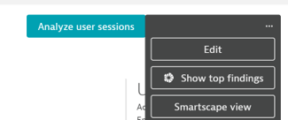
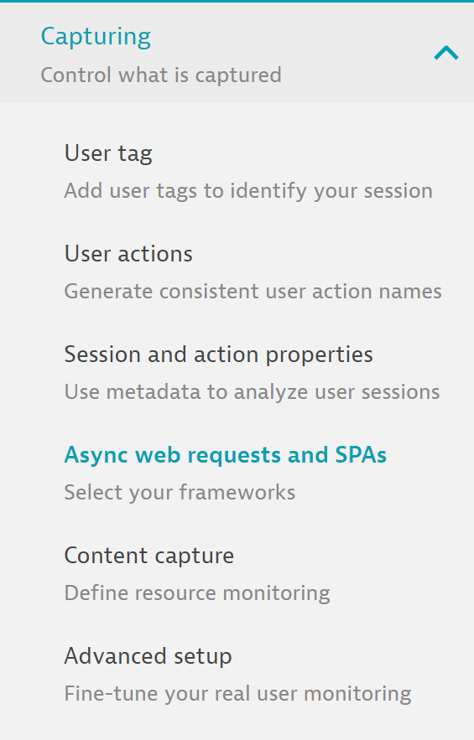

## Deploying XHR Frameworks

In this module, we'll go over how to enable XHR framework support in Dynatrace Real User Monitoring

This allows us to capture both page loads and XHR/web service request actions

### Application Settings

- Select your application with active traffic from the Web Applications list. This should be the EasyTravel Demo Application

- Within that application, hit the three dots at the top right and then Edit

- Next step is expand the Capturing menu under Application Settings and select Async Web Requests and SPAs

- In the case of our easyTravel site, the application will automatically detect that the application is built with Angular and recommend enabling that framework

- Turn on Angular and support for Fetch() and save your changes