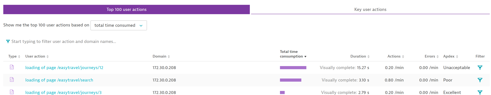
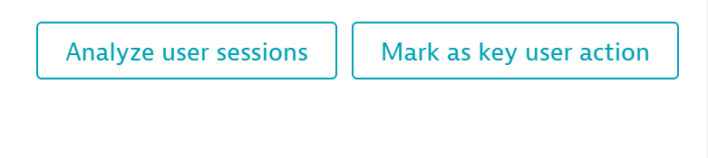
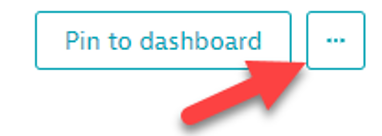
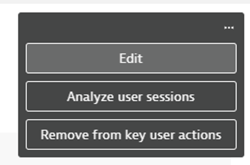
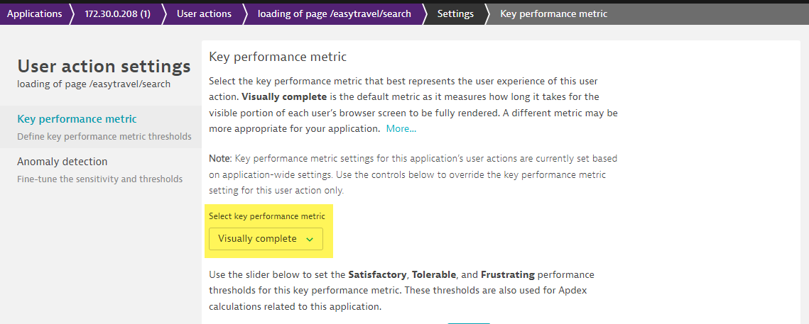

## Setting up Key User Actions

In this module, we'll cover how to set up Key User Actions and modify settings on a per action basis

### Creating a Key User Actions

- From within the RUM application's Multi-Dimensional Analysis, simply click on any one of the actions listed under the Top 100 actions

- When on the action screen, click “Mark as key user action” on the right 

### Modifying a Key User Actions

- Click the three dots on the top right of the screen on the action you have set as a Key User Action and select Edit

- Under the Key Performance Metric dropdown on the Key User Action settings screen, select Action Duration
- This will change the Key Performance Metric for that specific action from Visually Complete (default) to end to end time (Action Duration). It is not necessary to save after making these changes, as the save it automatic

