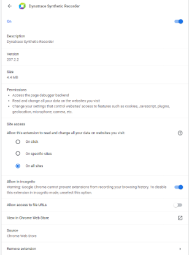
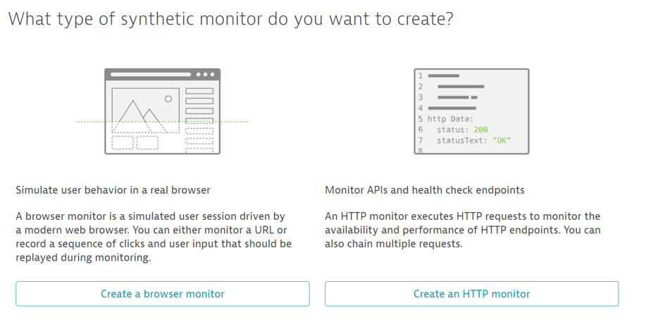
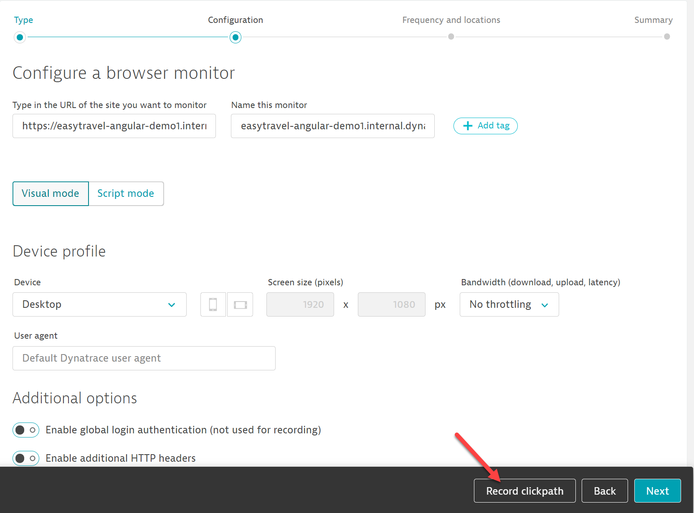
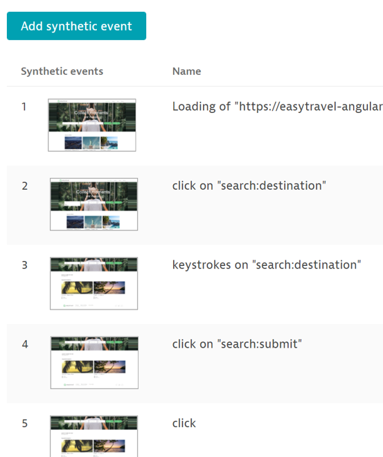
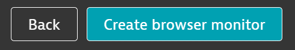
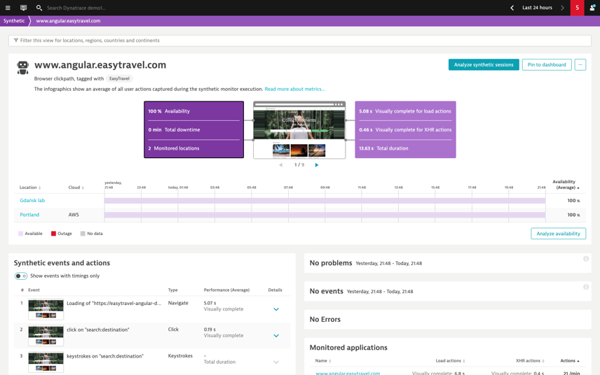

## Creating a Synthetic Script

In this module, we'll cover how to create a synthetic script. In order to do this, you must be using Chrome and have the Dynatrace Synthetic Recorder extension installed. It can be found here:

https://chrome.google.com/webstore/detail/dynatrace-synthetic-recor/ambepdkaijjnednbbemlciandnhoanie

Once installed, navigate to chrome://extensions in Chrome's browser URL. Select "Details" for Dynatrace Synthetic Recorder. 
In there, toggle on Allow Incognito. This ensures you are recording with a fresh cache and cookies, just like the public agents use when playing back the script

Unable to install the recorder? You can still follow the instructions below, but instead of selecting the Record clickpath button, you can select "Next" at the bottom right to deploy a single page script. The next exercise will also allow you to deploy a multi-page script that has already been recorded.

### Creating Your Own Synthetic Monitor

- Navigate to Synthetic under Digital Experience on the left menu

- Select Create a Synthetic Monitor on the top right

- You will be prompted for what type of monitor to create – select Browser

- Under "Configure a browser monitor", there will be a box to enter the URL. You can use the IP for your EasyTravel site (provided in Dynatrace University) or, if you are unsure of the address, you can use the following:

https://easytravel-angular-demo1.internal.dynatracelabs.com/easytravel/home

- You can leave everything else as is, and click "Record clickpath" at the bottom to start recording. Make sure you click "Record Clickpath" and not "Next". Record Clickpath will create a transactional flow of multiple steps, while Next creates a one page monitor

- Click through the easyTravel site as you think a user would. After a few pages, feel free to close the recording window

- You should now see the recorded script in your recording window. These are the steps you have recorded -- the agents will follow this flow

### Deploying the Script

After creating the script, we will need to deploy it to the public agents. Click Next to navigate to the location deployment screen. You can select any one

- After selecting a location, select Next to get to the script deployment summary page

- Click Create Browser Monitor to deploy

- You should now see your browser monitor in the synthetic monitor list. It may take a few minutes to begin returning data

- This was just a hands-on session for how to create a script. Good scripts should always follow best practices like validations to ensure the proper page loaded!

