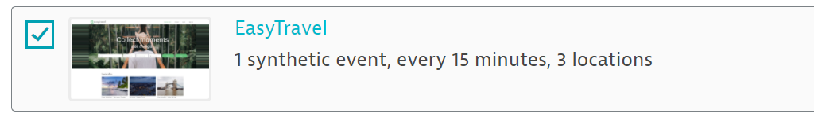
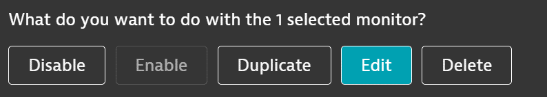
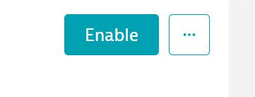

## Scripting Best Practices

This module is a bonus module where we will deploy an EasyTravel script that follows our best practices (validations, readable names)


### Creating Your Own Synthetic Monitor

- Navigate to Synthetic under Digital Experience on the left menu

- Select the checkbox beside your monitor and select Duplicate 




- You’ll be brought into an inactive duplicate script. Click the three dots beside Enable, and select Edit



- From here, select Monitor Script
- You’ll be brought to a JSON for that script. Replace the contents with the JSON file found below

```{
    "configuration": {
        "monitorFrames": {
            "enabled": true
        },
        "device": {
            "orientation": "landscape",
            "deviceName": "Desktop"
        },
        "disableWebSecurity": false
    },
    "type": "clickpath",
    "version": "1.0",
    "events": [{
        "type": "navigate",
        "wait": {
            "waitFor": "page_complete"
        },
        "description": "Home Page",
        "url": "https://easytravel-angular-demo1.internal.dynatracelabs.com/easytravel/home",
        "validate": [{
            "type": "text_match",
            "failIfFound": false,
            "isRegex": false,
            "match": "Special Offers"
        }]
    }, {
        "type": "click",
        "wait": {
            "waitFor": "network"
        },
        "target": {
            "locators": [{
                "type": "css",
                "value": "#specialOffers\\:result:eq(0)"
            }, {
                "type": "css",
                "value": "a:contains(\"Salama - Villa Park\")"
            }, {
                "type": "css",
                "value": "html body:nth-child(8) app-root app-dashboard:nth-child(2) app-main-layout div div:nth-child(2) app-home-main:nth-child(2) main div app-offers-list div app-offer:nth-child(2) h3:nth-child(2) a"
            }]
        },
        "button": 0,
        "description": "Select Destination",
        "validate": [{
            "type": "text_match",
            "failIfFound": false,
            "isRegex": false,
            "match": "Journey"
        }]
    }, {
        "type": "click",
        "target": {
            "locators": [{
                "type": "css",
                "value": "select"
            }, {
                "type": "css",
                "value": ".ng-untouched:eq(1)"
            }, {
                "type": "css",
                "value": "html body:nth-child(8) app-root app-journey:nth-child(2) app-main-layout div div:nth-child(2) main:nth-child(2) div div:nth-child(3) form:nth-child(2) select"
            }, {
                "type": "css",
                "value": "body app-root app-journey app-main-layout.search-page div.page div.page-content main.page-section div.widget div.journey-actions form.ng-untouched select.ng-untouched"
            }]
        },
        "button": 0,
        "description": "Click Travellers Dropdown"
    }, {
        "type": "selectOption",
        "target": {
            "locators": [{
                "type": "css",
                "value": "select"
            }, {
                "type": "css",
                "value": ".ng-untouched:eq(1)"
            }, {
                "type": "css",
                "value": "html body:nth-child(8) app-root app-journey:nth-child(2) app-main-layout div div:nth-child(2) main:nth-child(2) div div:nth-child(3) form:nth-child(2) select"
            }, {
                "type": "css",
                "value": "body app-root app-journey app-main-layout.search-page div.page div.page-content main.page-section div.widget div.journey-actions form.ng-untouched select.ng-untouched"
            }]
        },
        "description": "Select Number of Travellers",
        "selections": [{
            "index": 3,
            "value": "4"
        }]
    }, {
        "type": "click",
        "target": {
            "locators": [{
                "type": "css",
                "value": "select"
            }, {
                "type": "css",
                "value": ".ng-untouched:eq(1)"
            }, {
                "type": "css",
                "value": "html body:nth-child(8) app-root app-journey:nth-child(2) app-main-layout div div:nth-child(2) main:nth-child(2) div div:nth-child(3) form:nth-child(2) select"
            }, {
                "type": "css",
                "value": "body app-root app-journey app-main-layout.search-page div.page div.page-content main.page-section div.widget div.journey-actions form.ng-untouched select.ng-untouched"
            }]
        },
        "button": 0,
        "description": "click"
    }, {
        "type": "click",
        "wait": {
            "waitFor": "page_complete"
        },
        "target": {
            "locators": [{
                "type": "css",
                "value": "button[name=\"book:booknow\"]"
            }, {
                "type": "css",
                "value": "button:contains(\"Book Now\")"
            }, {
                "type": "css",
                "value": "html body:nth-child(8) app-root app-journey:nth-child(2) app-main-layout div div:nth-child(2) main:nth-child(2) div div:nth-child(3) form:nth-child(2) button:nth-child(2)"
            }, {
                "type": "css",
                "value": "body app-root app-journey app-main-layout.search-page div.page div.page-content main.page-section div.widget div.journey-actions form.ng-untouched button"
            }]
        },
        "button": 0,
        "description": "Log In"
    }, {
        "type": "click",
        "wait": {
            "waitFor": "network"
        },
        "target": {
            "locators": [{
                "type": "css",
                "value": "#loginForm\\:username"
            }, {
                "type": "css",
                "value": "input[type=\"text\"][name=\"email\"]"
            }, {
                "type": "css",
                "value": "document.forms[0][\"email\"]"
            }]
        },
        "button": 0,
        "description": "Click Username"
    }, {
        "type": "keystrokes",
        "target": {
            "locators": [{
                "type": "css",
                "value": "#loginForm\\:username"
            }, {
                "type": "css",
                "value": "input[type=\"text\"][name=\"email\"]"
            }]
        },
        "masked": false,
        "simulateBlurEvent": true,
        "description": "Enter Username",
        "textValue": "demetramcm"
    }, {
        "type": "click",
        "target": {
            "locators": [{
                "type": "css",
                "value": "#loginForm\\:password"
            }, {
                "type": "css",
                "value": "input[type=\"password\"][name=\"password\"]"
            }]
        },
        "button": 0,
        "description": "Click Password Form"
    }, {
        "type": "keystrokes",
        "target": {
            "locators": [{
                "type": "css",
                "value": "#loginForm\\:password"
            }, {
                "type": "css",
                "value": "input[type=\"password\"][name=\"password\"]"
            }]
        },
        "masked": false,
        "simulateBlurEvent": true,
        "description": "Enter Password",
        "textValue": "demetramcm"
    }, {
        "type": "click",
        "wait": {
            "waitFor": "network"
        },
        "target": {
            "locators": [{
                "type": "css",
                "value": "#loginForm\\:submit"
            }, {
                "type": "css",
                "value": "button[type=\"submit\"]"
            }, {
                "type": "css",
                "value": "button:contains(\"Sign In\")"
            }]
        },
        "button": 0,
        "description": "Checkout",
        "validate": [{
            "type": "text_match",
            "failIfFound": false,
            "isRegex": false,
            "match": "Pay $"
        }]
    }, {
        "type": "click",
        "target": {
            "locators": [{
                "type": "css",
                "value": "button[name=\"payment:pay\"]"
            }, {
                "type": "css",
                "value": "button:contains(\"Pay $600.7\")"
            }, {
                "type": "css",
                "value": "html body:nth-child(8) app-root app-book-journey:nth-child(2) app-main-layout div div:nth-child(2) main:nth-child(2) div:nth-child(3) div:nth-child(2) p:nth-child(4) button"
            }, {
                "type": "css",
                "value": "body app-root app-book-journey app-main-layout.search-page div.page div.page-content main.page-section div.steps div.step p button"
            }]
        },
        "button": 0,
        "description": "Payment"
    }, {
        "type": "click",
        "target": {
            "locators": [{
                "type": "css",
                "value": "html body:nth-child(8) app-root app-book-journey:nth-child(2) app-main-layout div div:nth-child(2) main:nth-child(2) div:nth-child(3) app-billing:nth-child(3) div div h2 div fa-icon svg path"
            }, {
                "type": "css",
                "value": "body app-root app-book-journey app-main-layout.search-page div.page div.page-content main.page-section div.steps app-billing.step div div.card-panel h2.card-title div fa-icon.ng-fa-icon svg.svg-inline--fa path"
            }]
        },
        "button": 0,
        "description": "Fill Payment Details"
    }, {
        "type": "click",
        "wait": {
            "waitFor": "network"
        },
        "target": {
            "locators": [{
                "type": "css",
                "value": "button[type=\"button\"][name=\"creditCard:submit\"]"
            }, {
                "type": "css",
                "value": "button:contains(\"Book Journey for $600.7\")"
            }, {
                "type": "css",
                "value": ".place-order"
            }, {
                "type": "css",
                "value": "html body:nth-child(8) app-root app-book-journey:nth-child(2) app-main-layout div div:nth-child(2) main:nth-child(2) div:nth-child(3) app-billing:nth-child(3) div div div:nth-child(6) button"
            }, {
                "type": "css",
                "value": "body app-root app-book-journey app-main-layout.search-page div.page div.page-content main.page-section div.steps app-billing.step div div.card-panel div.form-row button.place-order"
            }]
        },
        "button": 0,
        "description": "Order Confirmation",
        "validate": [{
            "type": "text_match",
            "failIfFound": false,
            "isRegex": false,
            "match": "Your journey was booked successfully"
        }]
    }, {
        "type": "click",
        "target": {
            "locators": [{
                "type": "css",
                "value": "#summaryButton"
            }, {
                "type": "css",
                "value": "button:eq(3)"
            }, {
                "type": "css",
                "value": "button:contains(\"Open summary and tickets\")"
            }, {
                "type": "css",
                "value": "html body:nth-child(8) app-root app-book-journey:nth-child(2) app-main-layout div div:nth-child(2) main:nth-child(2) div:nth-child(3) div:nth-child(4) button:nth-child(2)"
            }, {
                "type": "css",
                "value": "#summaryButton"
            }]
        },
        "button": 0,
        "description": "Trip Summary",
        "validate": [{
            "type": "text_match",
            "failIfFound": false,
            "isRegex": false,
            "match": "Email"
        }]
    }]
}
```

- Save your changes and enable the monitor
