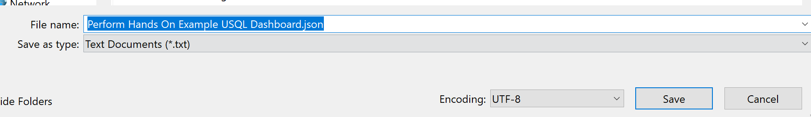
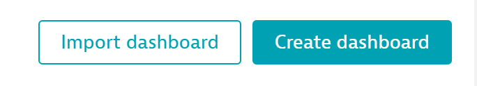

## Importing a Dashboard
This module will guide you through how to deploy a pre-configured dashboard for your EasyTravel application


### Deploying the JSON

- Navigate to Dashboards under Observe and Explorer on the left menu

- Copy the text in the box below into Notepad. From there, name the file and end the file name with .json, as seen in the screenshot below. Save the file



```{
  "metadata": {
    "configurationVersions": [
      5
    ],
    "clusterVersion": "1.234.0.20220110-154632"
  },
  "id": "4a41295e-9334-49f3-9451-2c784ba33c23",
  "dashboardMetadata": {
    "name": "Perform Hands On Example USQL Properties Dashboard",
    "shared": false,
    "owner": "tyler.rowe@dynatrace.com",
    "dashboardFilter": {
      "timeframe": "-7d to now"
    }
  },
  "tiles": [
    {
      "name": "User Sessions Query",
      "tileType": "DTAQL",
      "configured": true,
      "bounds": {
        "top": 38,
        "left": 304,
        "width": 304,
        "height": 304
      },
      "tileFilter": {},
      "customName": "Slowest Cities",
      "query": "SELECT TOP(usersession.city, 5) AS \"Slowest Cities\", avg(visuallyCompleteTime) AS \"Average Visually Complete Time (in MS)\" FROM useraction WHERE useraction.name=\"loading of page /easytravel/home\" GROUP BY usersession.city ORDER BY avg(visuallyCompleteTime) DESC",
      "type": "TABLE",
      "limit": 50
    },
    {
      "name": "Generic EasyTravel Tiles",
      "tileType": "HEADER",
      "configured": true,
      "bounds": {
        "top": 0,
        "left": 0,
        "width": 1292,
        "height": 38
      },
      "tileFilter": {}
    },
    {
      "name": "Markdown",
      "tileType": "MARKDOWN",
      "configured": true,
      "bounds": {
        "top": 38,
        "left": 0,
        "width": 304,
        "height": 304
      },
      "tileFilter": {},
      "markdown": "These tiles will work out of box with any EasyTravel install. They will also work on any tenant that has a web RUM application.\n\nIf you wish to filter it down to a specific application, you can set that in the USQL query or use a Management Zone to limit the dataset.\n\nThese tiles are meant to show the basics of USQL and a should be universal for any tenant or application."
    },
    {
      "name": "User Sessions Query",
      "tileType": "DTAQL",
      "configured": true,
      "bounds": {
        "top": 38,
        "left": 608,
        "width": 380,
        "height": 304
      },
      "tileFilter": {
        "timeframe": "-7d to now"
      },
      "customName": "Most Recent Errors",
      "query": "SELECT usererror.name AS \"Error Type\", usersession.endTime AS \"Session End Time\" from usersession WHERE usererror.name IS NOT NULL ORDER BY usersession.endTime DESC",
      "type": "TABLE",
      "limit": 50
    },
    {
      "name": "User Sessions Query",
      "tileType": "DTAQL",
      "configured": true,
      "bounds": {
        "top": 342,
        "left": 0,
        "width": 494,
        "height": 342
      },
      "tileFilter": {},
      "customName": "Browser Version Breakdown",
      "query": "SELECT COUNT(*), browserMajorVersion FROM usersession GROUP BY browserMajorVersion ",
      "type": "PIE_CHART",
      "limit": 50
    },
    {
      "name": "User Sessions Query",
      "tileType": "DTAQL",
      "configured": true,
      "bounds": {
        "top": 342,
        "left": 494,
        "width": 494,
        "height": 342
      },
      "tileFilter": {},
      "customName": "Slowest Avg VC By Browser (Page Load)",
      "query": "SELECT browserMajorVersion AS \"Browser Version\", avg(useraction.visuallyCompleteTime) AS \"Avg Page Load VC Time\" FROM usersession WHERE useraction.type=\"Load\" GROUP BY browserMajorVersion ORDER BY avg(useraction.visuallyCompleteTime) DESC LIMIT 10",
      "type": "TABLE",
      "limit": 50
    },
    {
      "name": "User Sessions Query",
      "tileType": "DTAQL",
      "configured": true,
      "bounds": {
        "top": 342,
        "left": 988,
        "width": 304,
        "height": 342
      },
      "tileFilter": {},
      "customName": "Action Apdex",
      "query": "SELECT useraction.apdexCategory AS \"Apdex Category\", COUNT(*) AS \"Number of Actions\" FROM useraction GROUP BY useraction.apdexCategory ORDER BY count(*) DESC",
      "type": "TABLE",
      "timeFrameShift": "dynamic",
      "limit": 50
    },
    {
      "name": "User Sessions Query",
      "tileType": "DTAQL",
      "configured": true,
      "bounds": {
        "top": 38,
        "left": 988,
        "width": 304,
        "height": 304
      },
      "tileFilter": {},
      "customName": "Bounce Count",
      "query": "SELECT COUNT(*) AS \"Number of Sessions\", usersession.browserType AS \"Browser Type\", bounce AS \"Did User Bounce\" FROM usersession GROUP BY usersession.browserType, bounce",
      "type": "TABLE",
      "limit": 50
    },
    {
      "name": "EasyTravel Funnel",
      "tileType": "HEADER",
      "configured": true,
      "bounds": {
        "top": 722,
        "left": 0,
        "width": 1292,
        "height": 38
      },
      "tileFilter": {}
    },
    {
      "name": "User Sessions Query",
      "tileType": "DTAQL",
      "configured": true,
      "bounds": {
        "top": 912,
        "left": 0,
        "width": 1292,
        "height": 266
      },
      "tileFilter": {},
      "customName": "EasyTravel Funnel",
      "query": "SELECT FUNNEL(useraction.name STARTSWITH \"/easytravel/rest/journeys/?match\" AS \"Search\", (useraction.name STARTSWITH \"/easytravel/rest/journeys/1\" OR useraction.name STARTSWITH \"/easytravel/rest/journeys/2\" OR useraction.name STARTSWITH \"/easytravel/rest/journeys/3\" OR useraction.name STARTSWITH \"/easytravel/rest/journeys/4\" OR useraction.name STARTSWITH \"/easytravel/rest/journeys/5\" OR useraction.name STARTSWITH \"/easytravel/rest/journeys/6\" OR useraction.name STARTSWITH \"/easytravel/rest/journeys/7\" OR useraction.name STARTSWITH \"/easytravel/rest/journeys/8\" OR useraction.name STARTSWITH \"/easytravel/rest/journeys/9\") AS \"Journey Page\", useraction.name=\"/easytravel/rest/login\" as \"Login\", useraction.name=\"/easytravel/rest/validate-creditcard\" AS \"Payment Page\", useraction.stringProperties.booking_message=\"Your journey was booked successfully! Open the summary and print out the ticket's.\" AS \"Successful Booking\") FROM usersession",
      "type": "FUNNEL",
      "limit": 50
    },
    {
      "name": "Search",
      "tileType": "HEADER",
      "configured": true,
      "bounds": {
        "top": 874,
        "left": 38,
        "width": 266,
        "height": 38
      },
      "tileFilter": {}
    },
    {
      "name": "Journey Page",
      "tileType": "HEADER",
      "configured": true,
      "bounds": {
        "top": 874,
        "left": 304,
        "width": 228,
        "height": 38
      },
      "tileFilter": {}
    },
    {
      "name": "Login",
      "tileType": "HEADER",
      "configured": true,
      "bounds": {
        "top": 874,
        "left": 532,
        "width": 228,
        "height": 38
      },
      "tileFilter": {}
    },
    {
      "name": "Payment",
      "tileType": "HEADER",
      "configured": true,
      "bounds": {
        "top": 874,
        "left": 798,
        "width": 190,
        "height": 38
      },
      "tileFilter": {}
    },
    {
      "name": "Successful Booking",
      "tileType": "HEADER",
      "configured": true,
      "bounds": {
        "top": 874,
        "left": 1026,
        "width": 266,
        "height": 38
      },
      "tileFilter": {}
    },
    {
      "name": "Markdown",
      "tileType": "MARKDOWN",
      "configured": true,
      "bounds": {
        "top": 760,
        "left": 0,
        "width": 1292,
        "height": 114
      },
      "tileFilter": {},
      "markdown": "The funnel below tracks how many sessions made it to all the conversion points in their journey, and helps us understand where they may have left.\n\nWith additional USQL tiles (performance, errors, rage clicks, etc), we can give this funnel additional context to understand potential root causes or frustrations"
    },
    {
      "name": "Markdown",
      "tileType": "MARKDOWN",
      "configured": true,
      "bounds": {
        "top": 1254,
        "left": 0,
        "width": 1292,
        "height": 38
      },
      "tileFilter": {},
      "markdown": "If you've configured your EasyTravel properties with the same configuration as in our session (including the names!), the tiles below should have data from the property capture"
    },
    {
      "name": "Property Tiles",
      "tileType": "HEADER",
      "configured": true,
      "bounds": {
        "top": 1216,
        "left": 0,
        "width": 1292,
        "height": 38
      },
      "tileFilter": {}
    },
    {
      "name": "User Sessions Query",
      "tileType": "DTAQL",
      "configured": true,
      "bounds": {
        "top": 1292,
        "left": 0,
        "width": 418,
        "height": 380
      },
      "tileFilter": {},
      "customName": "Journey Breakdown",
      "query": "SELECT top(stringProperties.journey, 5) as \"Journey\", SUM(doubleProperties.revenue) as \"Revenue\" FROM useraction where stringProperties.journey IS NOT NULL AND doubleProperties.revenue is NOT NULL GROUP BY top(stringProperties.journey,5)",
      "type": "TABLE",
      "limit": 50
    },
    {
      "name": "User Sessions Query",
      "tileType": "DTAQL",
      "configured": true,
      "bounds": {
        "top": 1292,
        "left": 418,
        "width": 418,
        "height": 380
      },
      "tileFilter": {},
      "customName": "Breakdown of Top 5 Destinations By Revenue",
      "query": "SELECT top(stringProperties.journey, 5) as \"Journey\", SUM(doubleProperties.revenue) as \"Revenue\" FROM useraction where stringProperties.journey IS NOT NULL AND doubleProperties.revenue is NOT NULL GROUP BY top(stringProperties.journey,5)",
      "type": "PIE_CHART",
      "limit": 50
    },
    {
      "name": "User Sessions Query",
      "tileType": "DTAQL",
      "configured": true,
      "bounds": {
        "top": 1292,
        "left": 836,
        "width": 456,
        "height": 380
      },
      "tileFilter": {},
      "customName": "Booking Page Messages",
      "query": "SELECT count(*) AS \"Impacted Actions\", useraction.stringProperties.booking_message AS \"Booking Message\", useraction.name AS \"Page Name\" FROM useraction WHERE useraction.stringProperties.booking_message IS NOT NULL GROUP BY useraction.stringProperties.booking_message, useraction.name",
      "type": "TABLE",
      "limit": 50
    },
    {
      "name": "Custom chart",
      "tileType": "CUSTOM_CHARTING",
      "configured": true,
      "bounds": {
        "top": 1292,
        "left": 1330,
        "width": 608,
        "height": 304
      },
      "tileFilter": {},
      "filterConfig": {
        "type": "MIXED",
        "customName": "Action count (by Apdex category)",
        "defaultName": "Custom chart",
        "chartConfig": {
          "legendShown": true,
          "type": "TOP_LIST",
          "series": [
            {
              "metric": "builtin:apps.web.actionCount.category",
              "aggregation": "NONE",
              "type": "LINE",
              "entityType": "APPLICATION",
              "dimensions": [
                {
                  "id": "1",
                  "name": "Apdex category",
                  "values": [],
                  "entityDimension": false
                }
              ],
              "sortAscending": false,
              "sortColumn": true,
              "aggregationRate": "TOTAL"
            }
          ],
          "resultMetadata": {}
        },
        "filtersPerEntityType": {}
      }
    },
    {
      "name": "Custom Charts",
      "tileType": "HEADER",
      "configured": true,
      "bounds": {
        "top": 0,
        "left": 1330,
        "width": 608,
        "height": 38
      },
      "tileFilter": {}
    },
    {
      "name": "Custom chart",
      "tileType": "CUSTOM_CHARTING",
      "configured": true,
      "bounds": {
        "top": 38,
        "left": 1330,
        "width": 608,
        "height": 304
      },
      "tileFilter": {},
      "filterConfig": {
        "type": "MIXED",
        "customName": "Percentage of user actions affected by errors (by user type)",
        "defaultName": "Custom chart",
        "chartConfig": {
          "legendShown": true,
          "type": "TIMESERIES",
          "series": [
            {
              "metric": "builtin:apps.web.percentageOfUserActionsAffectedByErrors",
              "aggregation": "NONE",
              "type": "LINE",
              "entityType": "APPLICATION",
              "dimensions": [
                {
                  "id": "0",
                  "name": "dt.entity.application",
                  "values": [],
                  "entityDimension": true
                }
              ],
              "sortAscending": false,
              "sortColumn": true,
              "aggregationRate": "TOTAL"
            }
          ],
          "resultMetadata": {}
        },
        "filtersPerEntityType": {
          "APPLICATION": {
            "SPECIFIC_ENTITIES": [
              "APPLICATION-76735D2DA4197EE3"
            ]
          }
        }
      }
    },
    {
      "name": "Custom chart",
      "tileType": "CUSTOM_CHARTING",
      "configured": true,
      "bounds": {
        "top": 342,
        "left": 1330,
        "width": 608,
        "height": 304
      },
      "tileFilter": {},
      "filterConfig": {
        "type": "MIXED",
        "customName": "Average number of actions per session",
        "defaultName": "Custom chart",
        "chartConfig": {
          "legendShown": true,
          "type": "TIMESERIES",
          "series": [
            {
              "metric": "builtin:apps.web.actionsPerSession",
              "aggregation": "AVG",
              "type": "LINE",
              "entityType": "APPLICATION",
              "dimensions": [
                {
                  "id": "0",
                  "name": "dt.entity.application",
                  "values": [],
                  "entityDimension": true
                }
              ],
              "sortAscending": false,
              "sortColumn": true,
              "aggregationRate": "TOTAL"
            }
          ],
          "resultMetadata": {}
        },
        "filtersPerEntityType": {
          "APPLICATION": {
            "SPECIFIC_ENTITIES": [
              "APPLICATION-76735D2DA4197EE3"
            ]
          }
        }
      }
    },
    {
      "name": "Custom chart",
      "tileType": "CUSTOM_CHARTING",
      "configured": true,
      "bounds": {
        "top": 1596,
        "left": 1330,
        "width": 608,
        "height": 304
      },
      "tileFilter": {},
      "filterConfig": {
        "type": "MIXED",
        "customName": "Active users (estimated)",
        "defaultName": "Custom chart",
        "chartConfig": {
          "legendShown": true,
          "type": "TIMESERIES",
          "series": [
            {
              "metric": "builtin:apps.web.activeUsersEst",
              "aggregation": "NONE",
              "type": "LINE",
              "entityType": "APPLICATION",
              "dimensions": [
                {
                  "id": "0",
                  "name": "dt.entity.application",
                  "values": [],
                  "entityDimension": true
                },
                {
                  "id": "1",
                  "name": "Users",
                  "values": [],
                  "entityDimension": false
                }
              ],
              "sortAscending": false,
              "sortColumn": true,
              "aggregationRate": "TOTAL"
            }
          ],
          "resultMetadata": {
            "APPLICATION-76735D2DA4197EE3¦APPLICATION»APPLICATION-76735D2DA4197EE3»true¦Users»Returning users»falsebuiltin:apps.web.activeUsersEst|NONE|TOTAL|LINE|APPLICATION": {
              "lastModified": 1613072319746,
              "customColor": "#008cdb"
            }
          }
        },
        "filtersPerEntityType": {}
      }
    },
    {
      "name": "Custom chart",
      "tileType": "CUSTOM_CHARTING",
      "configured": true,
      "bounds": {
        "top": 1900,
        "left": 1330,
        "width": 608,
        "height": 342
      },
      "tileFilter": {},
      "filterConfig": {
        "type": "MIXED",
        "customName": "Cumulative Layout Shift (load action, by geolocation and user type)",
        "defaultName": "Custom chart",
        "chartConfig": {
          "legendShown": true,
          "type": "SINGLE_VALUE",
          "series": [
            {
              "metric": "builtin:apps.web.cumulativeLayoutShift.load.userType.geo",
              "aggregation": "AVG",
              "type": "LINE",
              "entityType": "APPLICATION",
              "dimensions": [],
              "sortAscending": false,
              "sortColumn": true,
              "aggregationRate": "TOTAL"
            }
          ],
          "resultMetadata": {}
        },
        "filtersPerEntityType": {}
      }
    },
    {
      "name": "",
      "tileType": "CUSTOM_CHARTING",
      "configured": true,
      "bounds": {
        "top": 1672,
        "left": 0,
        "width": 1292,
        "height": 266
      },
      "tileFilter": {},
      "filterConfig": {
        "type": "MIXED",
        "customName": "Revenue vs Performance",
        "defaultName": "Custom chart",
        "chartConfig": {
          "legendShown": true,
          "type": "TIMESERIES",
          "series": [
            {
              "metric": "calc:apps.web.easytravelperform.revenue",
              "aggregation": "SUM",
              "type": "LINE",
              "entityType": "APPLICATION",
              "dimensions": [],
              "sortAscending": false,
              "sortColumn": true,
              "aggregationRate": "TOTAL"
            },
            {
              "metric": "builtin:apps.web.visuallyComplete.load.browser",
              "aggregation": "AVG",
              "type": "LINE",
              "entityType": "APPLICATION",
              "dimensions": [
                {
                  "id": "0",
                  "name": "dt.entity.application",
                  "values": [],
                  "entityDimension": true
                }
              ],
              "sortAscending": false,
              "sortColumn": true,
              "aggregationRate": "TOTAL"
            }
          ],
          "resultMetadata": {}
        },
        "filtersPerEntityType": {
          "APPLICATION": {
            "SPECIFIC_ENTITIES": [
              "APPLICATION-76735D2DA4197EE3"
            ]
          }
        }
      }
    },
    {
      "name": "",
      "tileType": "CUSTOM_CHARTING",
      "configured": true,
      "bounds": {
        "top": 1938,
        "left": 0,
        "width": 1292,
        "height": 304
      },
      "tileFilter": {},
      "filterConfig": {
        "type": "MIXED",
        "customName": "Revenue vs HTTP and JS Errors",
        "defaultName": "Custom chart",
        "chartConfig": {
          "legendShown": true,
          "type": "TIMESERIES",
          "series": [
            {
              "metric": "calc:apps.web.easytravelperform.revenue",
              "aggregation": "SUM",
              "type": "LINE",
              "entityType": "APPLICATION",
              "dimensions": [],
              "sortAscending": false,
              "sortColumn": true,
              "aggregationRate": "TOTAL"
            },
            {
              "metric": "builtin:apps.web.countOfErrors",
              "aggregation": "NONE",
              "type": "LINE",
              "entityType": "APPLICATION",
              "dimensions": [
                {
                  "id": "2",
                  "name": "Error type",
                  "values": [
                    "HTTP",
                    "JavaScript"
                  ],
                  "entityDimension": false
                }
              ],
              "sortAscending": false,
              "sortColumn": true,
              "aggregationRate": "TOTAL"
            }
          ],
          "resultMetadata": {}
        },
        "filtersPerEntityType": {
          "APPLICATION": {
            "SPECIFIC_ENTITIES": [
              "APPLICATION-76735D2DA4197EE3"
            ]
          }
        }
      }
    }
  ]
}
```
- Select the Import button on the right of the dashboard screen and upload the JSON file you just created


