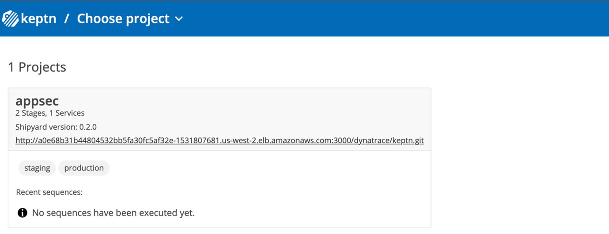
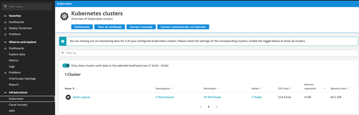

# Pre-Requisites 
- Web browser (see supported browsers: https://www.dynatrace.com/support/help/shortlink/web-ui-requirements#supported-browsers-for-dynatrace-ui)
- SSH Client such as Putty, iTerm, MobaXterm
- Text Editor

# Configure Server
1. Using your web browser and the credentials provided, login to the Dynatrace environment you have been granted access to. 
2. Navigate to the ‘Deploy Dynatrace’ screen and click ‘Start Installation’. 
3. Select Linux and click ‘Create token’ to generate a PaaS token. Copy the generated token to an empty text editor. 
4. Navigate to ‘Access tokens’ and click ‘Generate new token’. Enter a token name, and select the following scopes:  

    `entities.read`, `entities.write`, `logs.read`, `metrics.read`, `metrics.write`, `DataExport`, `LogExport`, `ReadConfig`, `WriteConfig`, `securityProblems.read`

5. Copy the newly generated API token to the same text editor as before. 
6. Access the bastion host via SSH using the provided credentials. 
   `ssh -l dtu_training 52.10.7.151`
   Note. Type ‘yes’ if you are asked to verify the SSH fingerprint: *Are you sure you want to continue connecting (yes/no/[fingerprint])? yes *
7. Clone the git repository:
   `git clone https://github.com/robinwyss/perform22-appsec.git`
8. Change to the directory of the cloned repository 
    `cd perform22-appsec`
9. Change the permissions of ‘setup-env.sh’ to make the script executable. 
    `chmod +x setup-env.sh`
10. Set the variables for the Dynatrace tenant, API token, and PaaS token using the following commands:
    ```
    export DT_TENANT=.. (URL of your environment) 
    export DT_API_TOKEN=.. (The API token you generated) 
    export DT_PAAS_TOKEN=.. (The PaaS token you generated) 
    ```
11. Run the setup script using the command below. The script will install and configure your server application. It may take up to 15 minutes before it is finished. 
    `./setup-env.sh`
    Note. If prompted to enter sudo password, use the same as password used to login. 
12. Once the script has finished, copy the details of the Keptn bridge and Git service into your text editor. An example output is as follows: 
    ```
    Installation Complete! 
    - Dynatrace Tenant: https://lgk93446.sprint.dynatracelabs.com 
    - Keptn Bridge: http://a93052e4c6cf04b368d4ecd27776bda9-170165908.us-west-2.elb.amazonaws.com/bridge 
    - User: keptn Password: 84TlvZuwhE32s8IQeNY0 
    - Git: a0e68b31b44804532bb5fa30fc5af32e-1531807681.us-west-2.elb.amazonaws.com:3000 
    - User: dynatrace Password: dynatrace  
    ```
13. Enter the URL for the Keptn bridge in your web browser. When prompted, enter the credentials that were created as part of the installation script. Once logged in, you will see a newly created project called ‘appsec’. 
    


14.  Check that the Kubernetes cluster is being monitored by navigating to the Kubernetes section in the Dynatrace environment. 
   
