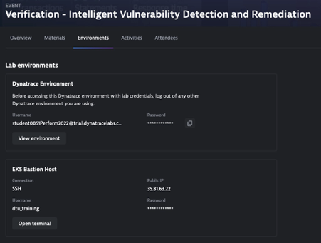
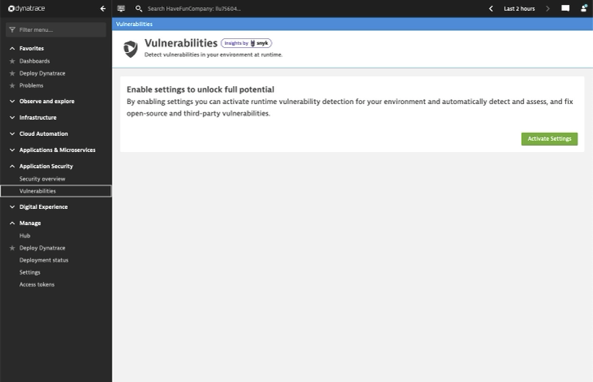
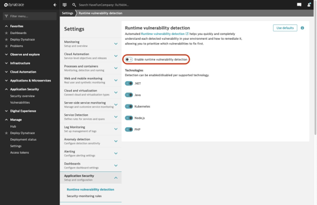
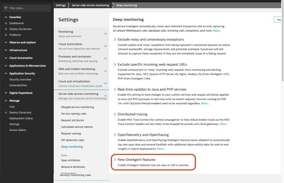
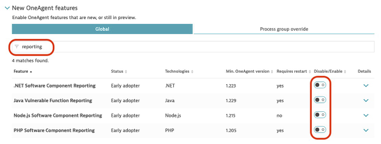

## Enable App Sec
### Verify access to environment
In Dynatrace University you will find the information on how to access the Environment required for the lab. Please make sure you can:
- Access the Dynatrace Environment using a web browser
- Connect to the bastion host using SSH

### Enable runtime vulnerability detection

To enable Application Security,  go to *Application Security > Vulnerabilities* and select Activate settings.

> Alternatively can also directly go to Settings > Application Security > Runtime vulnerability detection.

On the Runtime vulnerability detection page that opens, select *Enable runtime vulnerability detection*. 

> You also have the option to restrict it to certain technologies. 

### Enable OneAgent Features
After enabling runtime vulnerability detection, you need to enable OneAgent reporting software components from your running applications to Dynatrace.
- Under Settings > Service Side Service Monitoring > Deep Monitoring
- Scroll down to New OneAgent features and expand that section

Filter by *reporting* and enable the following features
- .NET Software Component Reporting
- Java Vulnerable Function Reporting
- Node.js Software Component Reporting
- PHP Software Component Reporting

