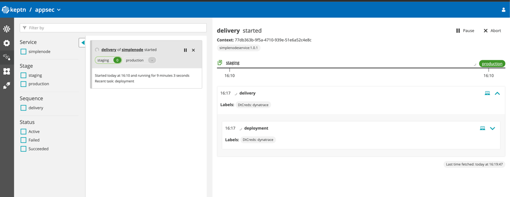
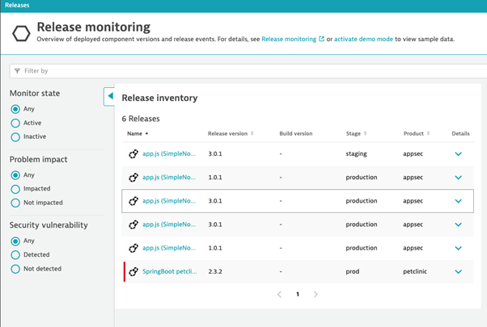
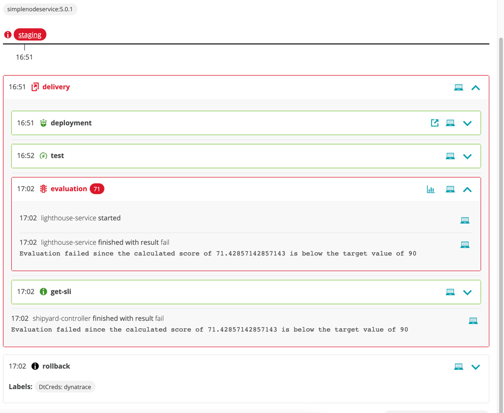
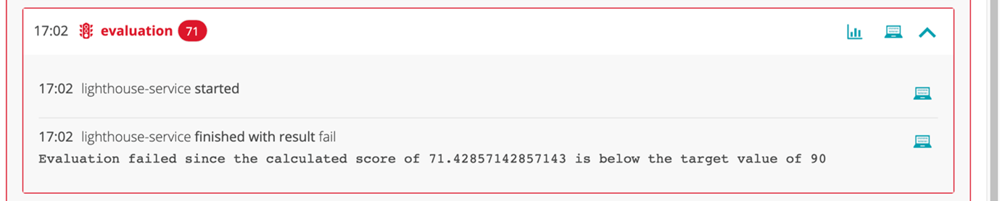
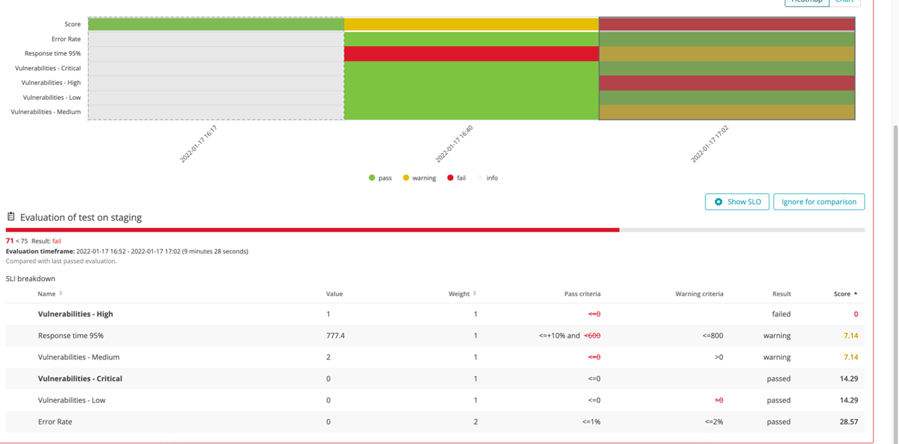
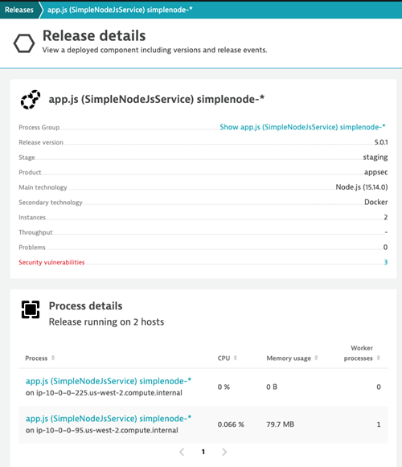
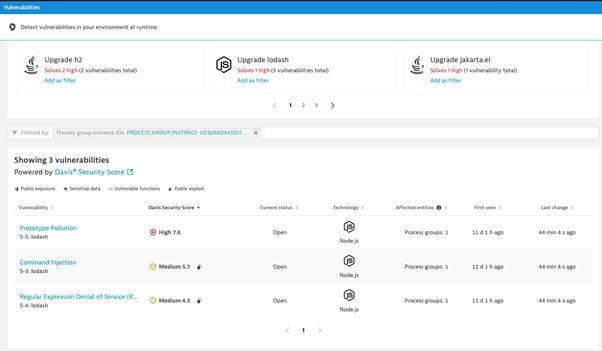

# Deploy First Build
Now that the environment is set up, we are ready to deploy the simplenode application. First, we will deploy a good build, without any service level indicators or objectives. Second, we will define both the service level indicators and service level objectives, followed by another deployment. Finally, we will deploy a build that contains vulnerabilities.

Each deployment may take between 10 and 20 minutes.

1.	To do deploy the first build, open the terminal window and enter the following command:
  
    `keptn trigger delivery --project=appsec --service=simplenode --image=docker.io/robinwyss/simplenodeservice --tag=1.0.1`

2.	Monitor the deployment status by opening the Sequences section in the Keptn bridge. After some time, the deployment status will change to succeeded. 

 

3.	Confirm that the deployment is being successfully monitored by Dynatrace by navigating to ‘Releases’ in your environment. You will see simplenode version 1.0.1 listed under the release inventory.

4.	Now that there is a basic build of the application deployed, we are going to add service-level indicators to define security problem metrics. To do this, paste the following into the terminal window from the ‘perform22-appsec’ directory.

    `keptn add-resource --project=appsec --stage=staging --service=simplenode --resource=./keptn/dynatrace/sli.yaml --resourceUri=dynatrace/sli.yaml`

5.	Now we need to define the service-level objectives. To do this, paste the following:

    `keptn add-resource --project=appsec --stage=staging --service=simplenode --resource=./keptn/slo.yaml --resourceUri=slo.yaml`

6.	With the SLI and SLOs defined, it is time to deploy another good build of the application. To do this, enter the following command in the terminal window:

    `keptn trigger delivery --project=appsec --service=simplenode --image=docker.io/robinwyss/simplenodeservice --tag=3.0.1`

7.	Confirm that the latest build has been deployed by checking the release inventory in the Dynatrace environment. It should include a simplenode version 3.0.1 in staging and production.
 
 

8.	Finally, we will deploy a version of the application that contains vulnerabilities. Do this, by entering the following command in the terminal:
  
    `keptn trigger delivery --project=appsec --service=simplenode --image=docker.io/robinwyss/simplenodeservice --tag=5.0.1`

9.	Monitor the deployment in Keptn. The application will be deployed into staging but will fail the evaluation due to breaching the defined SLOs and so will not be deployed into production. This is reflected in the below screenshot.

   

10.	Click on the bar chart icon within the evaluation section of Keptn as shown below. You will be taken to the evaluation board which provides a breakdown of the SLIs used in the evaluation.
 

11.	Check the release inventory in Dynatrace. The simplenode version 5.0.1 application will only be listed once in ‘staging’. This confirms that the deployment into production was halted. 

12.	Click on the simplenode version 5.0.1 release to view the release details.

13.	Click on the ‘3’ next to security vulnerabilities.

