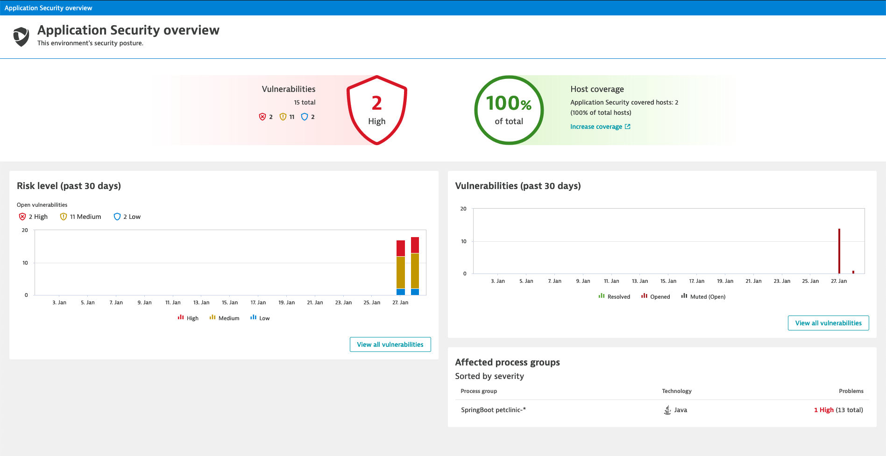
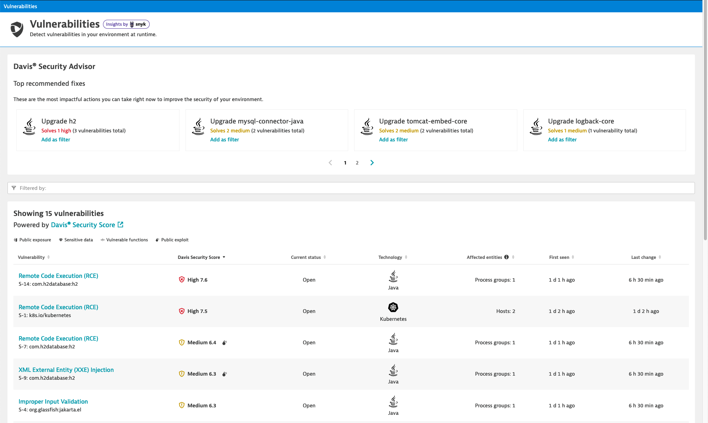
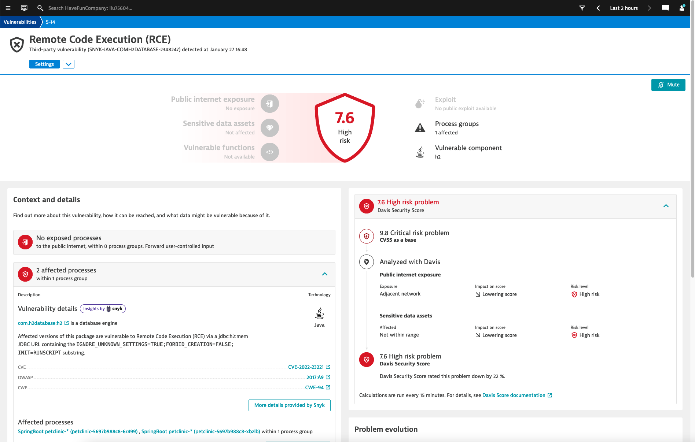
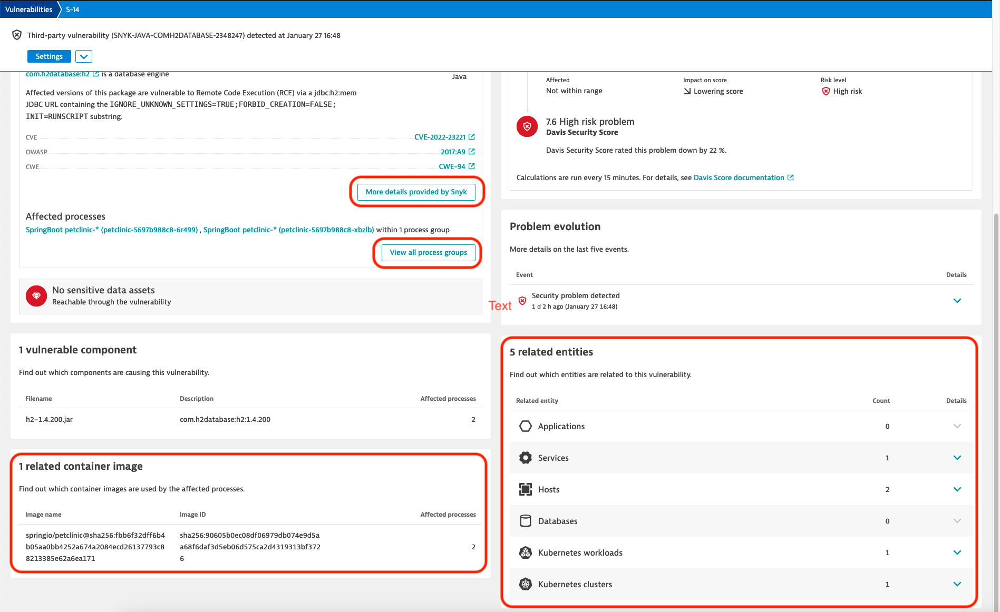

## Getting Familiar with App Sec
### Security Overview
Navigate to Application *Security > Security Overview*

Explore what is displayed ont he screen:
- How many vulnerabilities were discovered
- How many of each category?

> Since we just activated it, the evolution over the past 30 days doesn't show much. 

Click on **View all vulnerabilities**

### Vulnerabilities
On this screen you can see a list of all vulnerabilities that were discovered in the environment. 

Take a look at the list, try out the different filters, take a look at the findings from the Davis Security Advisor.

- How many vulnerabilities are affecting Kubernetes?
- Which library has the most critical vulnerabilities and should be updated with priority?
- A new critical vulnerability was discovered in Janaury *CVE-2022-23221* is this environment affected by it?

Click on the vulnerability with the highest score (first in the list).

### Vulnerability details
Here you can find all the details about the selected vulnerabilty

On the left side under *Context and details* you can see which processes are affected and get more details about the vulnerability. Using the links you can navigate to NVD, CWE, OWASP or Snyk to read more about it. Click on the *More details provided by Snyk* button to get more details. 

With *View all process groups* you get to the Remediation Tracking screen, that shows details about the affected process groups. 

At the bottom you can see the related entities and container images (if it is a containerized process)

- What is the version of the affected library
- To which version do you need to upgrade to resolve the vulnerability?
- On which hosts are the affected processes running?
- Under which namespace are the pods deployed in Kubernetes?