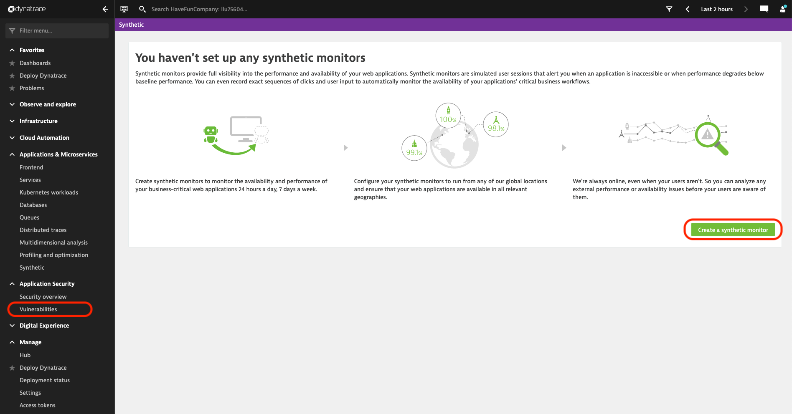
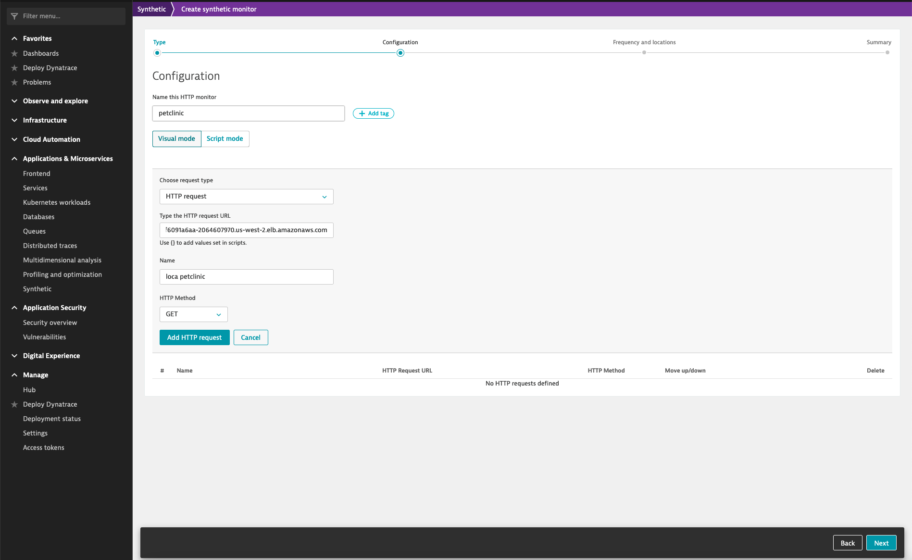
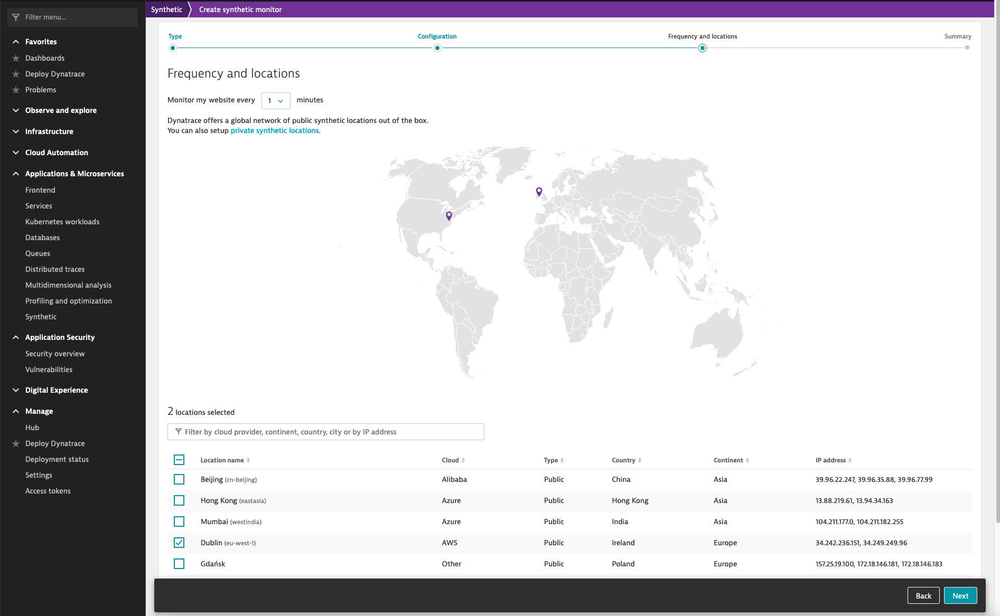

## Davis Security Score
### Simulating Public Exposure
In order to simulate Public Internet Exposure we take advantage of the Synthetic Monitors in Dynatrace to simulate requests from several locations.
- In Dynatrace Open Application & Microservice > Synthetic and create a new Synthetic Monitor

Choose: Create an HTTP Monitor

On the next screen, give it a name and click *Add HTTP request*
- type: HTTP request
- URL: url to the petclinic app 
- Name: load petclinic
- HTTP Method: GET

Click: *Add HTTP Request*

Review the settings and the click *Next*. On the requency and location screen select 
- Frequency: 1min
- Location: choose at least 2 locations

Click: *Next* and *Create HTTP Monitor*

> It will take a couple mintues until this is reflected under vunerabilities