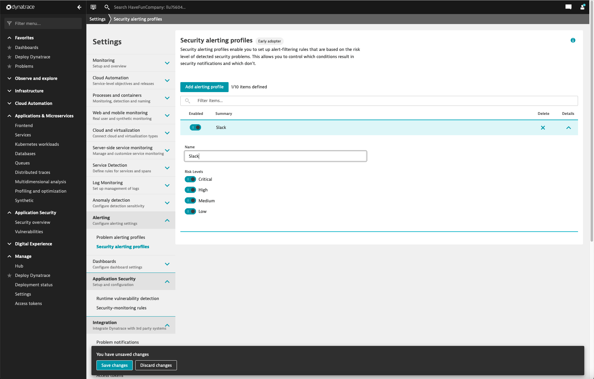
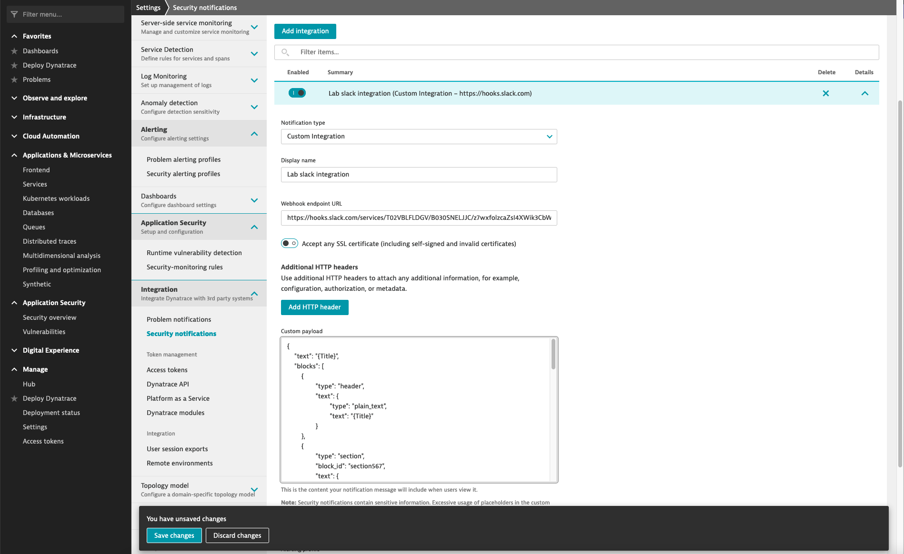

## Setup integration
In this exercise we will setup an integration with Slack in order to send a slack message when a new vulnerability has been found. 

# Create Security alerting profile
Security alerting profiles enable you to set up alert-filtering rules that are based on the risk level of detected security problems. This allows you to control which conditions result in security notifications and which don't.

Under *Settings > Alerting > Security alerting profiles* click *Add alerting profile*
- Name: Slack (or choose any name you like)
- Risk Levels: enable them all


Click *Save changed*

# Create Slack integration

Under *Settings > Integration > Security notifications* click *Add integration*

- Notification type: Custom integration
- Display name: Lab slack integration
- Webhook endpoint URL: You can find the URL on you Dashboard in Dynatrace
- Custom Payload: 
``` json
{
    "text": "{Title}",
    "blocks": [
    	{
    		"type": "header",
    		"text": {
    			"type": "plain_text",
    			"text": "{Title}"
    		}
    	},
    	{
    		"type": "section",
    		"block_id": "section567",
    		"text": {
    			"type": "mrkdwn",
    			"text": "<!here>\n{Description}\n\n<{SecurityProblemUrl}|{SecurityProblemId}>"
    		},
    		"accessory": {
    			"type": "image",
    			"image_url": "https://marvel-b1-cdn.bc0a.com/f00000000236551/dt-cdn.net/wp-content/uploads/2021/11/11103_RC_Blog_AppSec_800x450_FINAL-2-300x169.jpg",
    			"alt_text": "Haunted hotel image"
    		}
    	},
        {
			"type": "section",
			"fields": [
				{
					"type": "mrkdwn",
					"text": "*Public Exposure:*\n{Exposed}"
				},
				{
					"type": "mrkdwn",
					"text": "*Sensitive Data:*\n{SensitiveDataReachable}"
				},
				{
					"type": "mrkdwn",
					"text": "*Public Exploit:*\n{Exposed}"
				}
			]
		},
    	{
    		"type": "section",
    		"block_id": "section789",
    		"fields": [
    			{
    				"type": "mrkdwn",
    				"text": "*Davis Security Score*\n{DavisSecurityScore}"
    			}
    		]
    	}
    ]
}
```

- Alerting profile: Slack



Click *Save changes*
