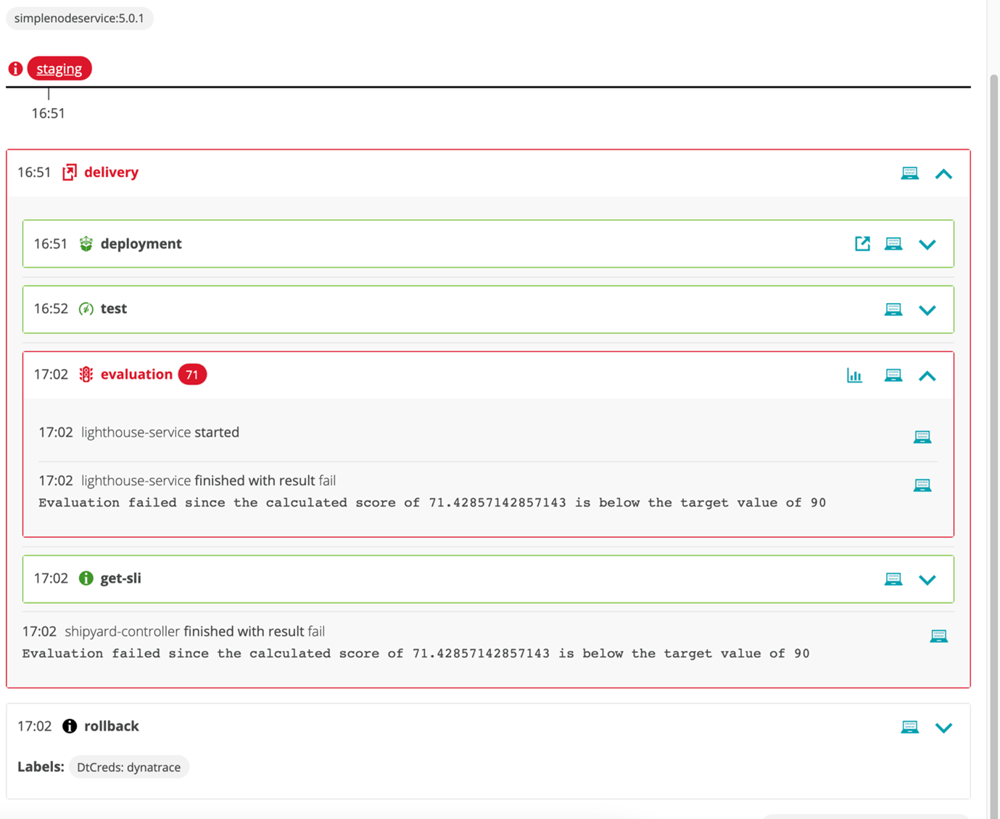
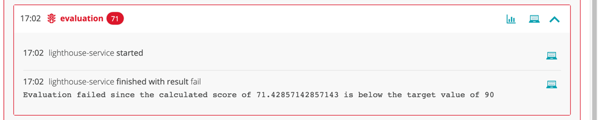
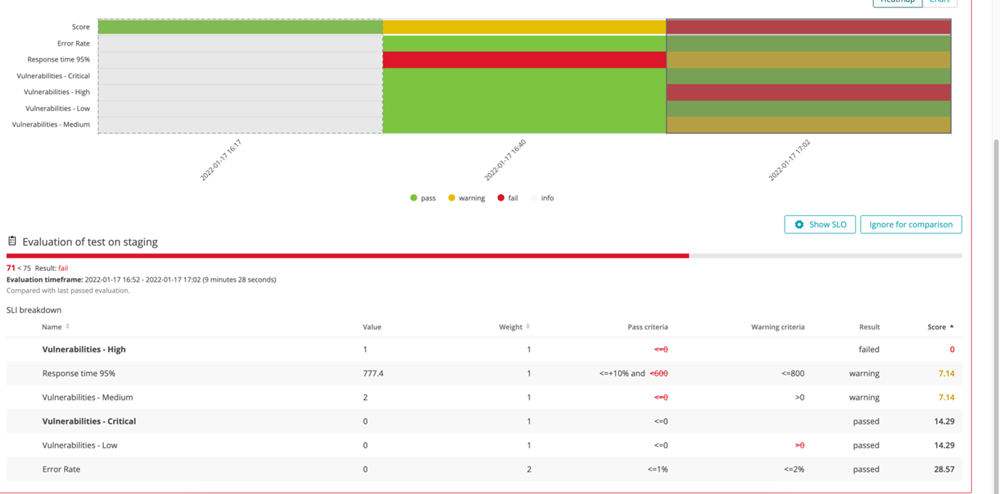
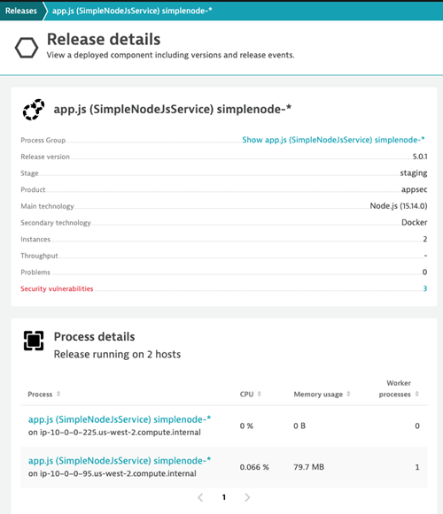
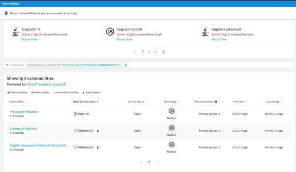

## Quality Gate
### Deploy Build with Vulnerabilities
For this example we will use a very simple Node.js application called simplenode, currently version 1.0.1 of the application is deployed. You can verify that by navigating to *Cloud Automation > Releases* in your Dynatrace environment. On that screen you will see simplenode 1.0.1 deployed in staging and production. If you go to the details of one of those releases, you will notive that there are no open Security Problems. 

> The project and service, including quality gates have already been setup. 

Now lets see what happens when we deploy a version with a vulnerability. 

1.	To do deploy the first build, open the terminal window and enter the following command:
  
    `keptn trigger delivery --project=appsec --service=simplenode --image=docker.io/robinwyss/simplenodeservice --tag=5.0.1`

2.	Monitor the deployment in Keptn. The application will be deployed into staging but will fail the evaluation due to breaching the defined SLOs and so will not be deployed into production. This is reflected in the below screenshot.

3.	Click on the bar chart icon within the evaluation section of Keptn as shown below. You will be taken to the evaluation board which provides a breakdown of the SLIs used in the evaluation.
 

4.	Check the release inventory in Dynatrace. The simplenode version 5.0.1 application will only be listed once in ‘staging’. This confirms that the deployment into production was halted. 

5.	Click on the simplenode version 5.0.1 release to view the release details.

6.	Click on the ‘3’ next to security vulnerabilities.

