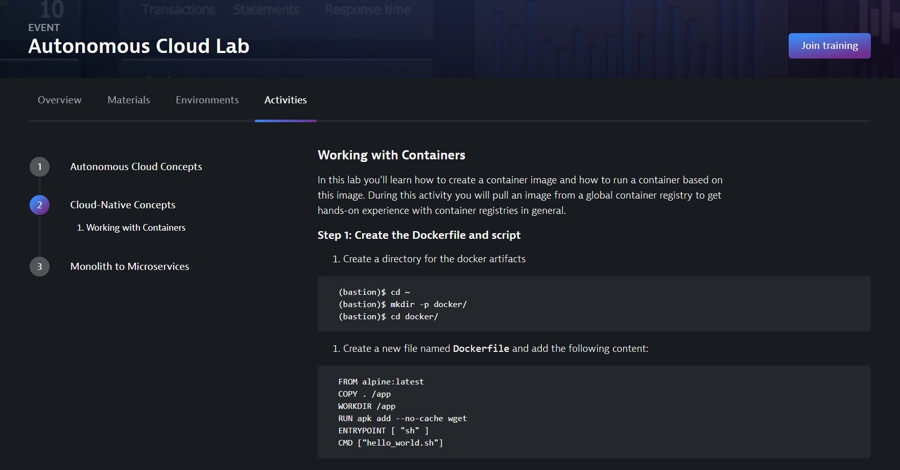

# Dynatrace University Lab Guide Example



Dynatrace University provides the ability to provide lab guides for training participants within their virtual classroom. This folder contains an example of the structure and formatting needed to generate these guides.

## Getting Started

1. Copy this folder as a starting point and then begin to structure your content.
1. Run the generator script to transform the content into the supported output. Dynatrace University currently supports JSON.

   ```bash
   $ node bin/generator.js
   ```

1. Run the server script to start a local web server to preview your generated lab guide.

   ```bash
   $ node bin/server.js
   ```

> Scripts provided in this repository are for internal use only

## Formatting

### Folder structure

All activities are organized in folders, each containing their own index.md. Activities support 1 set of sub activities if needed. Navigation is created automatically using the order that each folder comes in.

- 01_activity_one
  - index.md
- 02_activity_two
  - 01_subactivity_one
    - index.md
  - index.md
- 03_activity_three
  - index.md

### Headers

Each activity needs to have a **Heading 2** as the first line of the index.md. This will be used for the table of contents and navigation. From there, **Heading 3** and **Heading 4** paragraph styles can be used to organize your content.

### Images

All images can be included in the `assets/images` folder. When the lab guide is generated and applied, images will be uploaded to the CDN used by Dynatrace University.
