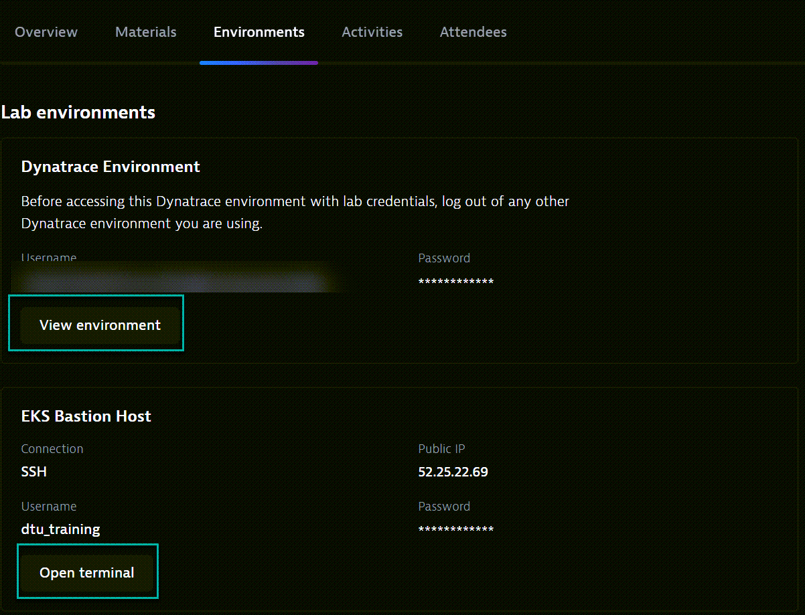
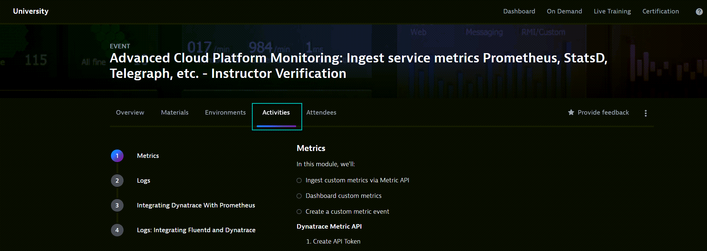

## Getting Started

### Tips when working in the virtural classroom

1. Use your mouse to right-click copy/paste. Keyboard ctrl+c or ctrl+v will not work.
2. The Bastion Host can be accessed by navigating to 'Environments' in the virtural classroom, clicking on 'Open Terminal'.
3. The Dynatrace envrionment can be accessed by navigating to 'Environments' in the virtural classroom, clicking on 'View Environment'.

4. You can open multiple terminals, by duplicating the 'https://university.dynatrace.com/' and opening the terminal.
5. The HoT session lab guides are found under 'Activities'

6. Editing files can be done by using 'vim'.
- Opening a file to edit : vim filename.ext
- Editing a file : 'i' key
- Closing a file without saving : 'esc' key > ':' key > type 'q!'
- Closing a file with saving: 'esc' key > ':' key > type 'wq!'