## Metrics

In this module, we'll:

- Ingest custom metrics via Metric API
- Dashboard custom metrics
- Create a custom metric event

## Dynatrace Metric API

### Create API Token

Navigate to `Access Tokens` via Dynatrace Menu : `Manage > Access Tokens`

- Click on Generate New Token

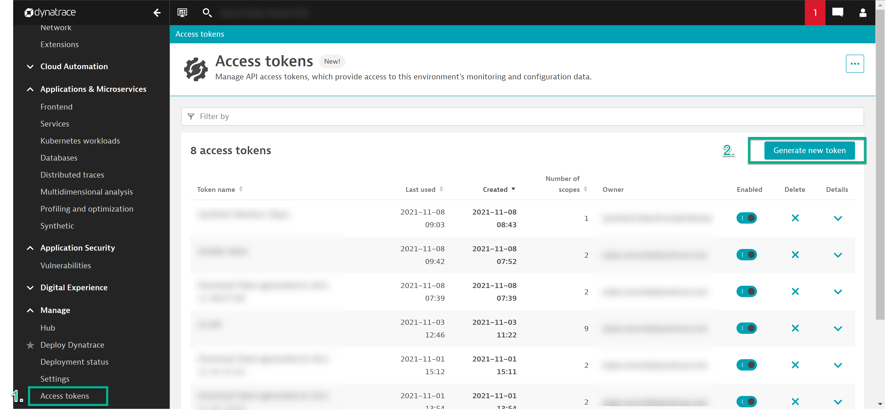

 -Set token name `Perform 2022`

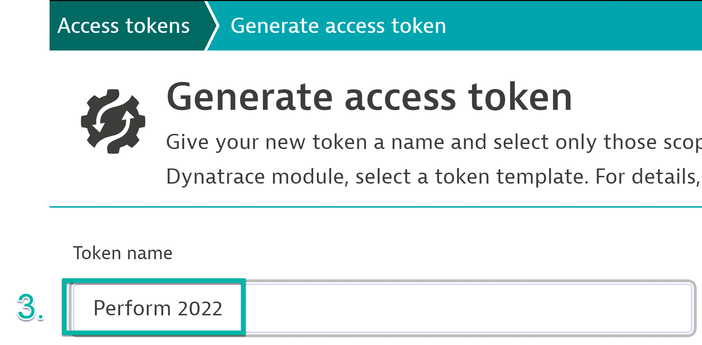

- Search for `metric`
- Select `Ingest Metrics` & `Read Metrics` & `Write Metrics` API v2

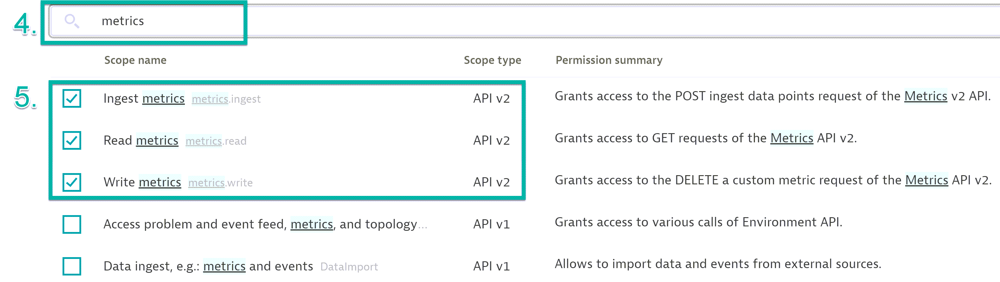

- Search for `logs`
- Select ` Ingest Logs` & `Read Logs` API v2

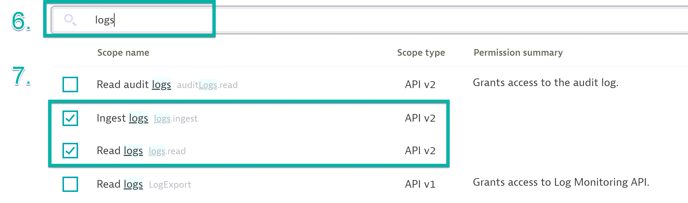

- Click on `Generate Token`
- Copy and Save Token to Notepad and click DONE.

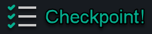

Please take a moment to mark the spreadsheet *Metrics - Created Tokens* column for your row with `done`.

### Send data to Dynatrace

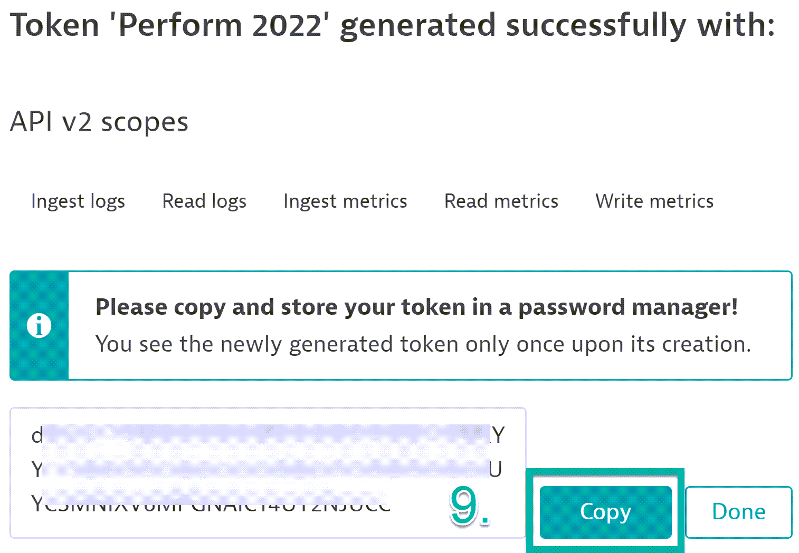

- POST Metric via API
- Navigate to `Environment API v2` via Account Icon

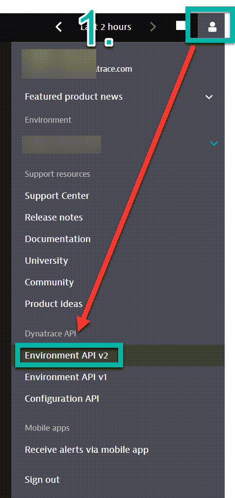

- Search for `Metrics` then select `POST` /metrics/ingest

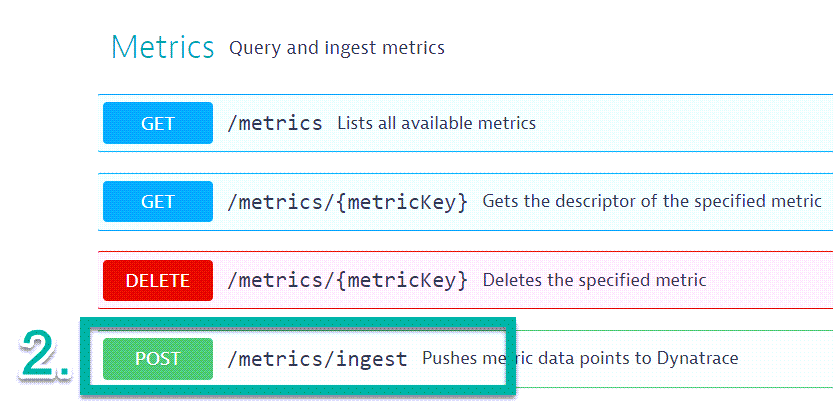

- Copy and Paste API-TOKEN via lock icon and authorize token

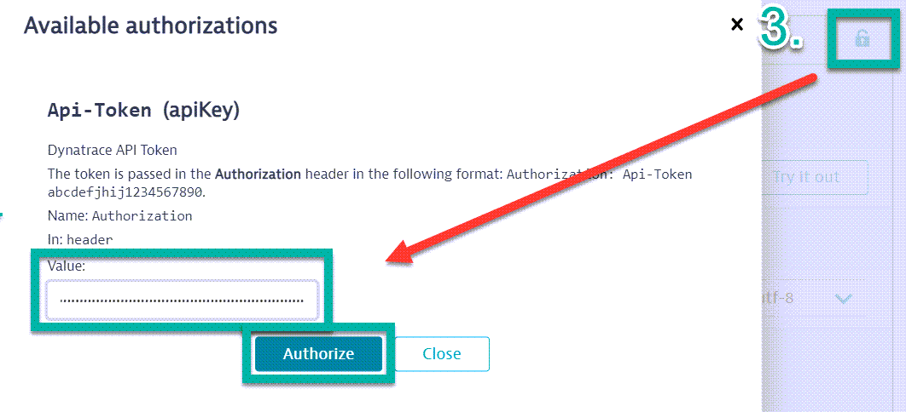

- Click on `Try it out`
- Copy and Paste the metrics below :

```bash
perform2022.mycool.metric,state=Wisconsin,country=US 22
perform2022.mycool.metric,state=Georgia,country=US 67
perform2022.mycool.metric,state=Maine,country=US 55
perform2022.mycool.metric,state=Nevada,country=US 42
```

- Click on execute

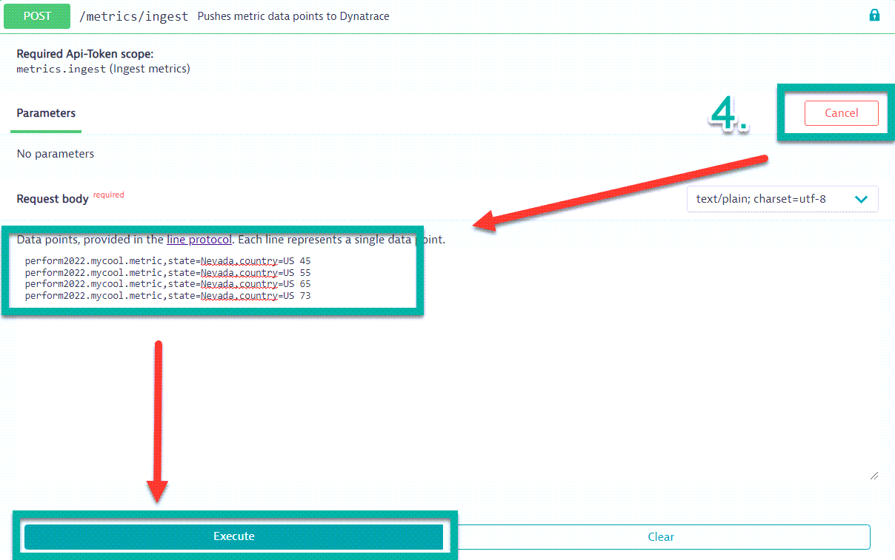

- Validate response

```bash
{
  "linesOk": 4,
  "linesInvalid": 0,
  "error": null,
  "warnings": null
}
```

Execute the command several more times over a couple minutes.

### Validate Metric in Dynatrace

- Navigate to `Metrics` via Dynatrace menu : `Observe and explore > Metrics`
- Search for `perform2022`

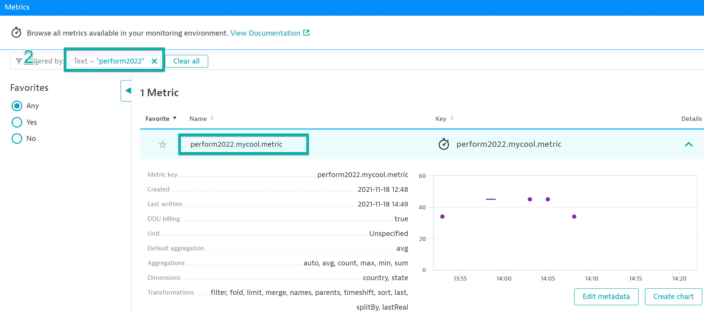

- It may take a minute, refresh screen if metric doesn't appear


Please take a moment to mark the spreadsheet *Metrics - Called API* column for your row with `done`.

### Dashboard Setup

- Create a Dashboard
- Navigate to `Dashboards` via Dynatrace menu: `Observe and explore > Dashboards`
- Click on `Create Dashboard`
- Set name to `Perform 2022 Dashboard`

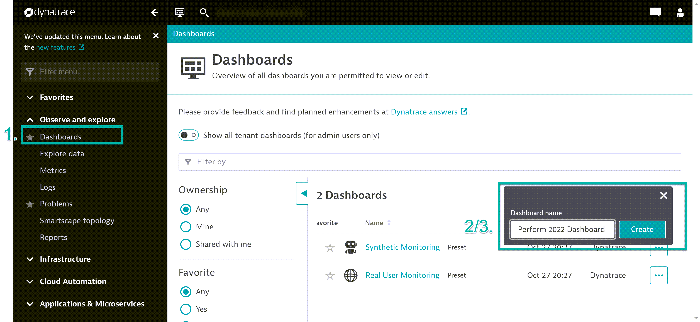

Pin Metric to Dashboard

> 1. Navigate to `Explore Data` via Dynatrace menu: `Observe and explore > Explore Data`
> 2. Search for `Perform2022`
> 3. Split by `Country` & `State`
> 4. Click on `Run query`

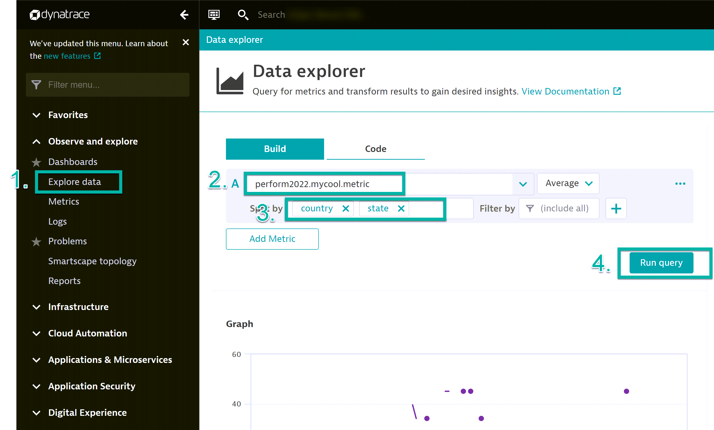

> 5. Click on `Pin to Dashboard`
> 6. Find the `Perform 2022 Dashboard` Dashboard
> 7. Set tile to `Perform 2022 Metric`
> 8. Click on `Pin`

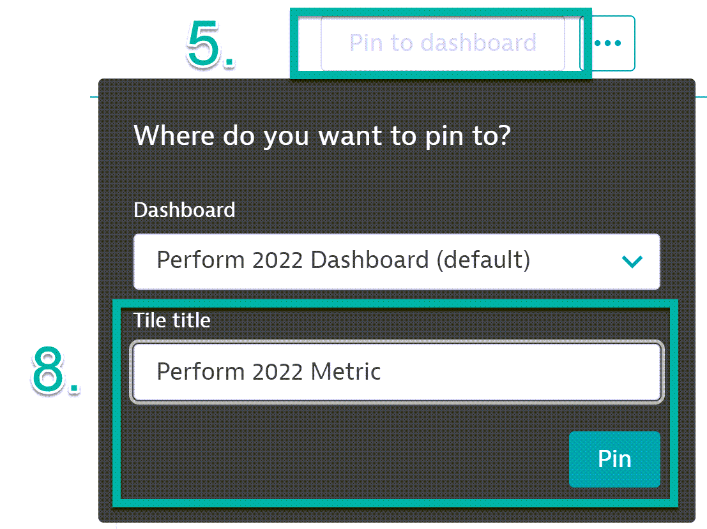

### Review Dashboard

Open `Perform 2022 Dashboard` and review `Perform 2022 Metric` tile

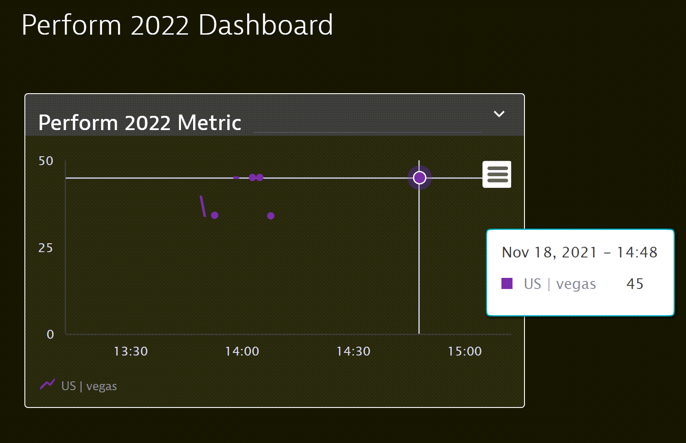

### Analyze and Alert

Create Custom Metric Event for Alerting.

> 1. Navigate to `Custom Events for alerting` via Dynatrace menu: `Manage > Settings > Anomaly Detection > Custom Events for Alerting`

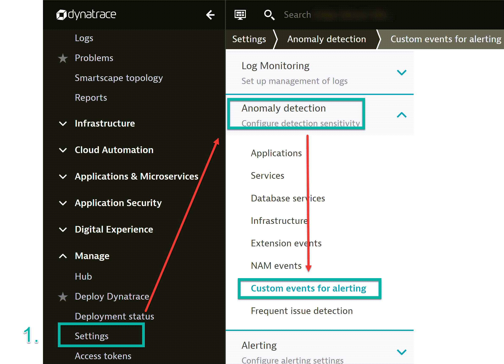

> 2. Click on `Create custom event for alerting`
> 3. Search for `Perform2022`

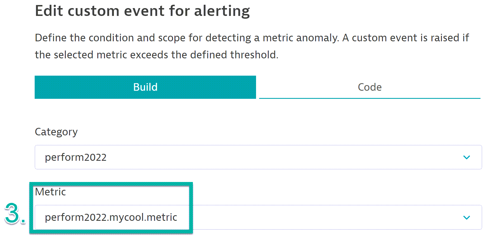

> 4. Set threshold to `30`
> 5. Set threshold time to `1` one minute in every `3` minute period

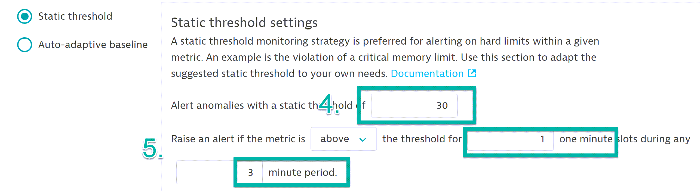

> 6. Set Event Description Title to `Perform2022 Custom Metric Event`
> 7. Set Severity to `Error`
> 8. Add the following to message

```bash
Dynamic Country: {dims:country}
Dynamic State: {dims:state}
```

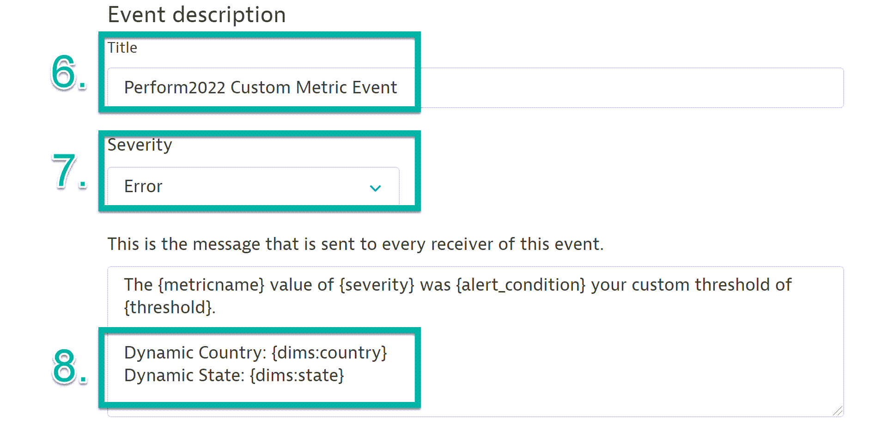

Generate Problem

> 1. Execute the command we used to ingest the `Perform2022.mycool.metric` several times over a couple minutes
> 2. Navigate to `Problems` via Dynatrace menu: `Observe and explore > Problems`
> 3. A new problem with the title `Perform2022 Custom Metric Event` will open

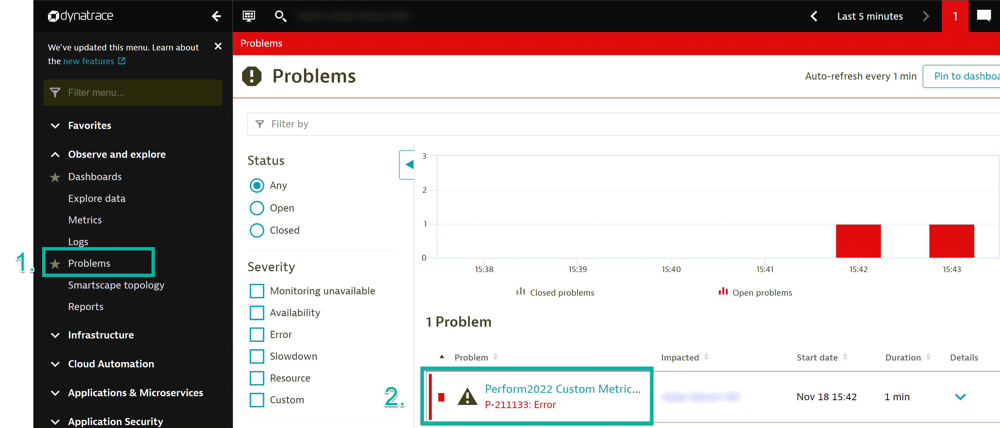

> 4. Click on the problem to open the problem card
> 5. Identify the dynamic `Country` and `Sate` value

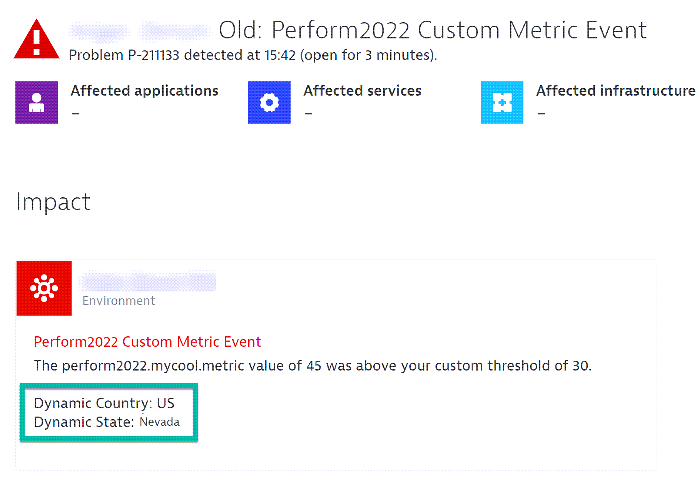


Please take a moment to mark the spreadsheet *Metrics - Created Dashboard & Alerts* column for your row with `done`.
