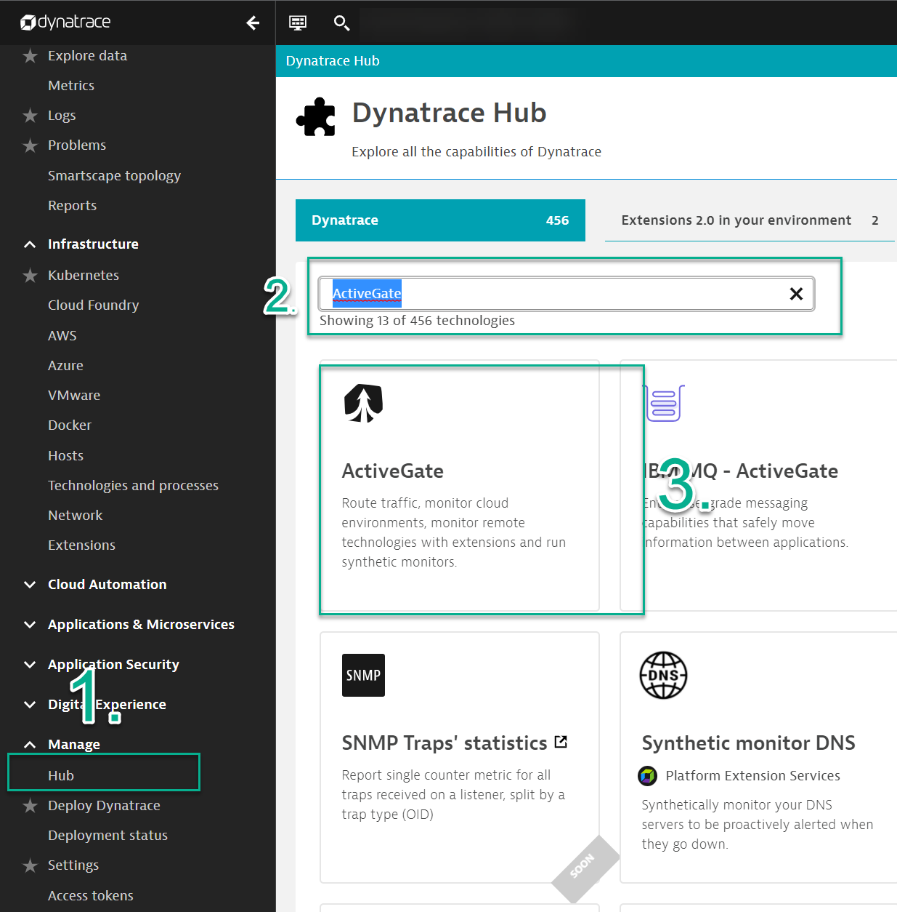

## Logs

In this module, we'll:
- Ingest logs using Log Ingestion API 
- Pin Log Query to dashboard
- Create Log Metric
- Create Log Event  

#### Log Ingest API
The Log Ingestion API allows for you to push custom logs into Dynatrace. 

1. Install/Deploy an ActiveGate

>Navigate to the Dynatrace HUB
> - Using the Dynatrace Menu -> Manage -> HUB
> - Search for and click on `ActiveGate`


The kubernetes cluster has already an active gate preinstalled.
To be able to interact with the Log ingest API you will ned to first get :
* the public ip of your environment
* the "technical" host of the active gate

To get this information run the following command
 ```
kubectl get ingress -n nondynatrace
 ```

2. POST Ingest Logs

> - Replace AG_DOMAIN with valid AG domain
> - Replace SaaS Tenant_ID with valid SaaS tenant ID
> - Replace HOST_ID with valid host id
> - Replace PG_ID with valid process group id
> - Replace ADDRESS with valid adress of you eks cluster
> - Replace APITOKEN with the value of you API TOKEN
```
curl -X POST -H "Host: activegate.domain.com" "https://<ADDRESS>:9999/e/<SaaS_Tenant_ID>/api/v2/logs/ingest" -H "accept: application/json; charset=utf-8" -H "Authorization: Api-Token <APITOKEN>" -H "Content-Type: application/json; charset=utf-8" -d "[{\"content\":\"example log content 1\",\"status\":\"error\",\"log.source\":\"/var/log/syslog\",\"dt.entity.host\":\"<HOST ID>\",\"dt.entity.process_group_instance\":\"<PG_ID>\"},{\"content\":\"example log content 2\",\"status\":\"info\",\"log.source\":\"/var/log/syslog\",\"dt.entity.host\":\"<HOST ID>\",\"dt.entity.process_group_instance\":\"<PG_ID>\"}]"
```
> - Example LOG JSON
```
[
    {
    "content": "example log content 1",
    "status" : "error",
    "log.source": "/var/log/syslog",
    "dt.entity.host" : "<HOST ID>",
    "dt.entity.process_group_instance": "<PG_ID>"
  },
  {
    "content": "example log content 2",
    "status" : "info",
    "log.source": "/var/log/syslog",
    "dt.entity.host" : "<HOST ID>",
    "dt.entity.process_group_instance": "<PG_ID>"
  }
]
```
### Dashboard


### Analyze and Alert
