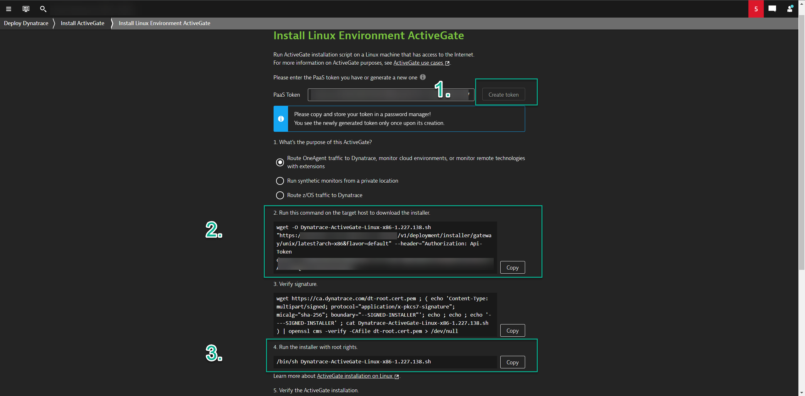

## Logs

In this module, we'll:
- Ingest logs using Log Ingestion API 
- Pin Log Query to dashboard
- Create Log Metric
- Create Log Event  

#### Log Ingest API
The Log Ingestion API allows for you to push custom logs into Dynatrace. 

1. Install/Deploy an ActiveGate

>Navigate to the Dynatrace HUB
> - Using the Dynatrace Menu -> Manage -> HUB
> - Search for and click on `ActiveGate`


>Click on `Install ActiveGate`


>Install ActiveGate
> - Select `Linux`
> - Click on `Generate Token`
> - Copy & Execute WGET Command into Linux Server
> - Copy & Execute Install Command into Linux Server


2. POST Ingest Logs

> - Replace AG_DOMAIN with valid AG domain
> - Replace SaaS Tenant_ID with valid SaaS tenant ID
> - Replace HOST_ID with valid host id
> - Replace PG_ID with valid process group id
```
curl -X POST "https://<AG_DOMAIN>:9999/e/<SaaS_Tenant_ID>/api/v2/logs/ingest" -H "accept: application/json; charset=utf-8" -H "Authorization: Api-Token API-TOKEN" -H "Content-Type: application/json; charset=utf-8" -d "[{\"content\":\"example log content 1\",\"status\":\"error\",\"log.source\":\"/var/log/syslog\",\"dt.entity.host\":\"<HOST ID>\",\"dt.entity.process_group_instance\":\"<PG_ID>\"},{\"content\":\"example log content 2\",\"status\":\"info\",\"log.source\":\"/var/log/syslog\",\"dt.entity.host\":\"<HOST ID>\",\"dt.entity.process_group_instance\":\"<PG_ID>\"}]"
```
> - Example LOG JSON
```
[
    {
    "content": "example log content 1",
    "status" : "error",
    "log.source": "/var/log/syslog",
    "dt.entity.host" : "<HOST ID>",
    "dt.entity.process_group_instance": "<PG_ID>"
  },
  {
    "content": "example log content 2",
    "status" : "info",
    "log.source": "/var/log/syslog",
    "dt.entity.host" : "<HOST ID>",
    "dt.entity.process_group_instance": "<PG_ID>"
  }
]
```
### Dashboard
### Analyze and Alert
