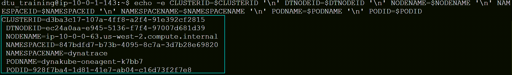
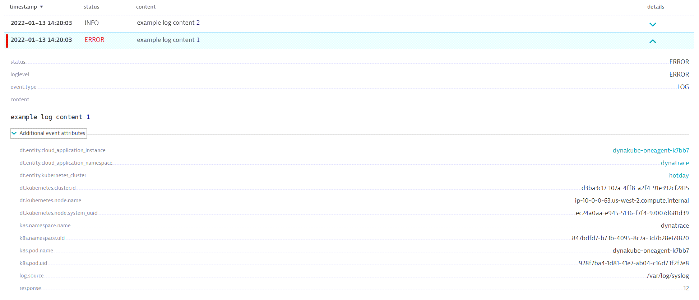
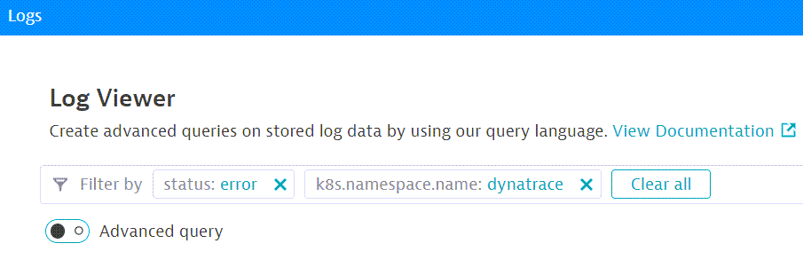
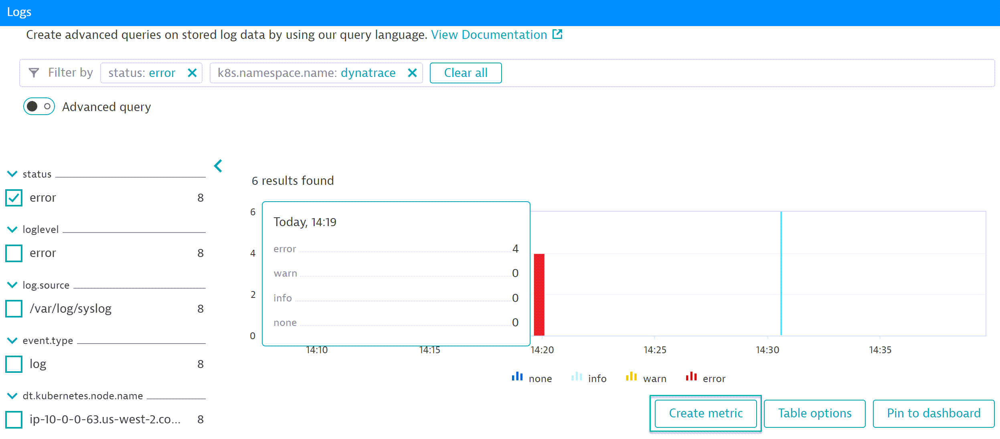
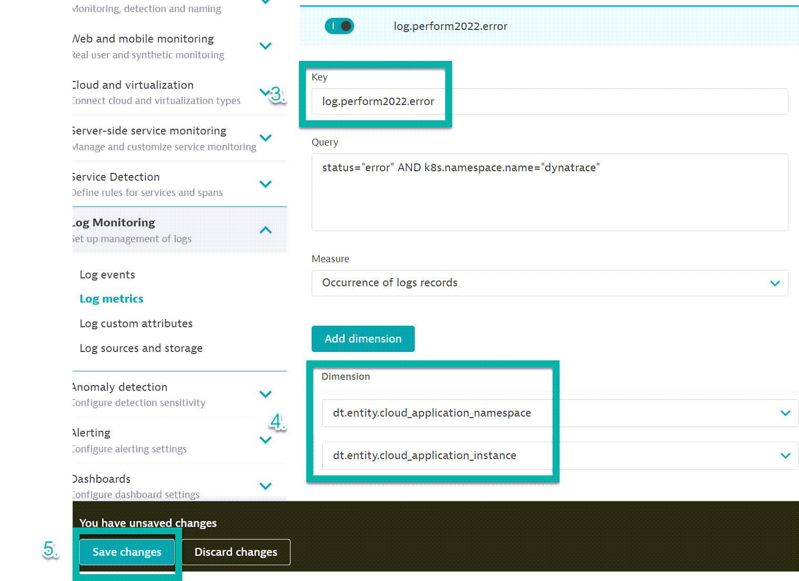
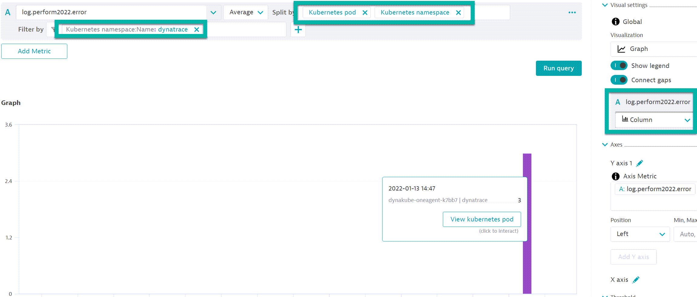
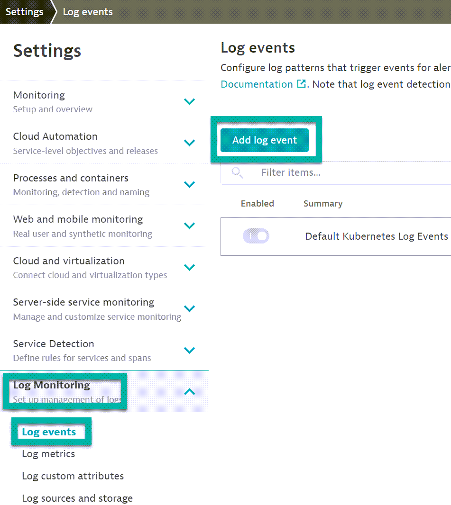
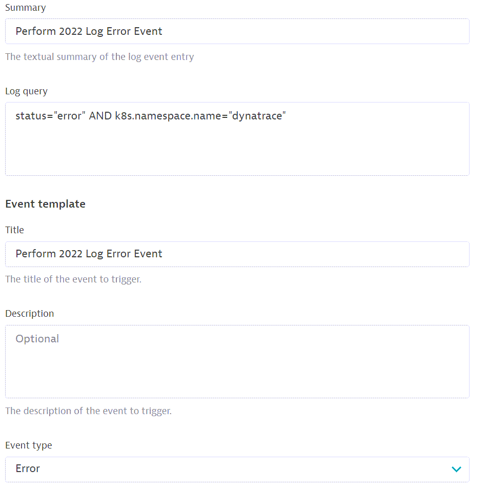
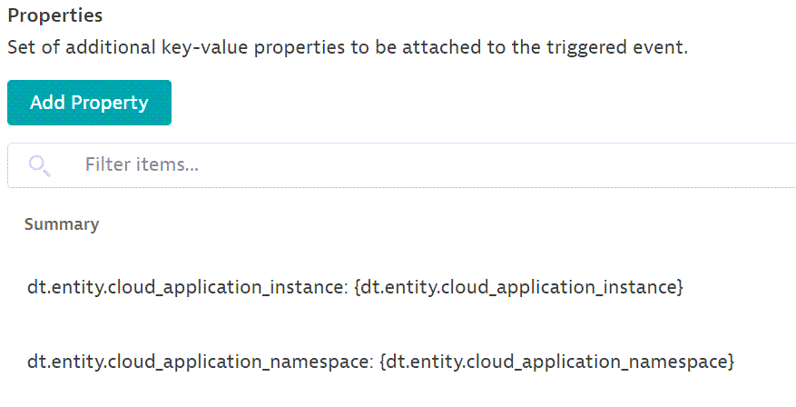
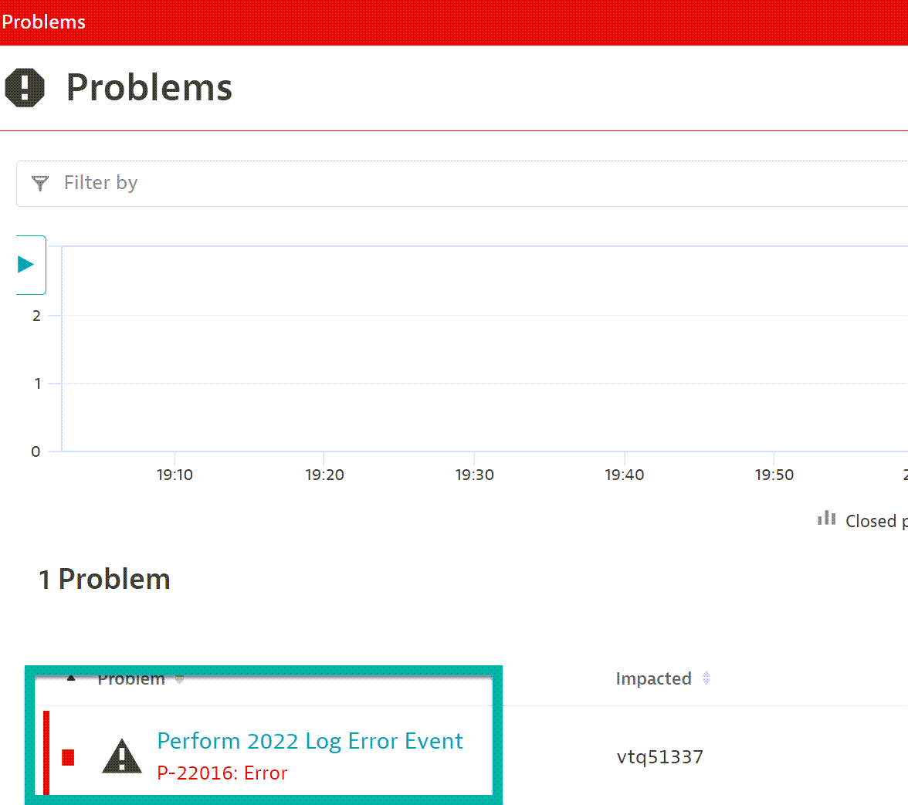

## Logs
In this module, we'll:
- Ingest logs using Log Ingestion API 
- Create Log Metric
- Create Log Event  

#### Log Ingest API
We will use an Early Adopted feature of the v2 Log Ingest to POST directly to Dynatace Environment.
Currently, v2 Log Ingest is via Active Gate.

1. Create envrionment variables on Bastion Host, open terminal.
Dynatrace will index the logs on dimensions 
> - Replace APITOKEN with the value of you API TOKEN
> - NODENAME dt.kubernetes.node.name 
> - NODE_ID dt.kubernetes.node.system_uuid 
> - CLUSTERID  dt.kubernetes.cluster.id 
> - NAMESPACEID  k8s.namespace.uid 
> - NAMESPACENAME  k8s.namespace.name 
> - PODNAME k8s.pod.name 
> - PODID k8s.pod.uid 

Copy and Paste the following  :
```
CLUSTERID=$(kubectl get namespace kube-system -o jsonpath='{.metadata.uid}')
DTNODEID=$(kubectl get nodes -o jsonpath='{.items[1].status.nodeInfo.systemUUID}')
NODENAME=$(kubectl get nodes -o jsonpath='{.items[1].metadata.name}')
NAMESPACEID=$(kubectl get ns -o jsonpath='{.items[1].metadata.uid}')
NAMESPACENAME=$(kubectl get ns -o jsonpath='{.items[1].metadata.name}')
PODNAME=$(kubectl get pods -n $NAMESPACENAME -o jsonpath='{.items[1].metadata.name}')
PODID=$(kubectl get pods -n $NAMESPACENAME -o jsonpath='{.items[1].metadata.uid}')
```

> 2. Validate the environment variables:
```
echo -e CLUSTERID=$CLUSTERID '\n' DTNODEID=$DTNODEID '\n' NODENAME=$NODENAME '\n' NAMESPACEID=$NAMESPACEID '\n' NAMESPACENAME=$NAMESPACENAME '\n' PODNAME=$PODNAME '\n' PODID=$PODID
```


> 3. POST Log to Dynatrac via Log Ingest API
- Replace {YOUR-ENV-DOMAIN} with your Dynatrace environment Domain
- Replace {API-TOKEN} with the API token created in Metric HoT
```
curl -iX POST "{YOUR-ENV-DOMAIN}/api/v2/logs/ingest" -H "accept: application/json; charset=utf-8" -H "Authorization: Api-Token {API-TOKEN}" -H "Content-Type: application/json; charset=utf-8" -d '[{"content":"example log content 1","status":"error","log.source":"/var/log/syslog","dt.kubernetes.node.name":"'"$NODENAME"'","dt.kubernetes.node.system_uuid":"'"$DTNODEID"'","dt.kubernetes.cluster.id":"'"$CLUSTERID"'","k8s.namespace.uid":"'"$NAMESPACEID"'","k8s.namespace.name":"'"$NAMESPACENAME"'","k8s.pod.name":"'"$PODNAME"'","k8s.pod.uid":"'"$PODID"'","response":12},{"content":"example log content 2","status":"info","log.source":"/var/log/syslog","dt.kubernetes.node.name":"'"$NODENAME"'","dt.kubernetes.node.system_uuid":"'"$DTNODEID"'","dt.kubernetes.cluster.id":"'"$CLUSTERID"'","k8s.namespace.uid":"'"$NAMESPACEID"'","k8s.namespace.name":"'"$NAMESPACENAME"'","k8s.pod.name":"'"$PODNAME"'","k8s.pod.uid":"'"$PODID"'","response":1}]'
```

> 4. Validate Logs in Dynatrace Environment
- Navigate to Dynatrace Envrionment > Logs (refresh page)



### Create a metric out of a logs
- We will create a metric out of logs to be viewed in a dashboard.

> 1. In the Log Viewer, add the following filters:
```
status: error
k8s.namespace.name: dynatrace
```



> 2. Click on `Create Metric`



> 3. Set key to:
```
log.perform2022.error
```

> 4. Add the following dimensions:
```
dt.entity.cloud_application_namespace
dt.entity.cloud_application_instance
```

> 5. Click on `Save Changes`



> 6. Execute the Log Ingest POST (x3)

> 7. Navigate to `Explore Data` and search for:
```
log.perform2022.error
```
- Add the following `splitBy`:
```
kubernetes pod
kuberenetes namespace
```
- Add the following `filterBy`:
```
Kubernetes namespace:Name: Dynatrace
```



### Analyze and Alert
- We will create a Log Event that will generate problems.

> 1. Navigate to `Settings` > `Log Monitoring` > `Log Events` and Click on `Add Log Event`



> 2. Set the following values:
```
Summary: Perform 2022 Log Error Event

Log Query: status="error" AND k8s.namespace.name="dynatrace"

Title: Perform 2022 Log Error Event

Event Type: Error
```



> 3. Add the following properties:
```
dt.entity.cloud_application_instance: {dt.entity.cloud_application_instance}

dt.entity.cloud_application_namespace: {dt.entity.cloud_application_namespace}
```



> 4. Execute the Log Ingest POST (x3)

> 5. Navigate to `Problems` (refresh page) and look for the `Perform 2022 Log Error Event`

