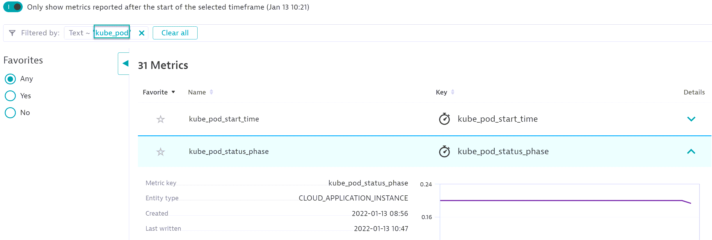

## Integrating Dynatrace With Prometheus

In this module we'll learn how to integrate Dynatrace with Prometheus in Kubernetes.

### Step 1: Ingest metrics exposed by one prometheus exporter

Let's report metrics from the node exporter and the kube state metric
#### a. Node Exporter
Let's identify the port exposed by the Node Exporter. The node exporter is deployed as a Daemonset by the Prometheus Operator
Let's describe the Daemonset , to indentify the prometheus port

```
DaemonsetID=$(kubectl get ds --output=jsonpath={.items..metadata.name} --selector=component=node-exporter)
kubectl describe ds $DaemonsetID
 ```
To validate the prometheus settings we can test the url of the prometheus exporter.
We can use port-forward to expose on the bastion host the port of the exporter :
```
kubectl port-forward <PODID> PORT:PORT
```
Then you can open another terminal and run:
```
curl http://localhost:PORT/metrics
```

To be able to let the Active Gate scrap the prometheus metric from the node exporter, we need to :
- create a Service attach to the node exporters
- add the Prometheus Annotation

In the bastion host, a template file, `serice_nodexporter_template.yaml` is available.
update the Yaml file by defining the right port.
Replace the value TO_DEFINE with the port of the node exporter
Deploy the new Service :
```
 kubectl apply -f Hotday_Script/prometheus/serice_nodexporter_template.yaml
 ```


#### b. Kube State Metrics
  Similar to the Node exporter update the template file : `prometheus/service_template.yaml`

Let's describe the deployment of kube state metric:
```
 DeploymentID=$(kubectl get deployment --output=jsonpath={.items..metadata.name} --selector=app.kubernetes.io/name=kube-state-metrics)
 kubectl describe deployment $DeploymentID
```

Deploy the new Service :
```
 kubectl apply -f Hotday_Script/prometheus/service_template.yaml
```

### Step 2 : Ingest metrics exposed by the nginx prometheus exporter
Similar to the Step 1 , we want to ingest metrics from the nginx ingress controller.
In the default namespace, nginx ingress controller has been deployed.
Describe the nginx ingress controller to identify the port exposing the prometheus metrics.

Update the template file, `prometheus/service__nginx_template.yaml` by replacing TO_DEFINE with the right port

Deploy the new Service :
```
 kubectl apply -f Hotday_Script/prometheus/service__nginx_template.yaml
```

### Step 3 : Use the metric expression to visualize the new ingested metrics

#### Metrics
All the ingested metrics can be found in "Metrics".
Open `Metrics`, and search for `kube_pod`


By expending , the desired metric you can see all the available dimensions.
#### Data explorer

##### Kube proxy
Let's create a pie chart showing the ditribution of the pod Phases.
In tha Data explorer search for `kube_pod_status_phase`.


Create a pie chart splitting the value by the dimension `phase`


##### Nginx ingress controller

The current environment use a Nginx Ingress controller to expose the following services out of the cluster:
- the active gate ( to be able to utilize the api) though the service `fluentd-activegate` located in the namespace `nondynatrace`
- the hipster-shop through the service `frontend` located in the namespace `hipster-shop`

To understand the health of our ingress, it would be useful to be able to split any of the statistics by :
- the service name
- the name of the ingress
- the namespace of the ingress

Let's create a graph showing the `http_request_total`

In the Data explorer search for `nginx_ingress_nginx_http_requests_total.count`


Do you have the right dimension to split the statistic by service name?


