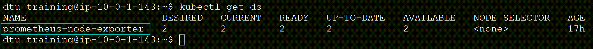
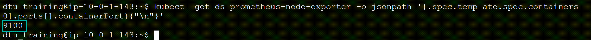
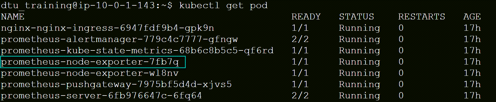
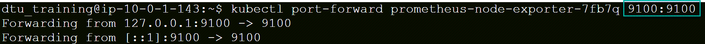
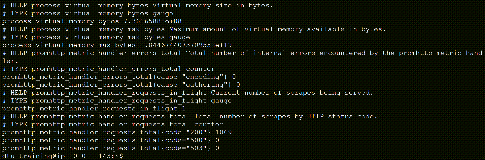
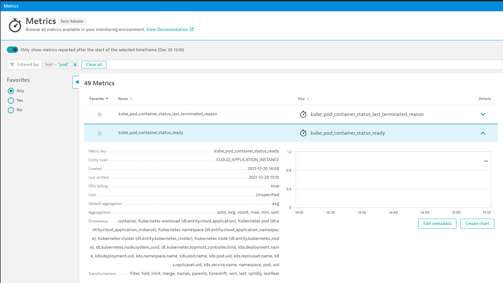
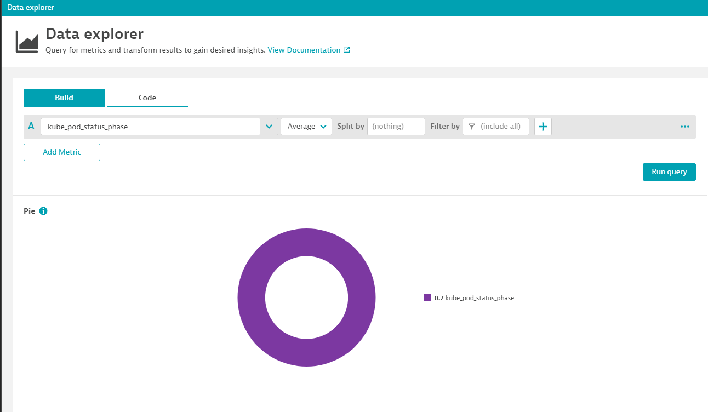
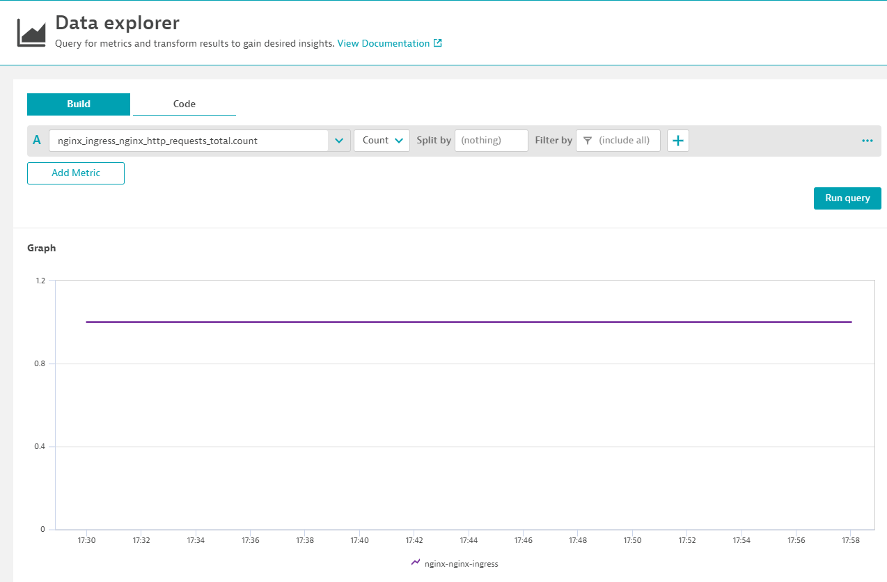

## Integrating Dynatrace With Prometheus

In this module we'll learn how to integrate Dynatrace with Prometheus in Kubernetes.

- Setup Node Exporter for Metric Ingest
- Setup ActiveGate to scrape Prometheus Metrics
- Setup Kube-state Metric Exporter for Metric Ingest
- Setup Nginx Exporter for Metric Ingest
- Visualize Metric in Dynatrace

### Setup Prometheus Exporter For Metric Ingest
Let's explore how the promethues-node-exporter is exposing metrics.
There are some things we need to gather from the exporter:
- Port
- Metric Url Endpoint

#### Step 1: Identifying Port - Node Exporter
Let's identify the port exposed by the Node Exporter. 
The node exporter is deployed as a Daemonset by the Prometheus Operator.
> 1. Run the kubectl command:
- This will get all the daemonsets in the default namespace.
```
kubectl get ds
 ```


> 2. Copy and replace the name of the Node Exporter DS and run the kubectl command:
- This will get the container port for the Prometheus-node-exporter daemonset.
```
kubectl get ds {DS NAME} -o jsonpath='{.spec.template.spec.containers[0].ports[].containerPort}{"\n"}'
```


#### Step 2: Validate the prometheus metrics by exposing exporter port to localhost.
> 1. Run the kubectl command:
- This will get all pods in the default namespace.
```
Kubectl get pod
```


> 2. Copy the name of one of the prometheus-node-exporter pods, replace the {POD NAME} and {PORT} with the port identified above and run the command:
- This will expose the port to the host to be accessible on localhost.
```
	kubectl {POD NAME} {PORT}:{PORT}
```



#### Step 3: Test and identifying prometheus metric url endpoint
The Metric Url is typically /metrics. In our case it is /metrics.
> 1. Duplicate the 'https://university.dynatrace.com/' tab, this should open another instance of the virtural classroom. Then terminal into the Bastion Host. Run the following curl command:
```
curl http://localhost:PORT/metrics
```

- The result should be a large output of available node exporter metrics:


### Setup ActiveGate to scrape Prometheus-node-exporter Metrics
To be able to let the Active Gate scrape the prometheus metric from the node exporter, we need to :
- define the Dynatrace Annotations 
- create a Service attach to the node exporters

> 1. Use `vim` to edit the following file - `hotday_script/prometheus/serice_nodexporter_template.yaml`:
```
vim hotday_script/prometheus/serice_nodexporter_template.yaml
```
> 2. Update the annotation section replacing the value of 'metric.dynatrace.com/port' annotation with the correct port, current value is TO_DEFINE.

- Before

```
metadata:
  annotations:
    metrics.dynatrace.com/path: "/metrics"
    metrics.dynatrace.com/port: "TO_DEFINE"
    metrics.dynatrace.com/scrape: "true"
```
- After (replace TO_DEFINE with port identified)

```
metadata:
  annotations:
    metrics.dynatrace.com/path: "/metrics"
    metrics.dynatrace.com/port: "9100"
    metrics.dynatrace.com/scrape: "true"
```


> 3. Deploy the new Service :
```
kubectl apply -f Hotday_Script/prometheus/serice_nodexporter_template.yaml
```


### Setup Kube-state Metric Exporter for Metric Ingest
Similar steps to 'Setup Node Exporter for Metric Ingest'

> 1. Run the describe kubectl command to identify port: 
```
kubectl get deployment prometheus-kube-state-metrics -o jsonpath='{.spec.template.spec.containers[0].ports[].containerPort}{"\n"}'
```

> 2. Use vim to update the `hotday_script/prometheus/service_template.yaml` file with the correct port
```
vim hotday_script/prometheus/service_template.yaml

replace TO_DEFINE with port identified in 1.
```

> 3. Deploy the new Service :
```
kubectl apply -f Hotday_Script/prometheus/service_template.yaml
```

### Setup Nginx Exporter for Metric Ingest
Similar to above, we want to ingest metrics from the nginx ingress controller.
In the default namespace, nginx ingress controller has been deployed.

> 1. Run the describe kubectl command to identify port: 
```
kubectl get deployment nginx-nginx-ingress -o jsonpath='{.spec.template.spec.containers[0].ports[].containerPort}{"\n"}'
```

> 2. Use vim to update the `hotday_script/prometheus/service__nginx_template.yaml` file with the correct port
```
vim hotday_script/prometheus/service__nginx_template.yaml

replace TO_DEFINE with port identified in 1.
```

> 3. Deploy the new Service :
```
kubectl apply -f hotday_script/prometheus/service__nginx_template.yaml
```

### Visualize Metric in Dynatrace

#### Metrics
All the ingested metrics can be found in "Metrics".
Open `Metrics`, and search for `kube_pod`


By expending , the desired metric you can see all the available dimensions.
#### Data explorer

##### Kube proxy
Let's create a pie chart showing the ditribution of the pod Phases.
In tha Data explorer search for `kube_pod_status_phase`.


Create a pie chart splitting the value by the dimension `phase`


##### Nginx ingress controller

The current environment use a Nginx Ingress controller to expose the following services out of the cluster:
- the active gate ( to be able to utilize the api) though the service `fluentd-activegate` located in the namespace `nondynatrace`
- the hipster-shop through the service `frontend` located in the namespace `hipster-shop`

To understand the health of our ingress, it would be useful to be able to split any of the statistics by :
- the service name
- the name of the ingress
- the namespace of the ingress

Let's create a graph showing the `http_request_total`

In the Data explorer search for `nginx_ingress_nginx_http_requests_total.count`


Do you have the right dimension to split the statistic by service name?


