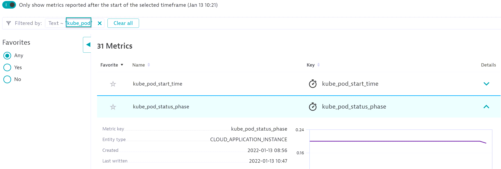

## Prometheus

### Integrating Dynatrace With Prometheus

In this module we'll learn how to integrate Dynatrace with Prometheus in Kubernetes.

- Setup Node Exporter for Metric Ingest
- Setup ActiveGate to scrape Prometheus Metrics
- Setup Kube-state Metric Exporter for Metric Ingest
- Setup Nginx Exporter for Metric Ingest
- Visualize Metric in Dynatrace

### Setup Prometheus Exporter For Metric Ingest

Let's explore how the promethues-node-exporter is exposing metrics.
There are some things we need to gather from the exporter:

- Port
- Metric Url Endpoint

#### Step 1: Identifying Port - Node Exporter

Let's identify the port exposed by the Node Exporter.
The node exporter is deployed as a Daemonset by the Prometheus Operator.

Run the kubectl command to get all daemonsets:

```bash
kubectl get ds
 ```


If the name matches prometheus-node-exporter run the command below as written.  If not, update the name to match before executing.

```bash
kubectl get ds prometheus-node-exporter -o jsonpath='{.spec.template.spec.containers[0].ports[].containerPort}{"\n"}'
```


#### Step 2: Validate the prometheus metrics by exposing exporter port to localhost.

Run the kubectl command:

```bash
Kubectl get pod
```


Copy the name of one of the prometheus-node-exporter pods, replace the {POD NAME} and {PORT} with the port identified above and run the command:

- This will expose the port to the host to be accessible on localhost.
  
```bash
kubectl port-forward {POD NAME} {PORT}:{PORT}
```


#### Step 3: Test and identifying prometheus metric url endpoint

The Metric Url is typically /metrics. In our case it is /metrics.
Duplicate the 'https://university.dynatrace.com/' tab, this should open another instance of the virtural classroom. Then terminal into the Bastion Host. Run the following curl command:

```bash
curl http://localhost:PORT/metrics
```


The result should be a large output of available node exporter metrics:


Please take a moment to mark the spreadsheet *Prometheus - Test Metric Endpoint* column for your row with `done`.

#### Setup ActiveGate to scrape Prometheus-node-exporter Metrics

To be able to let the Active Gate scrape the prometheus metric from the node exporter, we need to :

- define the Dynatrace Annotations
- create a Service attach to the node exporters

Use `vim` to edit the following file - `hotday_script/prometheus/serice_nodexporter_template.yaml`:

```bash
vim ~/hotday_script/prometheus/serice_nodexporter_template.yaml
```

Update the annotation section replacing the value of 'metric.dynatrace.com/port' annotation with the correct port, current value is TO_DEFINE.

##### Before

```bash
metadata:
  annotations:
    metrics.dynatrace.com/path: "/metrics"
    metrics.dynatrace.com/port: "TO_DEFINE"
    metrics.dynatrace.com/scrape: "true"
```

##### After (replace TO_DEFINE with port identified)

```bash
metadata:
  annotations:
    metrics.dynatrace.com/path: "/metrics"
    metrics.dynatrace.com/port: "9100"
    metrics.dynatrace.com/scrape: "true"
```

Deploy the new Service :

```bash
kubectl apply -f ~/hotday_script/prometheus/serice_nodexporter_template.yaml
```

#### Setup Kube-state Metric Exporter for Metric Ingest

Similar steps to 'Setup Node Exporter for Metric Ingest'

Run the describe kubectl command to identify port:

```bash
kubectl get deployment prometheus-kube-state-metrics -o jsonpath='{.spec.template.spec.containers[0].ports[].containerPort}{"\n"}'
```

Identify the pod name of the kube-state metric pod, replace the {POD NAME} and {PORT} with the port identified above and run the command:
This will expose the port to the host to be accessible on localhost.

```bash
kubectl port-forward {POD NAME} {PORT}:{PORT}
```

Verify the metrics are exposed by executing the curl command in the second terminal:

```bash
curl http://localhost:PORT/metrics
```

Use vim to update the `hotday_script/prometheus/service_template.yaml` file with the correct port:

```bash
vim ~/hotday_script/prometheus/service_template.yaml
```

replace TO_DEFINE with port identified in 1.

Deploy the new Service :

```bash
kubectl apply -f ~/hotday_script/prometheus/service_template.yaml
```

#### Setup Nginx Exporter for Metric Ingest

Similar to above, we want to ingest metrics from the nginx ingress controller.
In the default namespace, nginx ingress controller has been deployed.

Run the describe kubectl command to identify port:

```bash
kubectl get deployment nginx-nginx-ingress -o jsonpath='{.spec.template.spec.containers[0].ports[2].containerPort}{"\n"}'
```

Identify the pod name of the nginx-nginx-ingress pod, replace the {POD NAME} and {PORT} with the port identified above and run the command:

```bash
 kubectl port-forward {POD NAME} {PORT}:{PORT}
```

This will expose the port to the host to be accessible on localhost.

Verify the metrics are exposed by executing the curl command in the second terminal:

```bash
curl http://localhost:PORT/metrics
```

Use vim to update the `hotday_script/prometheus/service__nginx_template.yaml` file with the correct port

```bash
vim ~/hotday_script/prometheus/service__nginx_template.yaml
```

Replace TO_DEFINE with port identified in 1.

Deploy the new Service :

```bash
kubectl apply -f ~/hotday_script/prometheus/service__nginx_template.yaml
```


Please take a moment to mark the spreadsheet *Prometheus - Setup 3 Exporters* column for your row with `done`.

### Visualize the metrics in Dynatrace

#### Metrics

All the ingested metrics can be found in "Metrics".

Open `Metrics`, and search for:

```bash
kube_pod
```



#### Data explorer

All available metrics can be dashboarded using the 'Data Explorer'

Open 'Data Explorer', and search for:

```bash
kube_pod_status_phase
```


Select the `kube_pod_status_phase` metric, and add the following `filter by` dimensions:

```bash
pod: frontend-xyz...

phase: Running
```


Select the visualization `single value`


Please take a moment to mark the spreadsheet *Prometheus - Setup Data Explorer* column for your row with `done`.

#### Nginx ingress controller

The current environment use a Nginx Ingress controller to expose the following services out of the cluster:

- the active gate (to be able to utilize the api) though the service `fluentd-activegate` located in the namespace `nondynatrace`
- the hipster-shop through the service `frontend` located in the namespace `hipster-shop`

To understand the health of our ingress, it would be useful to be able to split any of the statistics by :

- the service name
- the name of the ingress
- the namespace of the ingress

Create a `data explorer` chart for the following metric:

```bash
nginx_ingress_nginx_http_requests_total.count
```

In the Data explorer search for `nginx_ingress_nginx_http_requests_total.count`


Do you have the right dimension to split the statistic by service name?
