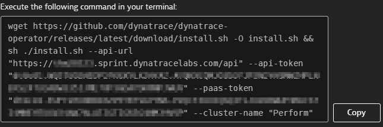
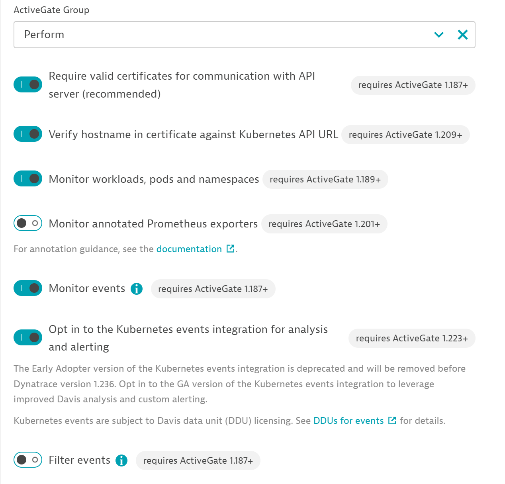

# Installing the Dynatrace Operator

We've provided an Kubernetes cluster running our easyTravel demo application. We'll need to deploy the Dynatrace Operator to fully monitor our K8s cluster. The Dynatrace Operator will deploy monitoring to all parts of Kubernetes. The operator also deploy's containerized Active Gates which will be used for OneAgent Traffic routing and Monitoring the Kubernetes cluster APIs.

## Step 1: Verify DTU Environment

1. Use the browser terminal or any SSH client to connect to your bastion. Run kubectl version to verify the k8s cli is installed.

    ```
    kubectl version
    ```


## Step 2. Deploy Dynatrace Operator

1. Sign into your provided SaaS tenant. Navigate to `Deploy Dynatrace` and select `start installation`. Select `kubernetes` and enter the connection name `perform`. 
2. Click create tokens to populate the tokens. All other switches can be left default. 

    

3. Copy the command generated from dynatrace
    

4. Inside of your Dynatrace University environment you'll find a terminal to your bastion host. Execute the copied command on your bastion host to install the Dynatrace Operator.

5. Once the installation is complete, check your Dynatrace tenant for succesful agent connections. On the left hand navigation panel select `Deployment Status` under the `manage` section.

## Step 3. Restart Easytravel Pods

1. Return to your browser and open the DTU terminal on the bastion host.
2. Run the following command which will delete 3 pods. easytravel-backend, easytravel-frontend, and easytravel-www. 

    ```
    kubectl get pods  -n easytravel --no-headers=true | awk '/easytravel-backend|easytravel-frontend|easytravel-www/{print $1}' | xargs  kubectl delete -n easytravel pod
    ```
3. Once the pods are deleted our deployments will automatically re-create new pods and the OneAgent will begin monitoring them on initialization.

## Step 3. Enable Kubernetes Event Monitoring and Alerts

1. Using the left-hand navigation panel, select `infrastructure` and `kubernetes`. Drill into the `Perform` cluster.
2. On the Perform cluster overview page you will find a `...` menu in the top right corner. Select this menu and click `settings`
3. Scroll to the bottom of this page and enable the switch `Monitor Events` and `Opt in to the Kubernetes events integration for analysis and alerting`

    

4. Save your changes.

## Step 4. Configure Log Monitoring Sources

By default Dynatrace requires you to configure which hosts or process groups you'd like to monitor logs for. Newly discovered hosts or process groups are not enabled automatically. We need to tell our environment we'd like to monitor some logs!

1. From the left hand navigation panel, under the `manage` section select `settings`. 
2. Scroll down and expand the `Log Monitoring` category. Choose `Log sources and storage` sub-menu.
3. At the top of the page there is a drop down field which offers 3 selections. Choose `Include all logs`.


   ** NOTE - choosing this setting will automatically ingest every log from every monitored source in your environment and will be subject to DDU consumption. **