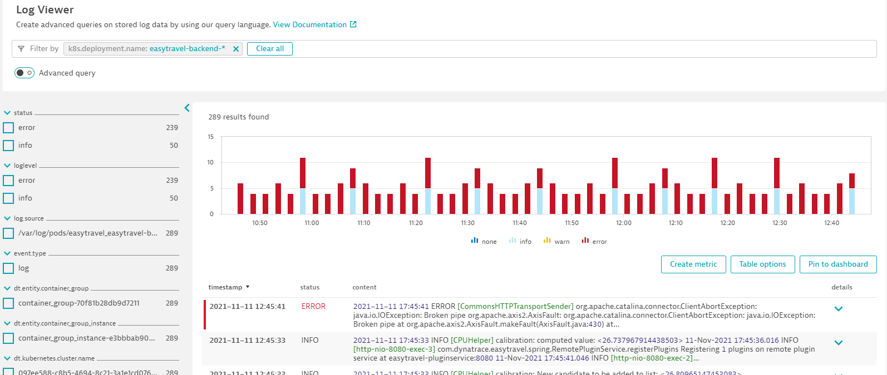
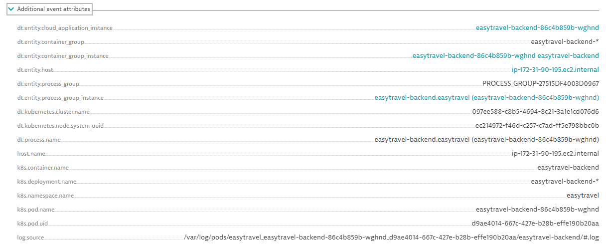
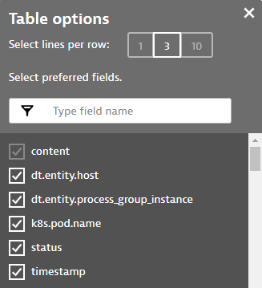
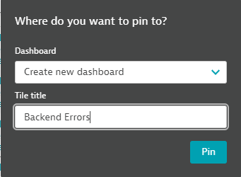

# Analyzing Auto-discovered Logs

Now that we have our EasyTravel application monitored, we can begin analyzing the captured log data. 

## Step 1: View all logs

1. Return to your Dynatrace UI and use the left-hand navigation panel to select `logs` under the `Observe and Explore` section.
    
    

2. Welcome to the new log viewer! Here we'll find all logs captured by deployed OneAgents, ingested from your cloud provider, and any other source you've configured. Our environment currently captures kubernetes pod logs (all namespaces) and subscribed AWS log groups. 

    

    The new log viewer will show all log enteries for the current timeframe and management zone filter. You can expand specific enteries, apply quick filters on the left hand side, and build a combination of filters within the `filter by` input box. Switching the `advanced query` mode will allow the user to input query syntax vs selecting individual filters.

## Step 2: Filtering the viewer

1. Our monitored Easytravel application has a java backend called `easytravel-backend-*` let's create a filter to only show entries from this group of containers.

   1. Query Result: 
    
   2. [Optional] - Copy & Paste this into the advanced query of the log viewer to get the same results
   

        ```
        k8s.deployment.name="easytravel-backend-\*"
        ```
2. It seems we have many error status entries coming from this deployment. Apply an additional filter for status=error to only view error entries for our easytravel-backend deployment
   1. Query Result:
    
   2. [Optional] - Copy & Paste the below syntax into the advanced query of the log viwer to get the same results

        ```
        k8s.deployment.name="easytravel-backend-\*" AND status="error"
        ```
3. View the details of an error log event. Along the bottom of the event you'll find `additional event attributes` which are all attributes matching this log entry. These attributes could also be used in combination with the current query.
    
   
   
4. These same attributes can also be added to our viewer in the form of additional columns. Since we're filtered to a deployment, it's possible our errors could be coming from a single pod or multiple pods. Add the following columns to your viewer by selecting `table options` then choosing the following attributes:
   
   
   
5. Now that we have the log viewer results confgured the way we want, let's pin this to a dashboard for monitoring. Next to the table options, select `pin to dashboard`. On the pop up choose the dashboard drop down and `create new dashboard`. Finally give the tile a meaningful name and select `pin`.
   
   