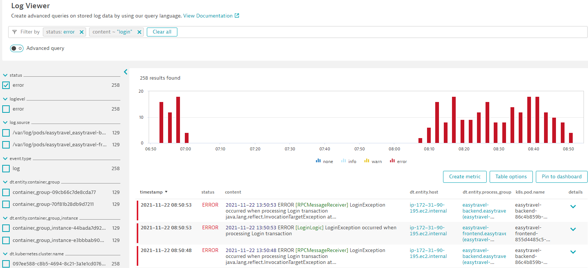
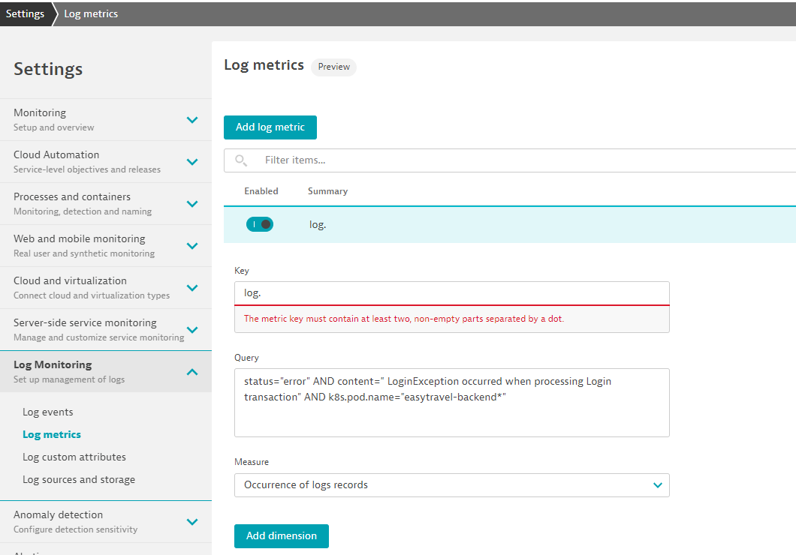

# Create a Metric and Event from log queries

In this lab we will simulate a real world application problem by enabling a problem pattern on our EasyTravel application. The goal is to force authenticaiton errors on our easyTravel frontend service which will be visible in our logging. Dynatrace will natively see theses errors within our server-side services and mark the transactions as failure. We want to build a log query that identifies authentication errors and measure the number of errors with a log metric. Futher we will create a new problem-generating log event from this same query. 

## Step 1: Get URL to enable login errors


1. Generate the URL to enable login problems

```
echo "http://$(kubectl -n easytravel get svc -o jsonpath='{ .items[4].status.loadBalancer.ingress[].hostname}')/services/ConfigurationService/setPluginEnabled?name=LoginProblems&enabled=true"
```

2. Copy the output and execute the request in your browser. Note, there will be no visible response in the browser that the request was accepted.

## Step 2: Query for login errors

1. With the problem scenario enabled, all logins will fail with an exception. Navigate to the log viewer and query for log level `error`.

2. Build a query that will filter specifically for login errors on the easytravel backend pod. Below is an example of a basic query:



3. In order to build a reliable metric, we'll need to make our query more specific. Switch to the advanced query mode and paste in the provided query below:

```
status="error" AND content=" LoginException occurred when processing Login transaction" AND k8s.pod.name="easytravel-backend*"
```


## Step 3: Create a metric

1. Now that our query is specific to login errors and will dynamically look at any easytravel-backend pod name we can reliably create a metric. Directly from the log viewer click on the button 'Create Metric'.


Selecting create metric will transition your UI to the settings -> Logs -> Log Metrics screen.



2. Define the key and measurement. The log key can be anything you want, however it's good practice to create a key name that's descriptive to the metric. We'll use:

```
log.backend.login.errors.count
```

For any log metric you have the option of measuring the 'occurance of log records' or 'attribute'. For this case, we will leave the default selection of 'Occurance of log records'. Measuring 'attribute' would be the collection of measures for the attribute value of log records that match the query. If you select this option, you need to also set Attribute to the attribute whose values will be gauged..


3. Save changes for this metric


## Step 4 Create a new log exception metric with added dimension

1. We're now going to modify our query slightly to remove the pod name and query for errors on any pod. Click 'create metric' and copy the query below to paste into the metric definition.

```
status="error" AND content=" LoginException occurred when processing Login transaction"
```
2. Define the metric key


3. Add a dimension to the metric. We want dt.entity.process_group as our dimension. This will measure the number of occurnaces from our query per process group


4. Click save changes

## Step 5: Add metrics to our dashboard

1. Open the dashboard from lab 02_Analyze_Logs and add a new graph tile.

2. Configure the tile and add the metric key `log.backend.login.errors.count`. Change the aggregation to `sum`.

3. Add another new graph tile and add the metric key `log.errors.login`. Change the aggregation to `sum` and split by `Process Group`


## Step 6: Create a custom event

1. Navigate to the log settings of your tenant. Settings -> Logs -> Log Events to create a new log event

2. Using our same query from earlier we'll create a log event to alert us if the entry is found. 

```
status="error" AND content=" LoginException occurred when processing Login transaction" AND k8s.pod.name="easytravel-backend*"
```

We'll configure the event as shown below:


