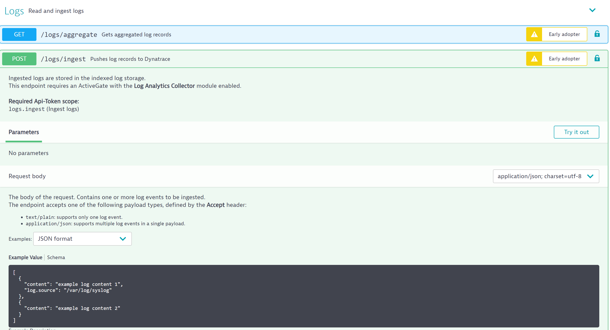
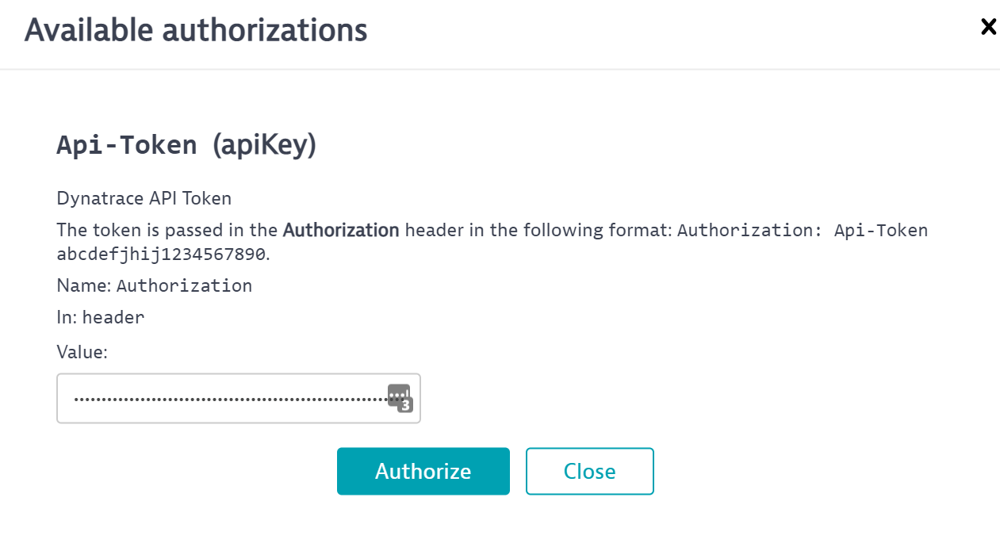
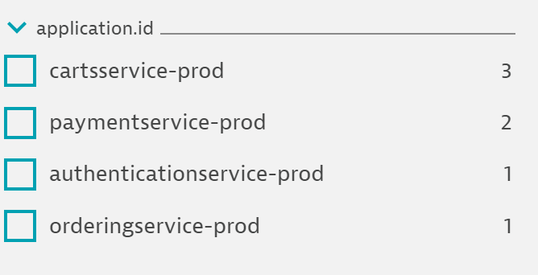

# Create Metrics from log queries

Now we've learned how to create log metrics, we can add custom defined attributes for additonal context and dimensions. Dynatrace Log Monitoring gives you the ability to define custom index log data attributes for log data that is ingested.

Dynatrace will automatically detect attributes of ingested log data. These attributes are used in the log viewer facets to quickly filter the result table data for a specific attribute. 

You can also define your own custom log data attributes that suits your particular log data format. Similarly to the automatically detected log attributes, your custom log attributes are extracted from the log data during ingestion and become availble within Dynatrace.

You can use them as filters in the log viewer (table options and log record detail attribues), as dimensions while creating log metrics, and as properties while creating log events.

## Step 1: Create Token and Use API to ingest log data

We will start by generating some custom log data for Dynatrace to ingest using the API. First, we need an API token to authenticate our API call. Navigate within your Dynatrace tenant to settings -> integration -> dynatrace API.

1. Create a new API token named `perform` and allow the v2 token scope of 'ingest logs'. Click Generate token. Copy the token value to a notepad temporarily.
   


2. Click your profile icon in the top right corner of the UI. Select `Environment API V2` to launch a new tab in your browser. Within the REST UI find the `logs` endpoint. Click to expand the endpoints and select `POST`. 



3. On the right hand side of that row, you'll find a lock icon. Click the lock icon and paste your API token to authenticate. 



4. Close the authentication window and select `Try it out` on the POST endpoint.

5. Remove all text in the example value box. Copy the snippet below and paste the contents within the Example Value box.

```
[
{
  "level": "error",
  "source": "Skynet",
  "application.id": "PaymentService-Prod",
  "message": "PaymentService-Prod failure."
},
{
  "level": "error",
  "source": "Skynet",
  "application.id": "CartsService-Prod",
  "message": "CartsService-Prod failure."
},
{
  "level": "error",
  "source": "Skynet",
  "application.id": "OrderingService-Prod",
  "message": "OrderingService-Prod failure."
},
{
  "level": "error",
  "source": "Skynet",
  "application.id": "AuthenticationService-Prod",
  "message": "AuthenticationService-Prod failure."
}
]

```
6. Click Execute to send the log data to Dynatrace. Response Code should be HTTP 204.

## Step 2: View Results in Log Viewer

1. Navigate back to your Dynatrace UI and choose `logs` on the left hand navigation panel. 

2. Filter the log viewer by status="error" and you should see entries for the Authentication, Ordering, Carts, and Payment service failures we just posted via the API. 

3. Expand one of the found entries and select `Additional event attributes` to find application.id. 
   1. Dynatrace automatically will detect attributes, however to use them in the viewer as filters and in metrics as dimensions we need to configure this attribute. 

4. Navigate to settings -> Log Monitoring -> log custom attributes. Click add custom attribute.

5. Type or copy `application.id` into the attribute key and click `save changes`.

6. Return to the REST API and execute the same call about 3-5 additional times. 

7. Return to the log viewer and you now should be able to use the new application.id attribute as a filter to view all events by application:



## Bonus:

1. Build a log metric that measures the occurance of log records where status="error" and split by (dimension) of application.id.
