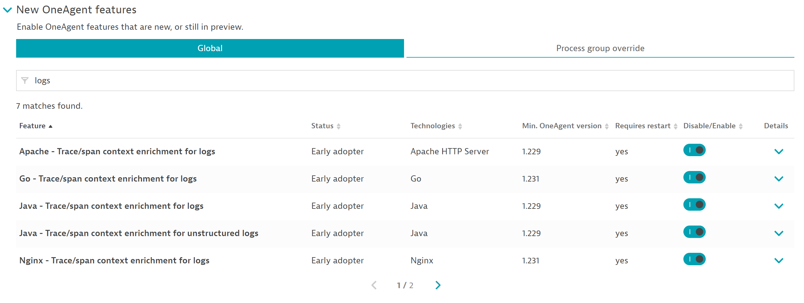
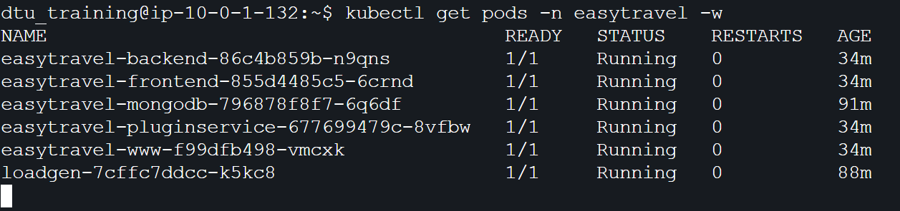
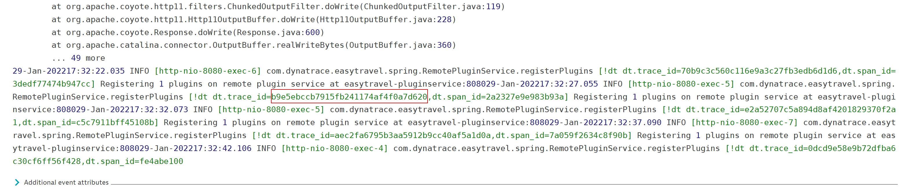
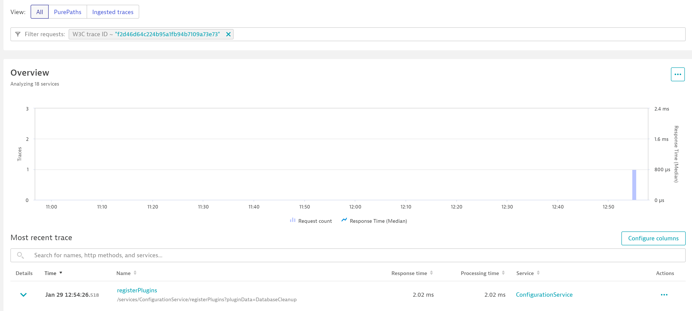

## PurePath Trace Context

**Note - This lab will showcase a feature currently available through early-adoptor and results may be inconsistant.**

## Enable Trace/Span enrichment for logs

1. Return the Dynatrace UI and navigate to the environments global setting panel.
2. Settings -> Server-side service monitoring -> Deep monitoring and scroll down / expand New OneAgent features.
3. Use the filter input on the top of the global features list and input `logs`
4. Enable all matching features (total of 7 switches) - be sure to check page 2.

    

5. Save your changes.

## Restart Easytravel Pods to enable log enrichment

1. Return to your DTU environment and open the terminal for the EKS Bastion.
2. Execute the following command to delete all easytravel pods we would like to add trace context to. 

    ```
    kubectl get pods  -n easytravel --no-headers=true | awk '/easytravel-backend|easytravel-frontend|easytravel-www|easytravel-pluginservice/{print $1}' | xargs  kubectl delete -n easytravel pod
    ```

3. Verify the new pods are ready after deleting:

    ```
    kubectl get pods -n easytravel -w
    ```

    

## Use log viewer to find a trace ID

1. Open the log viewer in your Dynatrace environment. 
2. Using the advanced query option copy and paste the following query into the viewer:

    ```
    content="dt.trace_id="
    ```

3. Expand one of the log events and scroll to the bottom of the event to find dt.trace_id=xxxxxx

    

4. Highlight and copy any id value you can find. The exact value copied does not matter, just make sure to only copy the portion between the `=` and `,`

## Find a purepath by DT Trace ID

1. Using the left hand navigation panel, expand `Applications & Microservices` and select `Distributed Traces`
2. In the filter input box at the top of the Distributed Traces screen, select `W3C Trace Id` in the filter drop down box.
3. Paste your copied dt.trace_id into the filter and hit `enter`

You should find a single purepath matching the trace id found in logs:

If you're having trouble finding a matching purepath, makes your timeframe in the log viewer and the distributed trace screen matches. You may have to try multiple different IDs to find a match.
    


4. Drill into the purepath found by clicking on the name of the request.
5. Once on the purepath details screen select the root node in the purepath tree. Then choose the `Logs` tab. The purepath should contain the log entry found in the log viewer!