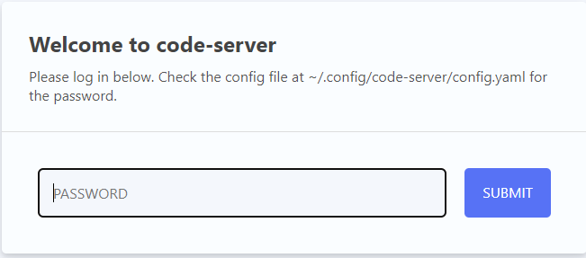
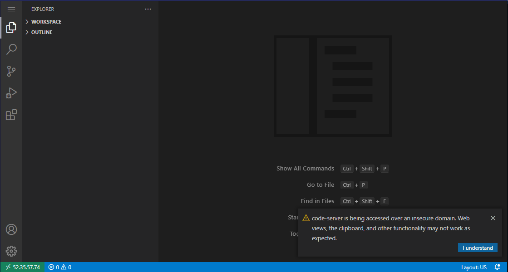
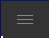
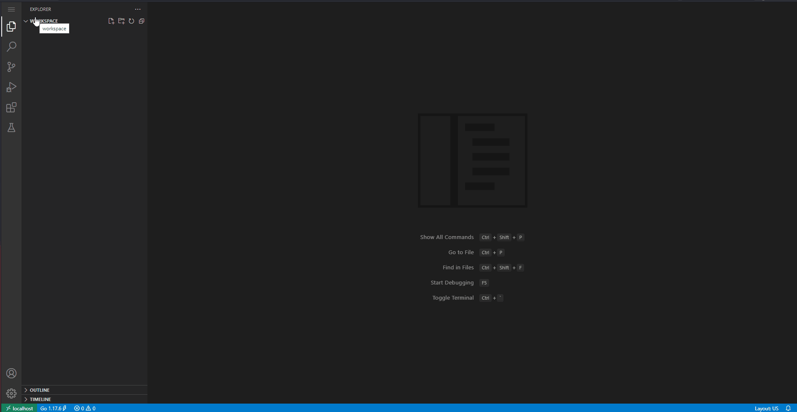
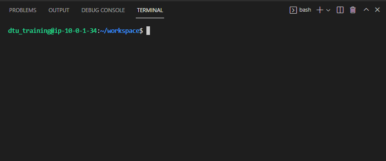

## Development Host

In addition to your Dynatrace Environment we have provisioned a development host for you.

Here we will build and run the applications for todays session.

### Log into your development environment

The IP Address and credentials for this Ubuntu host can be found within the `Environments` tab.

There is no need to open a Terminal Window to that host - this machine can get accessed with your browser.

Open a new browser window and paste in the IP Address into the address line. You should see the login screen now. Enter the password that has been provided for you alongside with the IP Address.

We are using <a href="https://github.com/coder/code-server" target="_blank">Visual Studio Code Server</a> today in order to build and launch applications.

After successful login it presents the `workspace` folder for you.

> A small popup may become visible at the bottom right of your screen, notifying you that the environment is getting accessed via an insecure domain. You can safely click on the ``I understand`` button here. None of the examples of today contain any confidential information.

#### Open a terminal tile in Visual Studio Code
Your development environment also provides access to the command line of your host.

Click on the Menu Button  in the top left corner and select `Terminal` and in here `New Terminal`.

As a result a terminal tile will appear at the bottom of the screen.

You current directory within this bash terminal should be `~/workspace` at this point.