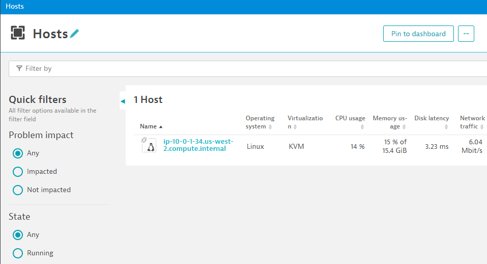

## Install OneAgent

Now that we have access to the command line, let's install OneAgent now.

### Download OneAgent

In your Dynatrace Environment navigate to ``Deploy Dynatrace`` and choose ``Linux`` for the platform. Create a PaaS Token and follow the instructions for downloading the installer.


### Execute the OneAgent Installer

Don't forget to invoke the installer with root permissions. You may get asked for a password - it's the same than the one you've used to access this host initially.

```bash
sudo sh Dynatrace-OneAgent-Linux-1.231.186.sh
```


### Cleanup - Remove OneAgent Installer from disk

We don't need the installer anymore, so let's delete it. 
```bash
rm Dynatrace-OneAgent-Linux-1.231.186.sh
```
on the command line.

### Verify OneAgent Installation

Let's verify that OneAgent is indeed reporting to your Dynatrace Environment.

