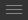

## Check out and build

Now let's check out the source code of the application we're using today.

### Clone the source code from Git

Enter the following command within your terminal tile.

```bash
git clone https://github.com/Dynatrace-Reinhard-Pilz/shopizer.git
```


### Prebuild the application

A new folder named ``shopizer`` will be available after that. Change into that directory.

```bash
cd shopizer
```


Next we're pre-building the application.

```bash
mvn clean install
```

This initial build will take a minute or two to complete.


> ***Hint***
>
> In the event that you close the browser window/codeserver tab accidentally, you can always follow the steps below.
> 
> - Relaunch the browser with the IP address.
> - Login to codeserver.
> - In the **Getting Started** screen, click on **Open a folder** to start,
> - or use the hamburger menu  -- File -- Open Folder
> - Select **shopizer** folder 

### You have arrived!

At this stage your development machine is ready to run the applications we are going to use today.