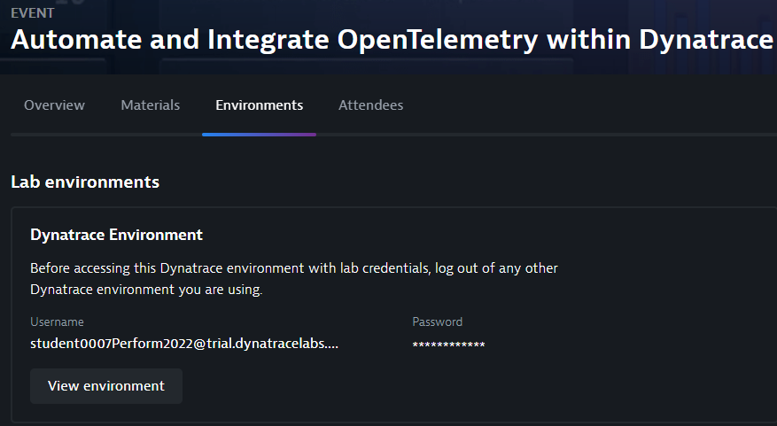
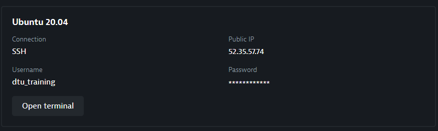
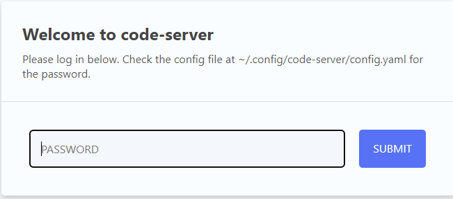
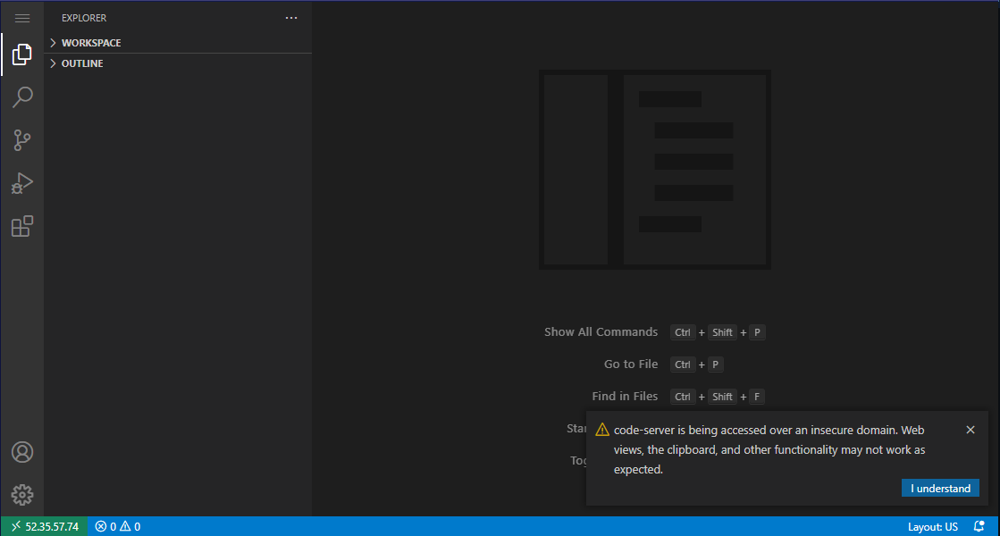
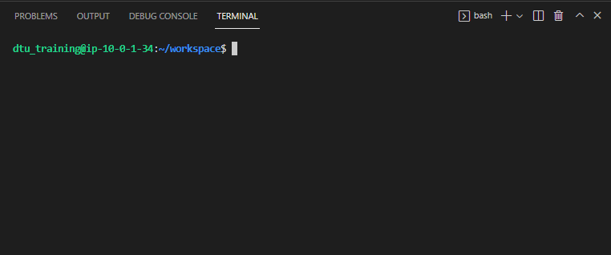
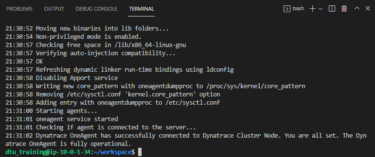
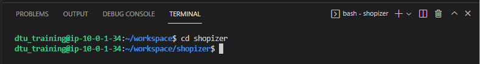

## Prepare your workspace

Welcome to the **Automate and integrate OpenTelemetry with Dynatrace lab**.

Before we begin, your workspace must get prepared.


### Validate that your Dynatrace Environment is accessible

Let's start with accessing the Dynatrace Environment that has been reserved for you.



### Validate that your development host is accessible

In addition to that a development machine has been provisioned for you.



This machine can get accessed with your browser. Open a new browser window and paste in the IP Address into the address line. You should see the login screen now. Enter the password that has been provided for you alongside with the IP Address.



We are using Visual Studio Code Server today in order to build and launch applications. After successful login it presents the ``workspace`` folder for you.



A small popup may become visible at the bottom right of your screen, notifying you that the environment is getting accessed via an insecure domain. You can safely click on the ``I understand`` button here. None of the examples of today contain any confidential information.

#### Open a terminal tile in Visual Studio Code
Your development environment also provides access to the command line of your host. Click on the Menu Button  in the top left corner and select

```Terminal > New Terminal```


As a result a terminal tile will appear at the bottom of the screen.



You current directory within this bash terminal should be ``~/workspace`` at this point.

### Install OneAgent
Let's install OneAgent now. In your Dynatrace Environment navigate to ``Deploy Dynatrace`` and choose ``Linux`` for the platform. Create a PaaS Token and follow the instructions for downloading the installer.


Don't forget to invoke the installer with root permissions. You may get asked for a password - it's the same on you used to access this host initially.

```bash
sudo sh Dynatrace-OneAgent-Linux-1.231.186.sh
```



We don't need the installer anymore, so let's delete it. 
```bash
rm Dynatrace-OneAgent-Linux-1.231.186.sh
```
on the command line.

Let's verify that OneAgent is indeed reporting to your Dynatrace Environment.


### Check out source code
Now let's check out the source code of the application we're using today. Enter the following command within your terminal tile.
```bash
git clone https://github.com/Dynatrace-Reinhard-Pilz/shopizer.git
```


### Prebuild the application
A new folder named ``shopizer`` will be available after that. Change into that directory.
```bash
cd shopizer
```



Next we're pre-building the application.
```bash
mvn clean install
```
This initial build will take a minute or two to complete.


### You have arrived!
At this stage your development machine is ready to run the applications we are going to use today.