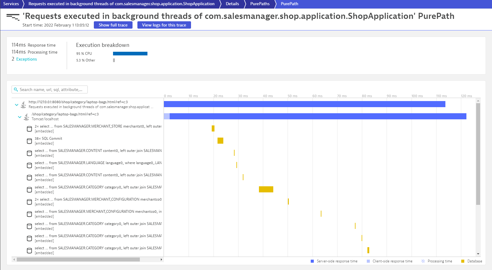

## Launch the Vintage Handbag Shop

Within your terminal navigate into the folder `sm-shop` by entering

```bash
cd sm-shop
```

Now we are ready to launch the Web Application.

```bash
mvn spring-boot:run
```


### Validate that the Vintage Handbag Shop is up and running

Open a new browser window and navigate to

```
http://<your-development-machine-ip>:8080/
```


Feel free to navigate around within that application. In the interest of simplicity we have introduced a load generator that requests the pages that are relevant for todays session automatically.

### Verify that Service Calls are getting monitored

Switch to the browser window that is logged into your Dynatrace environment. Within the `Services` you will notice an entry named

```
Requests executed in background threads of com.salesmanager.shop.application.ShopApplication
```

You will also notice that it contains two different kinds of service calls:

```
http://127.0.0.1:8080/shop/product/*
```

and 

```
http://127.0.0.1:8080/shop/category/*
```

Take a look at a PurePath that is named similar to this.

```
http://127.0.0.1:8080/shop/category/laptop-bags.html/ref=c:3
```



This is what Dynatrace captures out of the box with its very own Sensors. After a small configuration change we will see that there's a lot more data available.