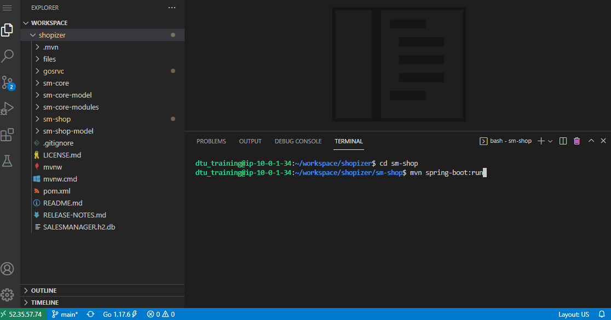
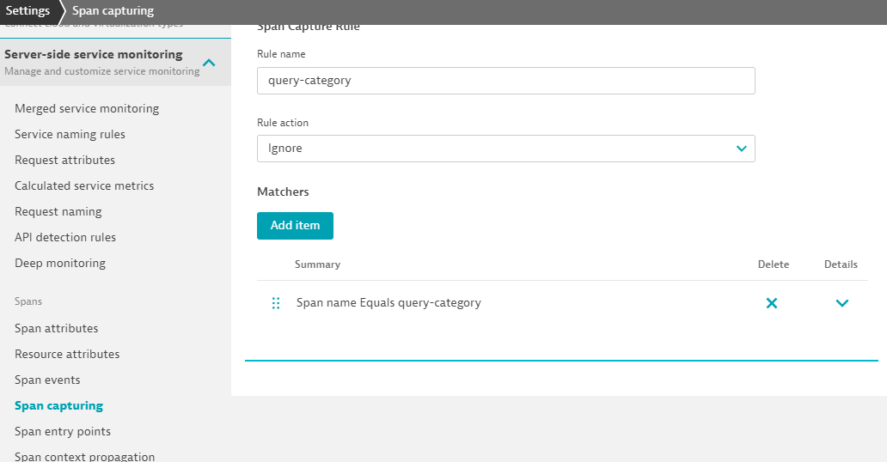

## Enable OpenTelemetry Sensors

The application we are working with is as a matter of fact already augmented with OpenTelemetry.
We just haven't told Dynatrace yet to take advantage of it.
In this section, we will explore what Dynatrace is able to capture, when applications are already pre-augmented with OpenTelemetry.

### Enable OpenTelemetry for Java
Switch to the browser window that is logged into your Dynatrace Environment.

Navigate in the left menu to

```
  Settings > Server-side service monitoring > Deep Monitoring
```

Here you will find a section called

```
OpenTelemetry and OpenTracing
```

Make sure that the switch ``OpenTelemetry for Java`` is enabled.


### Shut down the Vintage Handbag Shop

If you haven't already done so, terminate the application.
Within the Terminal where you previously entered `mvn spring-boot:run` press `Ctrl-C`.

### Launch the Vintage Handbag Shop

In your Terminal verify that your current directory is still `sm-shop`.
Now launch the Web Application again.

```bash
mvn spring-boot:run
```



Like before the application will generate its own load. There's no real need to browse through the Shop again.

### Investigate the new Service Calls

Switch to the browser window that is logged into your Dynatrace environment.
Within the `Services` find again the entry

```
Requests executed in background threads of com.salesmanager.shop.application.ShopApplication
```

We are still interested in the same kinds of PurePaths.

```
http://127.0.0.1:8080/shop/category/laptop-bags.html/ref=c:3
```

Among the well known PurePath nodes (Database Calls, ...) you will now notice additional entries with the OpenTelemetry Icon.


The application we are working with is indeed already augmented with OpenTelemetry. The developer has chosen to signal to monitoring solutions which portions of the service flow are of importance.

In this specific case he might have been a bit too overzealous. The Span

```
query-category
```

is visible countless times within the PurePath.

Dynatrace by default captures every span. You can prevent capturing the spans named

```
query-category
```

by adding an exclusion rule within the Settings in the Dynatace WebUI. Just navigate to

```
Settings > Server-side service monitoring > Span capturing
```

In our case it's sufficient enough to specify the span name that should be excluded. But you'll notice that the configuration allows for much more specific exclusion rules.



### You have arrived!
OneAgent automatically integrates OpenTelemetry Spans into ongoing PurePaths. Additional configuration is possible in order to tweak the results.
