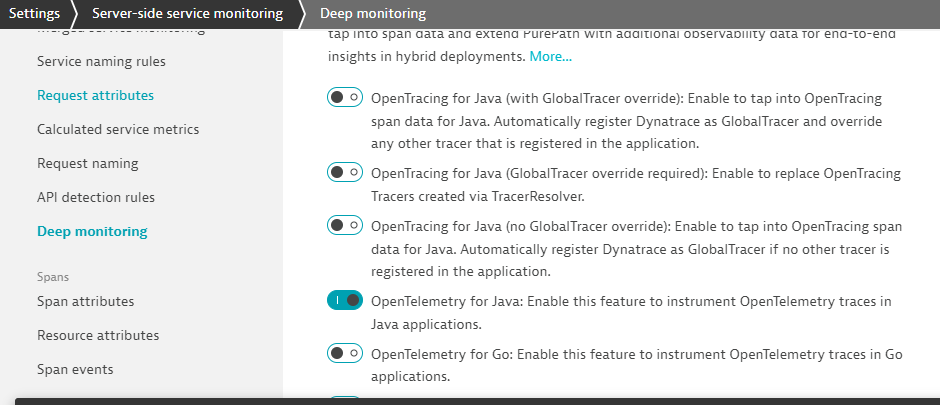
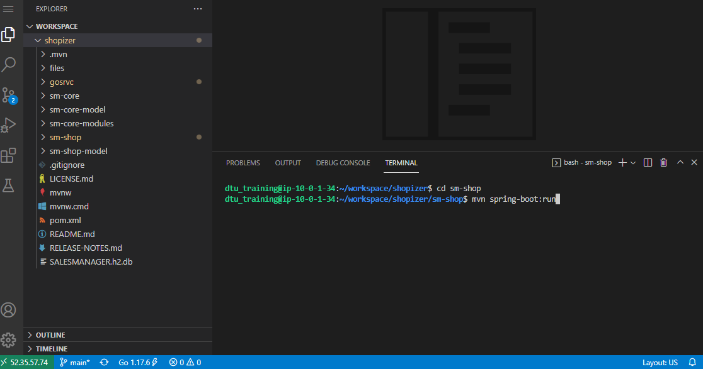
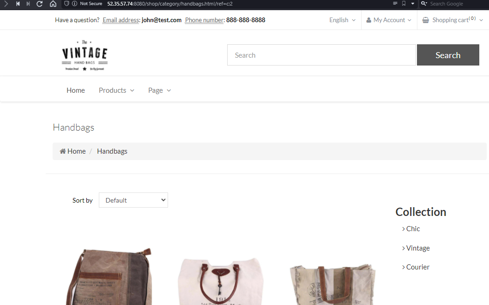
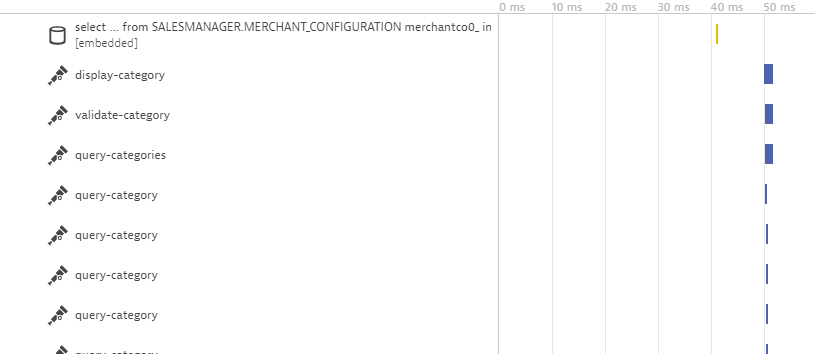
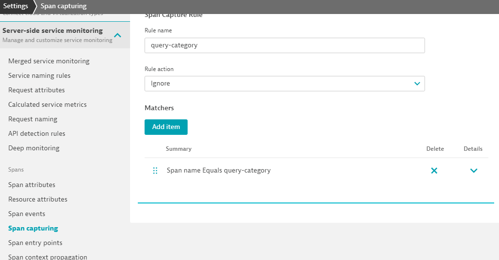

## OpenTelemetry Spans within PurePaths

In this section, we will explore what Dynatrace is able to capture, when applications are already pre-augmented with OpenTelemetry.

### Enable OpenTelemetry for Java
- Switch to the browser window that is logged into your Dynatrace Environment.
- Under ``Settings > Server-side service monitoring > Deep Monitoring`` you can find a section called ``OpenTelemetry and OpenTracing``.
- Make sure that the switch ``OpenTelemetry for Java`` is enabled.

### Launch the Vintage Handbag Shop

Within your terminal navigate into the folder ``sm-shop`` by entering ``cd sm-shop``.
The command line ``mvn spring-boot:run`` launches the Web Application.

Open a new browser window and navigate to ``http://<your-development-machine-ip>:8080/``

Feel free to navigate around within that application. In the interest of simplicity we have introduced a load generator that requests the pages that are relevant for todays session automatically.

Switch to the browser window that is logged into your Dynatrace environment. Within the ``Services`` you will notice an entry named ``Requests executed in background threads of com.salesmanager.shop.application.ShopApplication``. You will notice that it contains only different service calls.

Take a look at a PurePath that is named like this: ``http://52.35.57.74:8080/shop/category/laptop-bags.html/ref=c:3``. Among the well known PurePath nodes (Database Calls, ...) you will notice additional entries with the OpenTelemetry Icon.

The application we are working with is already augmented with OpenTelemetry. The developer has chosen to signal to monitoring solutions which portions of the service flow are of importance. In this specific case he might have been a bit too overzealous. The Span ``query-category`` is visible countless times within the PurePath.

Dynatrace by default captures every span. You can prevent capturing the ``query-category`` spans by adding an exclusion rule within ``Settings > Server-side service monitoring > Span capturing``. In our case it's sufficient enough to specify the span name that should be excluded. But you'll notice that the configuration allows for much more specific exclusion rules.

## You have arrived!
OneAgent automatically integrates OpenTelemetry Spans into ongoing PurePaths. Additional configuration is possible in order to tweak the results.