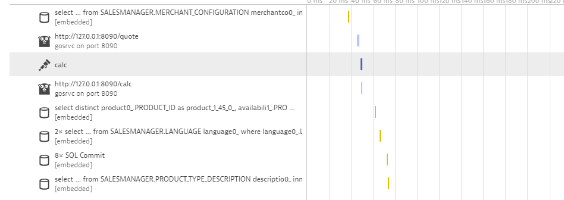
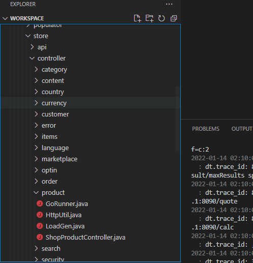
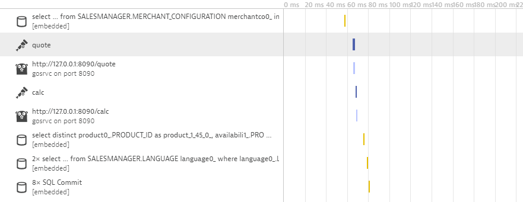
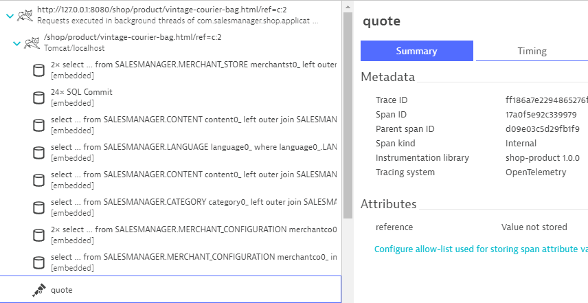
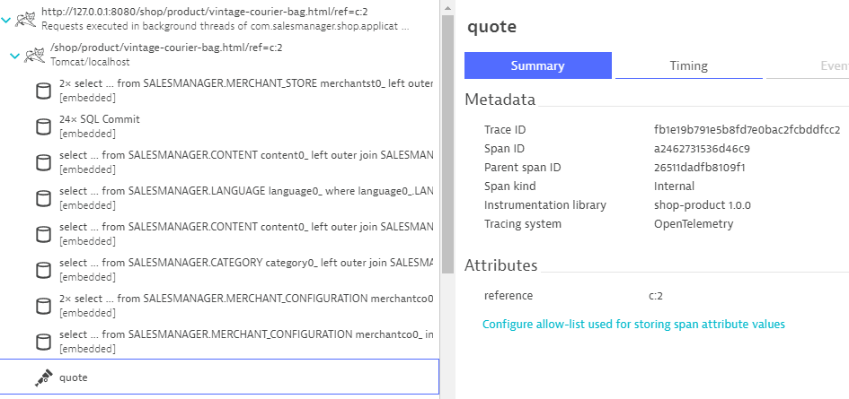

## Manual Instrumentation

The previous section focused on dealing with applications that are already pre-instrumented with OpenTelemetry.
We are now going to explore what this additional code really looks like.

Take another look at the service with the name
```
Requests executed in background threads of com.salesmanager.shop.application.ShopApplication
```
It contains a second kind of service call named
```
http://127.0.0.1:8080/shop/product/vintage-courier-bag.html/ref=c:2
```
Take a look at one of these PurePaths.



You'll notice that it also contains a Span named `calc`. That span essentially wants to introduce a bit more context information to the outgoing HTTP request afterwards.
Let's take a look at the source code that makes it possible.

Within Visual Studio Code expand the following folders:
```
shopizer/sm-shop/src/main/java/com/salesmanager/shop/store/controller/product
```



Select the file `ShopProductController.jav``. Scroll down to `line 100`. The method `calcPrice` is the one that currently produces this additional span.

```java
	public void calcPrice(Model model) {
		Span span = getTracer().spanBuilder("calc")
		.setAttribute("model", model.toString())
		.startSpan();
		try (Scope scope = span.makeCurrent()) {
			HttpUtil.Get("http://127.0.0.1:8090/calc");						
		} finally {
			span.end();
		}
	}
```

A few lines above method `calcPrice` you will find the method `handleQuote`. 

```java
	public void handleQuote(final String reference) {
		HttpUtil.Get("http://127.0.0.1:8090/quote");
	}
```

The PurePath we were looking at before indeed contained a second outbound call to
```
http://127.0.0.1:8090/quote
```

Let's augment the method `handleQuote` also with OpenTelemetry. You can use `calcPrice` as a template. You may want to report the `reference` instead of the `model` here, though.

In order for the modifications to become active the application needs to get restarted. Within the terminal tile, press `Ctrl-C` to shut it down. Relaunch then application afterwards.
```bash
mvn spring-boot:run
```

The new Service Calls should now contain an additional OpenTelemetry Span.



Let's take a closer look at the `quote` span.



Dynatrace realizes, that this span comes with additional metadata - a so-called `Span Attribute`. Its value is however not getting captured by default. Click on the link below the attribute and configure Dynatrace to also collect its value.

There is no requirement to rebuild or restart the application for that. The attribute is already getting reported. Dynatrace just has ignored it up to now.
Wait for new Service Calls to come in and verify that the value for the reference is getting captured.



You can now configure a `Request Attribute` that uses this value as its source.

### You have arrived!
At least for the programming language Java we have explored the basics of producing additional PurePath Spans.
