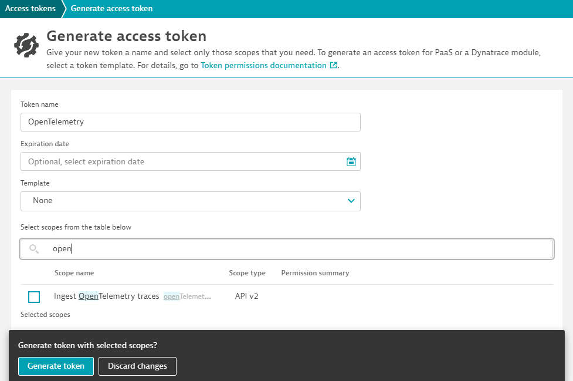
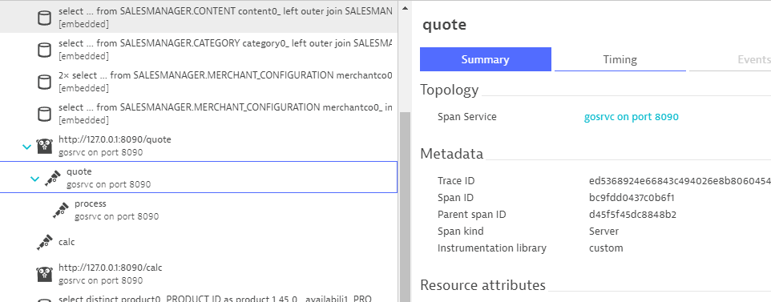

## Trace Ingestion using Dynatrace API

In the previous section we successfully added context information to these outbound web requests. Unfortunately that doesn't get us insight into what's happening within the application that receives these calls. The server side of these calls is a locally running application written in Golang - unfortunately a version of Golang that's not yet supported by OneAgent.

The application is however already prepared for sending OpenTelemetry Spans to Dynatrace. We just need to configure where to send that data to.

Within Visual Studio Code navigate to `shopizer/gosrvc/main.go`.


### Configure the OpenTelemetry Exporter

Around line 40 OpenTelemetry is getting configured. What's not correct yet is the exact host name of your Dynatrace environment and the API Token.

```go
	client := otlptracehttp.NewClient(
		otlptracehttp.WithEndpoint("######.sprint.dynatracelabs.com"),
		otlptracehttp.WithURLPath("/api/v2/otlp/v1/traces"),
		otlptracehttp.WithHeaders(map[string]string{
			"Authorization": "Api-Token ############################################################################################",
		}),
	)
```

- Check the address line of the browser window that is currently logged into your Dynatrace Environment for the correct host name / endpoint
- Navigate to ``Access Tokens`` within your Dynatrace environment and configure it with the correct permissions.



### Submit API token to Microsoft Forms

***Important***
This API token will also be used in the next part of the hands on. The instructor will need this token to configure an OpenTelemetry Collector.

Please submit your token to <a href="https://forms.office.com/r/b8We3K7Njk" target="_blank">https://forms.office.com/r/b8We3K7Njk</a>

In an actual production environment, please treat your Access Tokens with utmost care and not distribute it indiscriminately. As your lab environment will be destroyed after this session, we are using this token as a means to demonstrate some capabilities within the scope of the lab.

### Restart the Vintage Bag Shop Application

In order for the modifications to become active you need to shut down the application. Press `Ctrl-C` within the terminal window and restart the app

```bash
mvn spring-boot:run
```

The new service calls named similar to

```
http://127.0.0.1:8080/shop/product/vintage-courier-bag.html/ref=c:2
```

are now already showing what's going on for the `quote` calls.



What's not covered yet are the `calc` calls.

### Explore how OpenTelemetry in Golang works

Take another look at the file `main.go` and scroll down to line `65` where function `quote` starts.

```go
func quote(w http.ResponseWriter, req *http.Request) {
	ctx := otel.GetTextMapPropagator().Extract(req.Context(), propagation.HeaderCarrier(req.Header))
	var span trace.Span
	ctx, span = otel.Tracer(name).Start(ctx, "quote", trace.WithSpanKind(trace.SpanKindServer))

	process(ctx, uint(rand.Intn(20)))
	span.End()
	fmt.Fprintf(w, "done\n")
}
```
### Augment additional Golang Code with OpenTelemetry

Now take a look at the function `calc`. It handles the incoming `calc` requests.

```go
func calc(w http.ResponseWriter, req *http.Request) {
	process(req.Context(), uint(rand.Intn(20)))
	fmt.Fprintf(w, "done\n")
}
```

We can use the function `quote` as a template in order to augment the function `calc` properly with OpenTelemetry code.

### Restart the Vintage Bag Shop Application

In order for these modifications to become active the application needs to get restarted.

Press `Ctrl-C` within the terminal and enter `mvn spring-boot:run` to relaunch it.

### You have arrived!
We have successfully traced across process boundaries - even if OneAgent is not of assistance.
