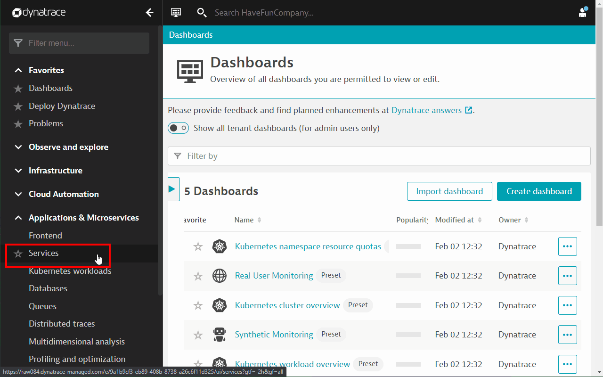
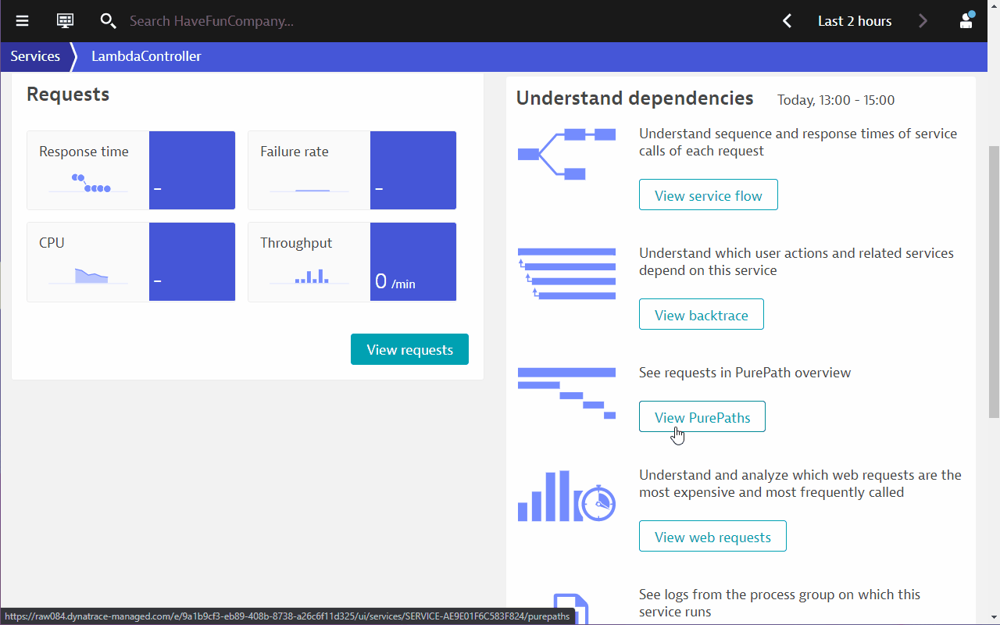
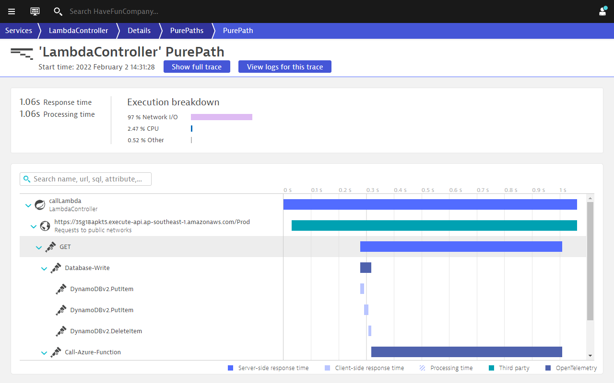
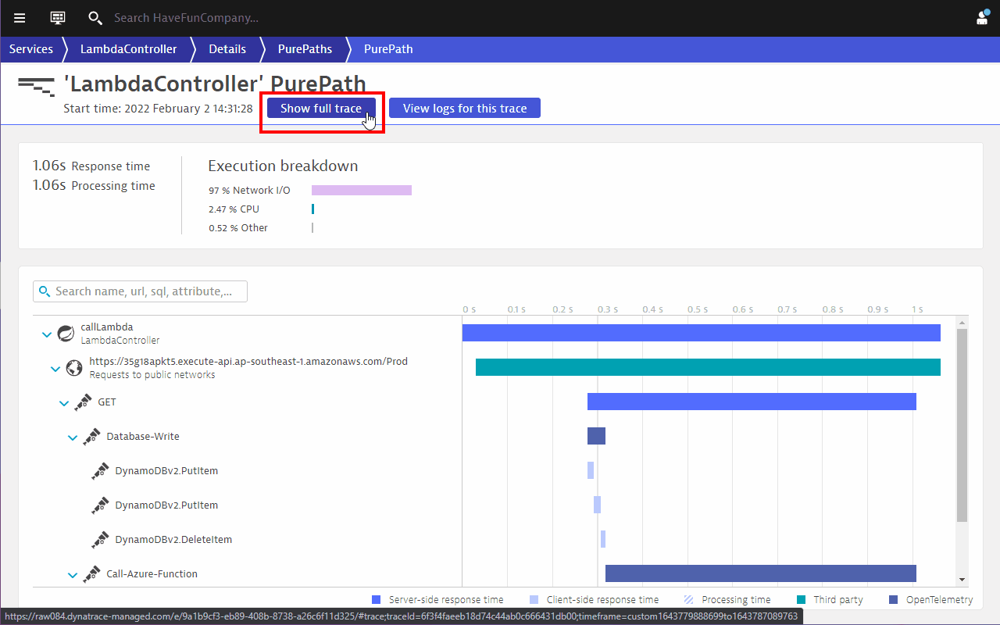
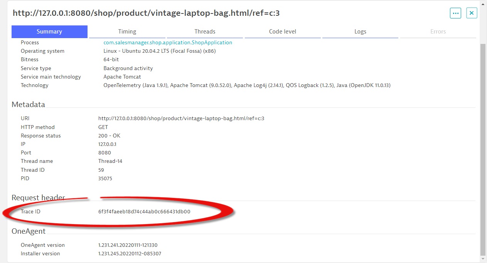
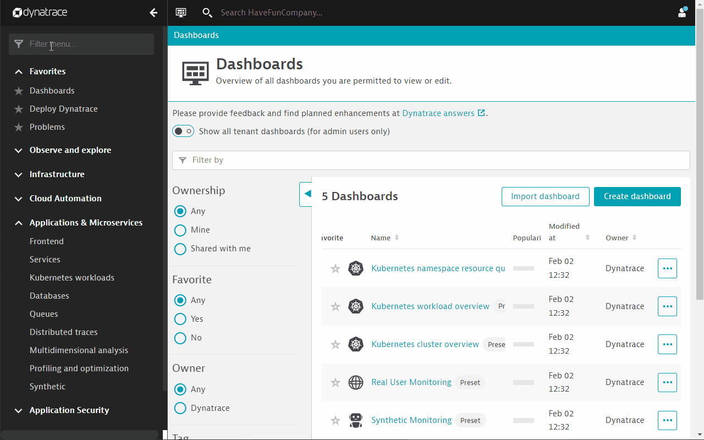
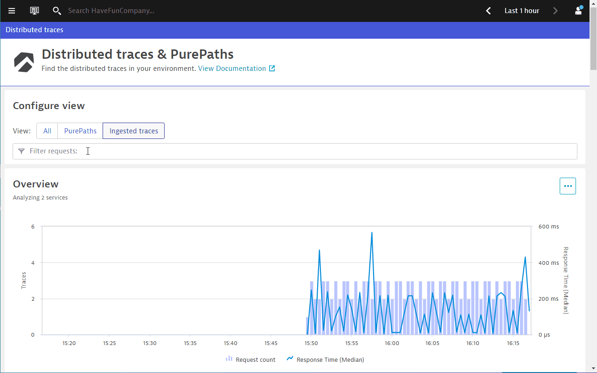
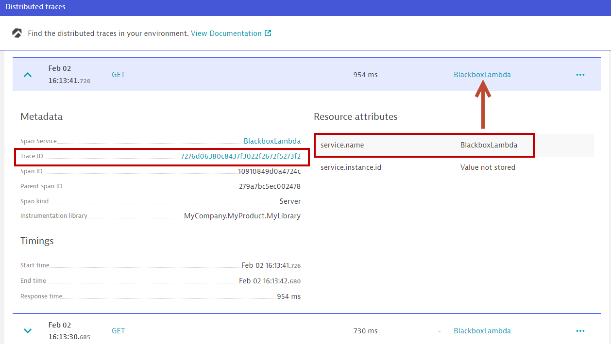
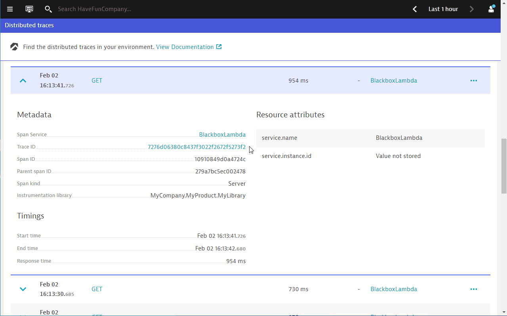
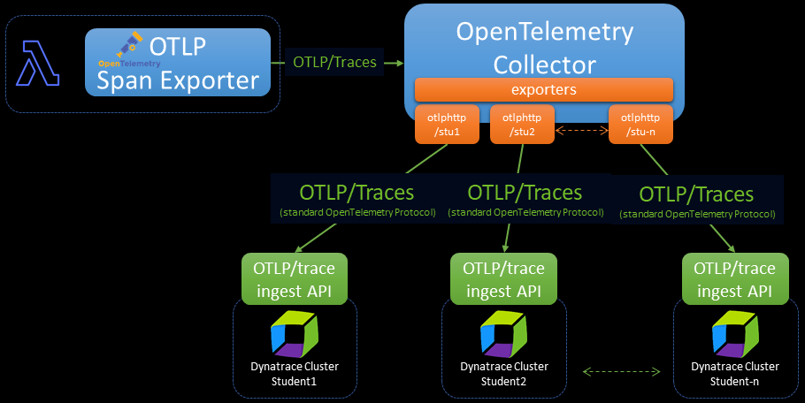

## Remote trace ingest using OpenTelemetry Collector

You will notice that an AWS Lambda function is called by shopizer. As we are not able to deploy the OneAgent into AWS Lambda functions, one of the ways to collect application traces is via OpenTelemetry.

In this section, the AWS Lambda function has already been auto-instrumented with OpenTelemetry, so we will use the Dynatrace remote trace ingest API to ingest the Lambda traces into Dynatrace.

If you had missed the eariler session, please submit a generated API token with the right access scope to us via <a href="https://forms.office.com/r/b8We3K7Njk" target="_blank">https://forms.office.com/r/b8We3K7Njk</a>

Without the token, you will not be able to view the remotely ingested traces.

### PurePaths before ingesting traces from .NET Lambda function
1. Go to Dynatrace menu -> Services -> Lambda Controller
   
1. View the purepaths 15 mins to 30 mins ago
   
1. callLambda service makes a call to the .NET Lambda function, but we are not aware of what the Lambda function does or which components in the Lambda function contribute to the 1 sec+ execution time.

We can shed more light using OpenTelemetry in the same way as the pervious labs.

### PurePaths after ingesting traces

This time, pick a few more recent `callLambda` traces (in the past 5 mins to 10 mins)



You should now be able to see that the Lambda function
1. Executes a HTTP GET
1. Which in turn, makes a call to write to a database
1. And once the calls to the database is done, the Lambda fucntion also calls an Azure function.

From here, we can tell that the Azure function contributes to the marjority of the response time.

### Exploring the full distributed trace

We could also understand which product in shopizer is making calls to `callLambda` by analyzing the full distributed trace.

1. Click on the button `Show full trace` at the top of the screen
1. You will be presented with the full distributed trace
1. You will then observe that the transaction making calls to `callLambda` is from the `vintage-laptop-bag`



Please take note of the ***Trace ID*** meta data inside the `request header`.



You will find this useful in the next part.

### Another way to view ingested traces

Dynatrace has a new menu item to view distributed traces. This can be a shortcut especially if the traces are mainly ingested from remote sources

Go to Dynatrace menu -> Distributed traces -> Ingested traces



Utilize the `Filter requests` bar. Filter traces that are related to the `Service name`  ***blackbox***



Scoll down and expand any one of the ingested traces.


   
Two things to note:
- `service.name` - A service is created in Dynatrace if you have defined a `service.name` in the OpenTelemetry instrumentation.
- The `trace id` is also registered. This is the same Trace ID that has been propagated from the Java codes to the Lambda function.

But with so many traces sent to your tenant, it is not easy to find the traces related to the transactions executed from your own instance of shopizer. There is where we will use the Trace ID to help us in the correlation of traces. Dynatrace uses the W3C trace ID to link up the traces.

Click on the `trace id` to view the full distributed trace across the caller and the callee.



### Quick note on OpenTelemetry Collector configuration

> ***Note***
> This part is only for your information and it will be demonstrated by the instructor. It does not require you to follow what was shown. And it does not require you to configure any items.

Your tenant is receving a lot of traces as the OpenTelemetry Collector was configured to send the trace data from a single Lambda function to multiple Dynatrace tenants. That is why you are receiving the same trace multiple times.

Dynatrace provides a <a href="https://www.dynatrace.com/support/help/extend-dynatrace/opentelemetry/opentelemetry-ingest#expand--sample-collector-configuration" target="_blank">sample exporter configuration</a> in our documentation.

Below is small section of the configuration used by the instructor specific for this lab. The focus is on the `exporters` and `pipelines` within the `service` section.

```yaml
...
exporters:
  otlphttp/stu1:
    endpoint: "https://tenant1url/api/v2/otlp"
    headers:
      Authorization: "Api-Token dt0c01.xxx"
  otlphttp/stu2:
    endpoint: "https://tenant2url/api/v2/otlp"
    headers:
      Authorization: "Api-Token dt0c01.xxx"
...
service:
  extensions: [health_check,pprof,zpages]
  pipelines:
    traces:
      receivers: [otlp]
      processors: [batch]
      exporters: [logging,otlphttp/stu1,otlphttp/stu2]
...
```

This diagram will help you visualize the configuration of the OpenTelemetry Collector.



Exporters are used to configure multiple endpoints where the collector can send the traces to. By referring to the <a href="https://opentelemetry.io/docs/collector/configuration/" target="_blank">OpenTelemetry Collector configuration documentation</a>, you will be able to configure other exporters like Jeager or the likes. This means that you will be able to send trace data from a single source, to multiple destinations, including multiple Dynatrace instances.