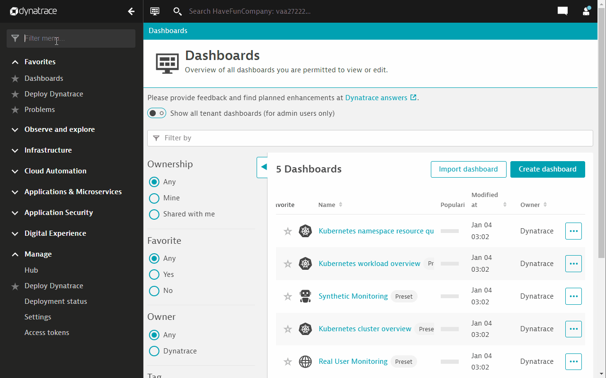
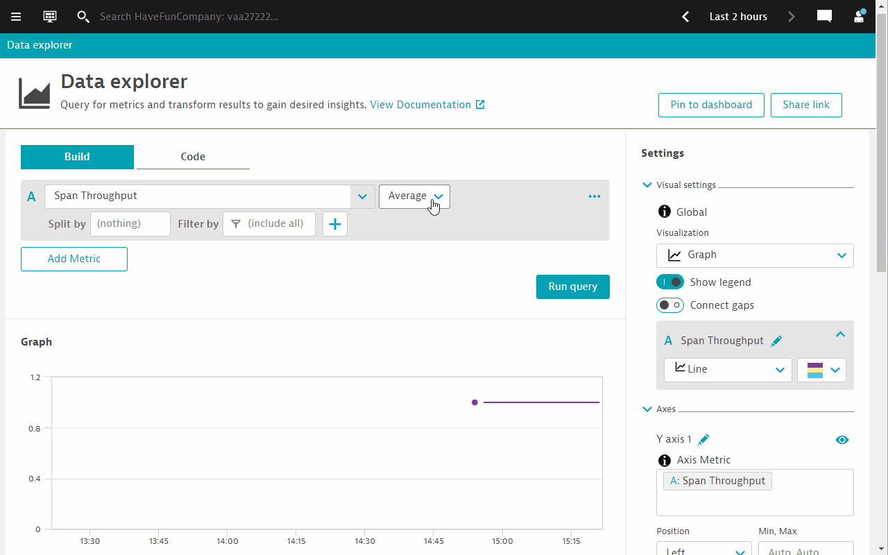
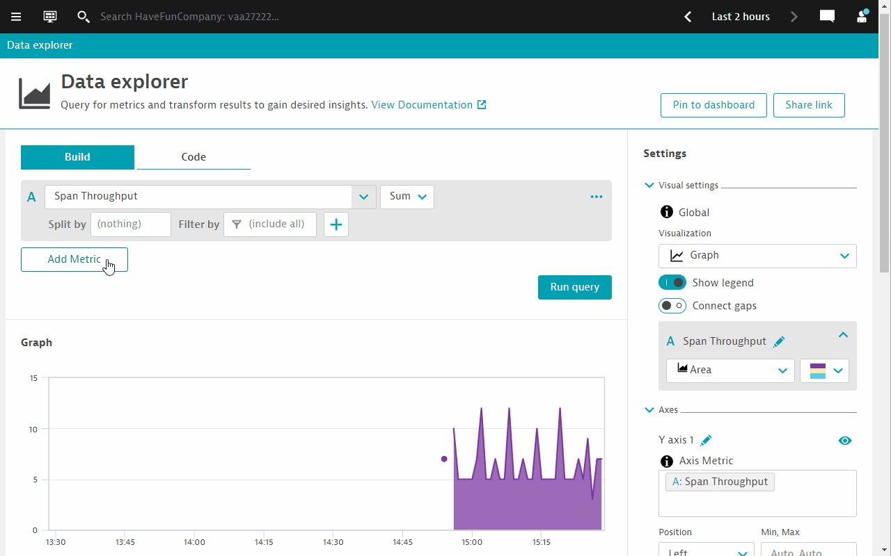
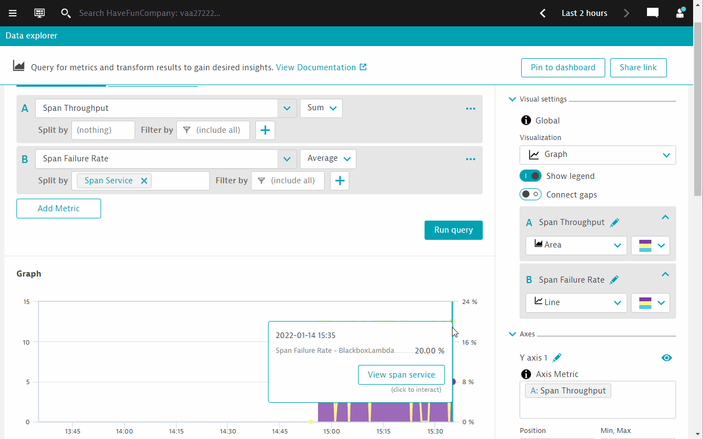
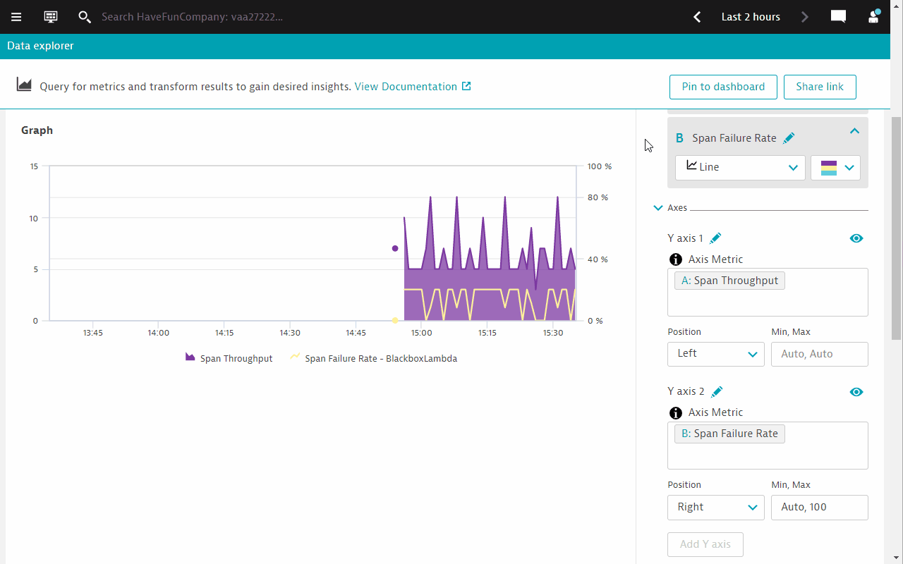

## Setting up charts to track key metrics

### Step 1: Browser for the relevant metrics
1. Go to Dynatrace menu -> metrics.
1. Search for `span`.
1. Select `Span Throughput`.
1. Click on `Create chart` button.

### Step 2: Use the Data Explorer to configure charts
1. Configure the `Span Throughput` metric to display `SUM`.
1. And select the `Area` graph visualization.
   
1. Add a 2nd metric, select `Span Failure rate`.
1. Configure `Split by` to `Span service`.
1. Click on `Run query`. You will notice the chart below changes with the 2nd metric added as an overlay.
   
1. Configure the Y-axis to display the full range of percentages.
1. Enter `Auto, 100` in the `Min, Max` configuration box.
1. Click on anywhere outside the configuration box to effect the changes.
1. See the changes on the chart.
   

### Step 3: Pin the Data Explorer chat to a new dashboard
1. Click on `Pin to Dashboard`.
1. Rename the dashboard and resize the chart to your liking.

