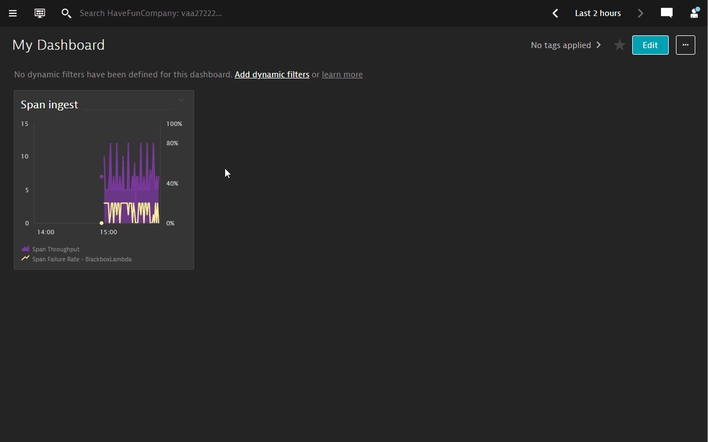
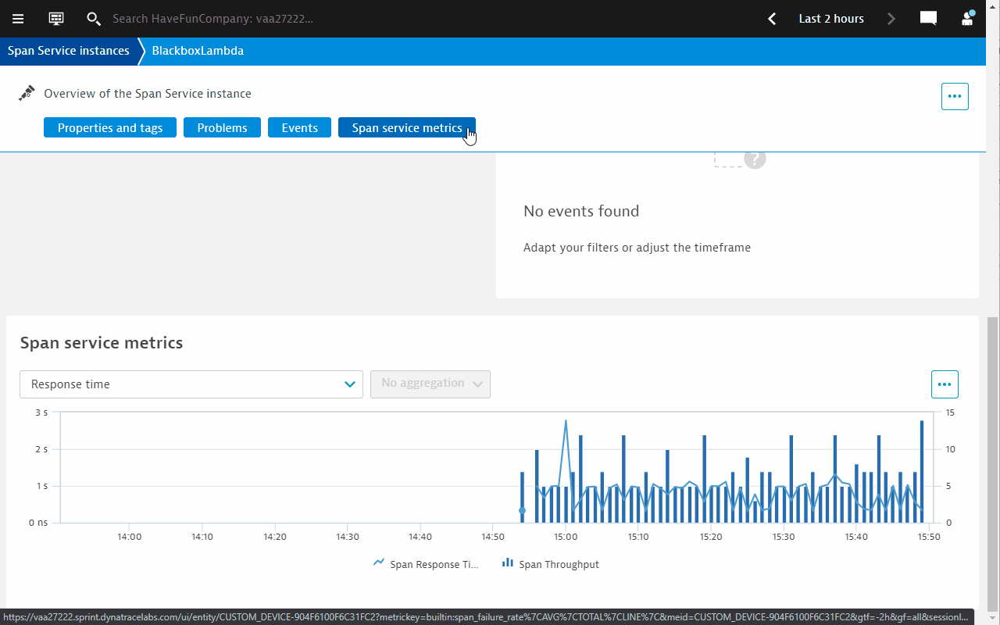
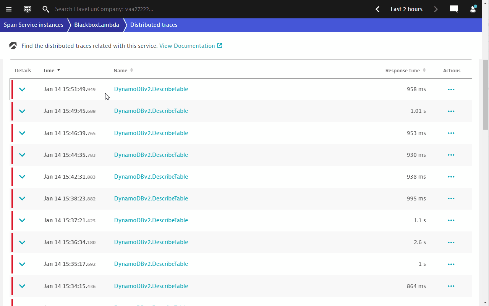

## Investigating errors flagged out in ingested traces

### Step 1: Investigate the span service
1. On the dashboard, hover the mouse over the tile.
1. Click on one of the data points where there is a Span failure.
1. Click on `View span service`
1. You will be brought to an "unified analysis" screen called `Span Service instance`
1. Click on `Span servic metrics` to view all related metrics for the Lambda traces

### Step 2: Deep dive into the distributed traces
1. Click on the elipsis button `...` on the top right hand corner.
1. Click on `Analyze distributed traces`
1. Filter on `Failed state` > `only failed`
1. The traces view wil start to show all traces where an error occured.

### Step 3: Explore Span errors and events
1. Expand one of the traces.
1. All the relevant metrics/attributes of the traces are captured. However, we do not see much.
1. Click on the TraceID link to see the full trace data.
1. In the various tabs like `Events` and `Errors`, you will notice that the information in there are too vague.

Let's proceed to the next step to configure `Span events` so that we can bring more context to these errors to Dynatrace.