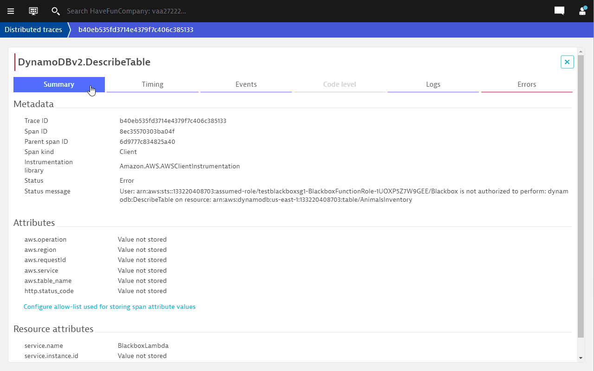
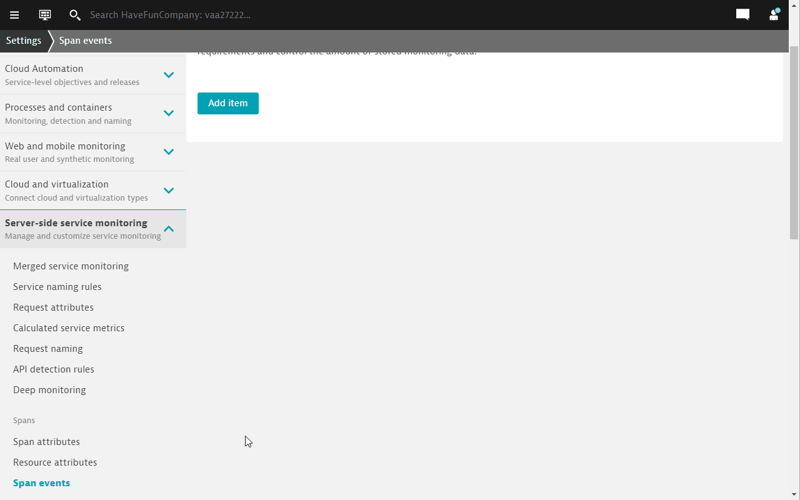
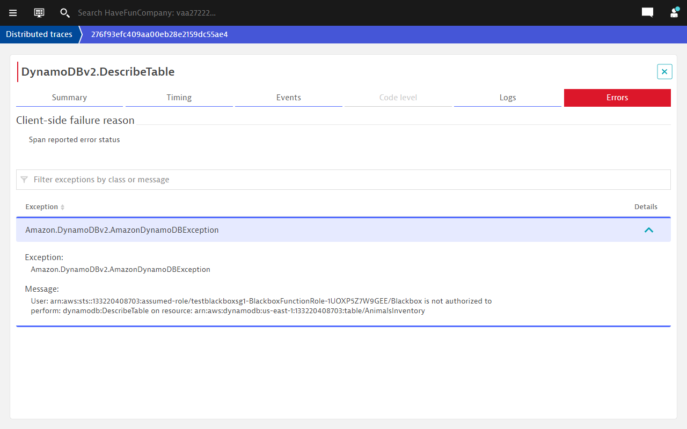
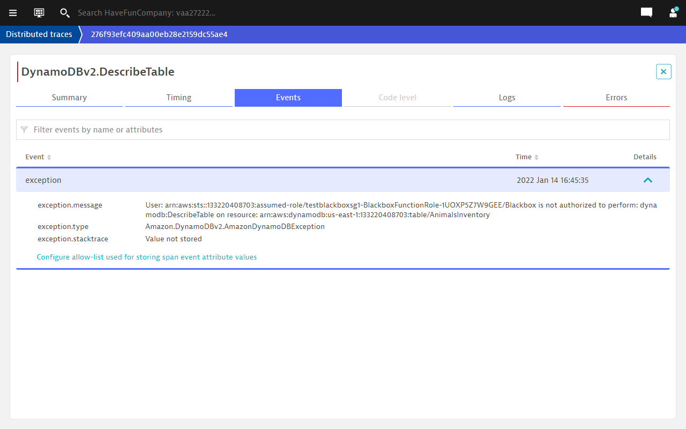

## Configure Span events to provide more details in Dynatrace

### Step 1: Add span events
1. In the same distributed traces view, click on the `Events` tab.
1. Click on Configure allow-list used for storing span events, you will be brought to the Settings configuration page directly.

1. Click on `Add item`.
1. Paste the following in the `key` field `exception.type`.
1. Click on `Save changes`.
1. Add another item called `exception.message` key. Rememer to click on `Save changes`.

### Step 2: Explore the distributed traces again
1. Execute a few transactions.
1. Go to Dynatrace menu -> Distributed traces
1. Select one of the transctions to view the PurePath.
1. Click on the `Errors` tab.
1. More details about the errors are provided, instead of just "errors" or "exceptions"

Now that we have more context, let us configure Dynatrace to alert us when Span failures are detected.