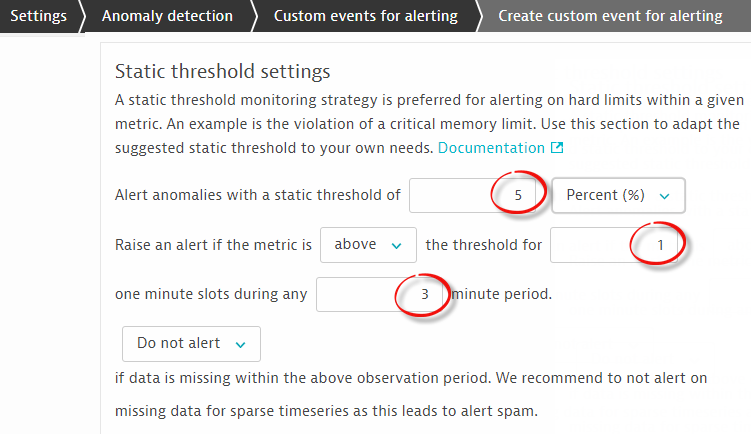
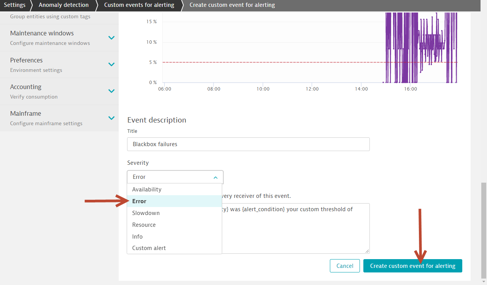
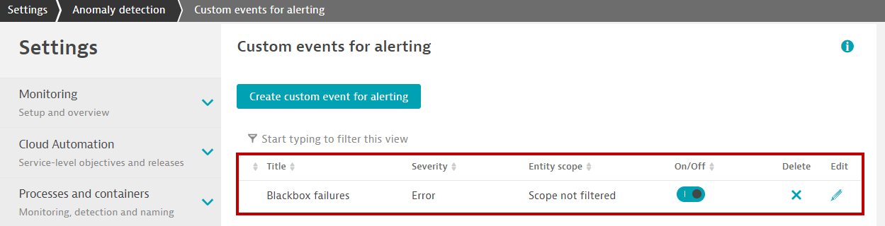

## Using metric events for alerting

### Step 1: Create a custom event for alerting
1. Go to Settings > Anomaly detection > Custom events for alerting
1. Click on `Create custom event for alerting`.
   
1. Under `Metric` section, select `Span Failure Rate`.
   
1. Scroll down to the `Static threshold` section, configure the following parameters
   - Alert anomalies with a static threshold of `5` percent (%)
   - Raise alert if ... the threshold for `1` minute slots
   - during any `3` minute period.
   
1. Scroll down further down to the `Event description` section and configure the event description as follows
   - Title: `Blackbox failures`
   - Severity: `Error`
   
1. Finally, click on `Create custom event for alerting` button.
1. The final configuration screen should look like the following.

### Step 2: Problem detection
1. Execute a few transactions.
1. A problem card should appear after a few minutes.

### Step 3: Drill down into problem card for details

1. Drill down into the problem card and navigate between the screens.
1. Observe how easy it is to move between one view and the next.
1. This is because Dynatrace has everything in context!